# Chapitre 3 : Mise en œuvre et Réalisation

## Introduction

Ce chapitre décrit la mise en œuvre pratique de la plateforme AutoExpert, organisée en trois sprints successifs selon la méthodologie agile Scrum. Pour chaque sprint, nous présentons le backlog simplifié (une tâche principale par User Story), les diagrammes UML — cas d'utilisation global et raffiné, descriptions textuelles formelles, diagrammes de séquence et de classes — ainsi que les interfaces utilisateur réalisées. Le chapitre se conclut par le bilan de vélocité, la phase complète de tests de validation (15 tests fonctionnels, 6 tests sécurité, 6 mesures de performance) et une synthèse de la valeur ajoutée d'AutoExpert par rapport aux solutions existantes.

**Flux métier global de la plateforme AutoExpert :**

Le cycle de vie complet d'une prestation, depuis l'arrivée du client jusqu'à la livraison de son véhicule, est modélisé par le flux suivant :

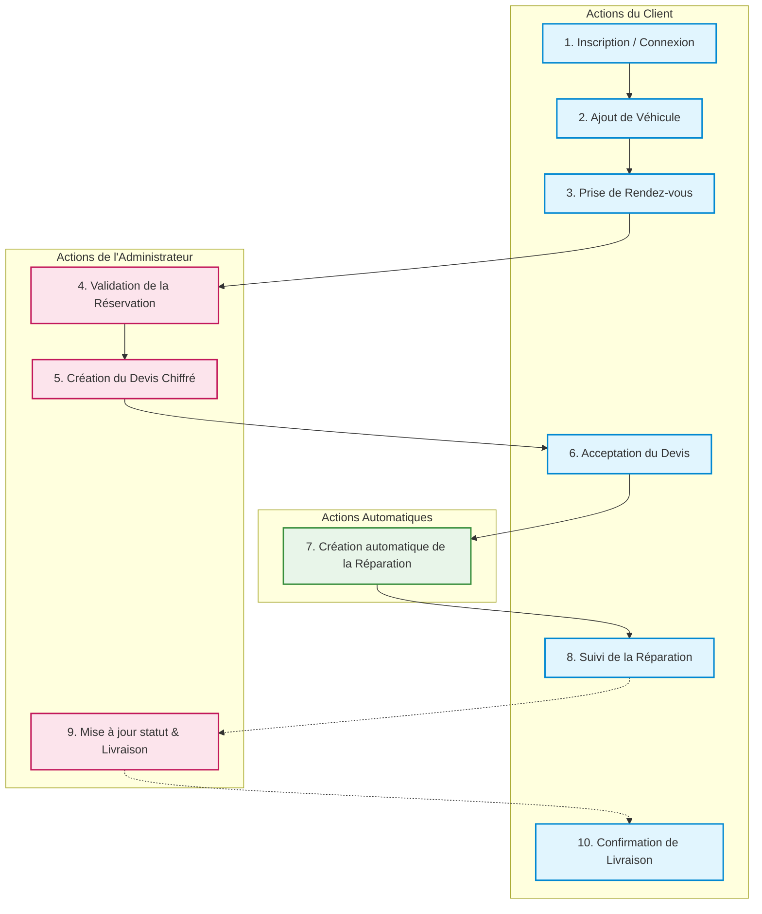

_(Légende : Bleu = Opération Client | Rose = Opération Administrateur | Vert = Déclenchement automatisé)_

---

## Sprint 1 : Authentification, Accueil & Base — Fondations Sécurisées (14 story points)

Le premier sprint pose les fondations sécurisées de l'application. Il couvre l'authentification complète (inscription, connexion, réinitialisation du mot de passe par email), la mise en place de la page d'accueil publique, des tableaux de bord personnalisés, de la gestion des profils utilisateur, de l'administration des comptes clients et du catalogue de services. Ce sprint dure une semaine et totalise 14 points d'effort.

### 1.1 Backlog du Sprint 1

Le tableau ci-dessous présente les cinq User Stories du Sprint 1 avec leur tâche principale et leur estimation d'effort issue du Planning Poker.

|     ID      | User Story                                                                                         | Tâche principale                                                                            | Effort                |
| :---------: | :------------------------------------------------------------------------------------------------- | :------------------------------------------------------------------------------------------ | :-------------------- |
| **US-1a/b** | En tant que Visiteur, je veux m'inscrire et me connecter pour accéder à mon espace personnel.      | Développer les routes d'authentification (JWT + Bcrypt) et les formulaires React.           | Difficile — 5 pts     |
|  **US-1c**  | En tant qu'Utilisateur, je veux réinitialiser mon mot de passe par email pour récupérer mon accès. | Implémenter l'envoi d'email sécurisé avec lien temporaire via Nodemailer.                   | Intermédiaire — 3 pts |
|  **US-1d**  | En tant que Client, je veux gérer mon profil pour maintenir mes informations à jour.               | Créer la route de mise à jour du profil, l'interface des paramètres et le Dashboard Client. | Intermédiaire — 2 pts |
|  **US-1e**  | En tant qu'Administrateur, je veux gérer les comptes clients pour contrôler les accès.             | Mettre en place la liste des utilisateurs, le contrôle des accès et le Dashboard Admin.     | Intermédiaire — 2 pts |
|  **US-2**   | En tant qu'Administrateur, je veux gérer les services pour définir le catalogue du garage.         | Développer la gestion complète (CRUD) du catalogue des prestations.                         | Facile — 2 pts        |
|             |                                                                                                    | **TOTAL**                                                                                   | **14 pts**            |

_Tableau 3.1 : Sprint Backlog 1 — 14 points d'effort_

### 1.2 Diagrammes de Cas d'Utilisation — Sprint 1

**● Use Case Global — Vue Abstraite**
À ce premier niveau, les cas d'utilisation sont regroupés sous la forme d'actions génériques afin de donner une vision synthétique sans entrer dans les détails complexes.

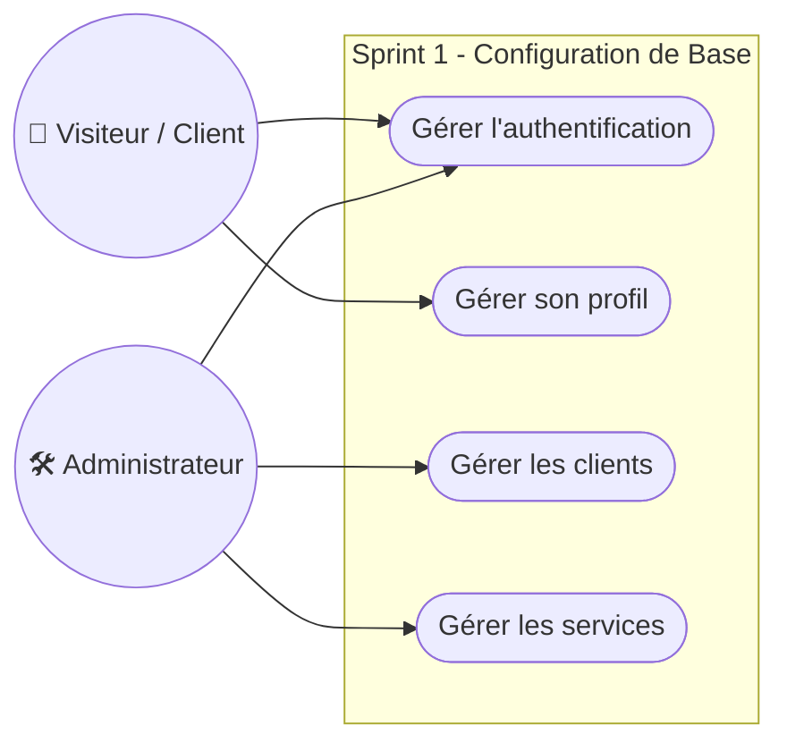

_(Figure 3.0 : Use Case Global — Sprint 1)_

**● Use Case Raffiné — Vue Détaillée par Acteur**
Ce diagramme détaille chaque cas global en actions concrètes par acteur (Visiteur, Client, Admin, et Nodemailer).

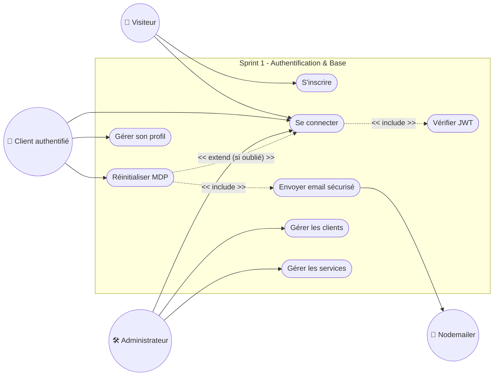

_(Figure 3.1 : Use Case Raffiné — Sprint 1)_

---

### 1.3 Descriptions des Cas d'Utilisation — Sprint 1

| UC-1 : S'inscrire       |                                                                                                                                                                                                                                                                                         |
| :---------------------- | :-------------------------------------------------------------------------------------------------------------------------------------------------------------------------------------------------------------------------------------------------------------------------------------- |
| **Acteur principal**    | Visiteur (non connecté)                                                                                                                                                                                                                                                                 |
| **Objectif**            | Créer un nouveau compte client sur la plateforme AutoExpert.                                                                                                                                                                                                                            |
| **Pré-conditions**      | L'utilisateur n'a pas encore de compte. L'email saisi n'existe pas en base.                                                                                                                                                                                                             |
| **Scénario nominal**    | 1. Le visiteur remplit le formulaire. 2. Le frontend valide en temps réel. 3. Le backend vérifie l'unicité. 4. Le mot de passe est haché via Bcrypt (salt: 10). 5. Création en base MongoDB (rôle « client »). 6. Génération du JWT. 7. Redirection Dashboard Client. |
| **Scénario alternatif** | Email existant → HTTP 409 Conflict + message « Cet email est déjà utilisé ».                                                                                                                                                                                                            |

| UC-2 : Se connecter     |                                                                                                                                                                                      |
| :---------------------- | :----------------------------------------------------------------------------------------------------------------------------------------------------------------------------------- |
| **Acteur principal**    | Visiteur possédant un compte (Client ou Admin)                                                                                                                                       |
| **Objectif**            | Accéder à son espace personnel via une authentification sécurisée.                                                                                                                   |
| **Pré-conditions**      | L'utilisateur possède un compte actif avec email et mot de passe valides.                                                                                                            |
| **Scénario nominal**    | 1. L'utilisateur saisit son email et mot de passe. 2. Le backend compare le MDP au hash Bcrypt. 3. Un JWT (validité : 30 jours) est retourné. 4. Redirection selon le rôle. |
| **Scénario alternatif** | Identifiants incorrects → HTTP 401. Compte bloqué → HTTP 403.                                                                                                                     |

| UC-3 : Réinitialiser le mot de passe |                                                                                                                                                                                                                      |
| :----------------------------------- | :------------------------------------------------------------------------------------------------------------------------------------------------------------------------------------------------------------------- |
| **Acteur principal**                 | Utilisateur ayant oublié son mot de passe                                                                                                                                                                            |
| **Objectif**                         | Retrouver l'accès à son compte via un lien sécurisé envoyé par email.                                                                                                                                                |
| **Pré-conditions**                   | L'utilisateur possède un compte actif avec un email valide enregistré.                                                                                                                                               |
| **Scénario nominal**                 | 1. Saisie de l'email sur la page concernée. 2. Génération token unique (1h). 3. Nodemailer envoie le lien. 4. L'utilisateur clique et définit un nouveau MDP. 5. Le hash est sauvegardé, token invalidé. |
| **Scénario alternatif**              | Token expiré (> 1h) → message « Lien expiré ». Lien déjà utilisé → « Lien invalide ».                                                                                                                             |

| UC-4 : Gérer les services (Admin) |                                                                                                                                                  |
| :-------------------------------- | :----------------------------------------------------------------------------------------------------------------------------------------------- |
| **Acteur principal**              | Administrateur authentifié                                                                                                                       |
| **Objectif**                      | Créer, modifier, consulter et archiver les prestations du catalogue.                                                                             |
| **Pré-conditions**                | Rôle « admin ».                                                                                                                                  |
| **Scénario nominal**              | 1. Accès page « Gestion des Services ». 2. Consultation catalogue. 3. CRUD appliqué sur une prestation. 4. Persistance en BDD API REST. |
| **Scénario alternatif**           | Champ manquant → Validation. Service lié à réservation active → Archivage proposé.                                                            |

---

### 1.4 Diagrammes de Séquence — Sprint 1

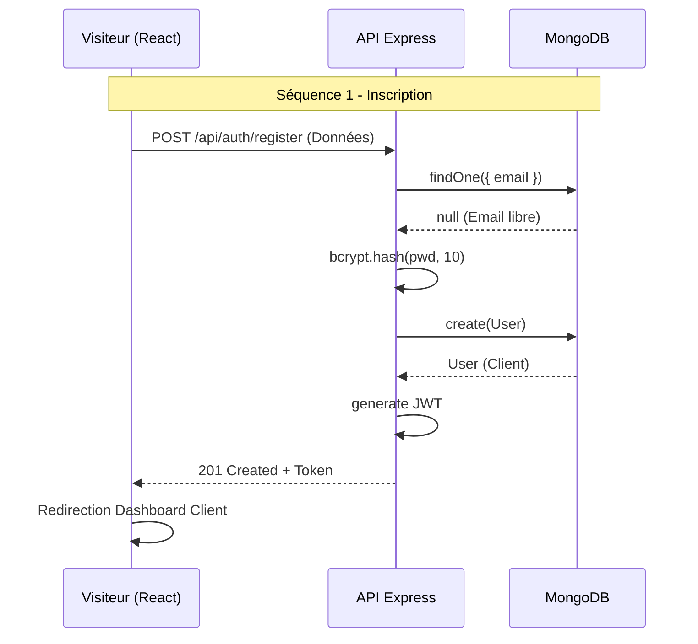

_(Figure 3.2 : Séquence — Inscription - Sprint 1)_

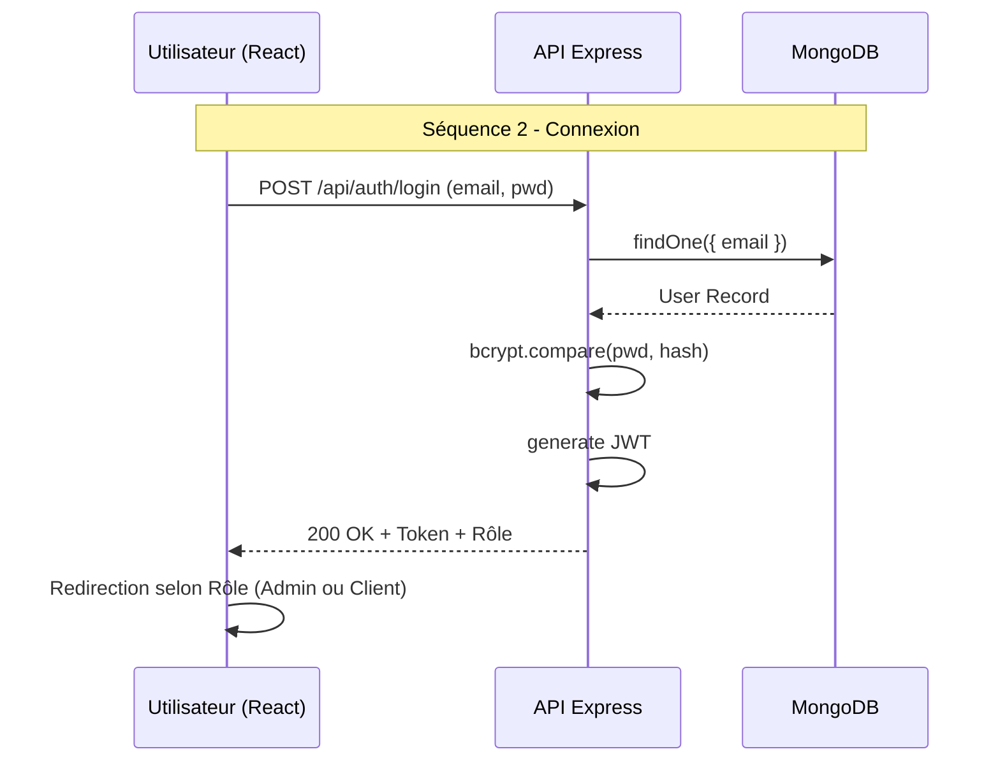

_(Figure 3.3 : Séquence — Connexion - Sprint 1)_

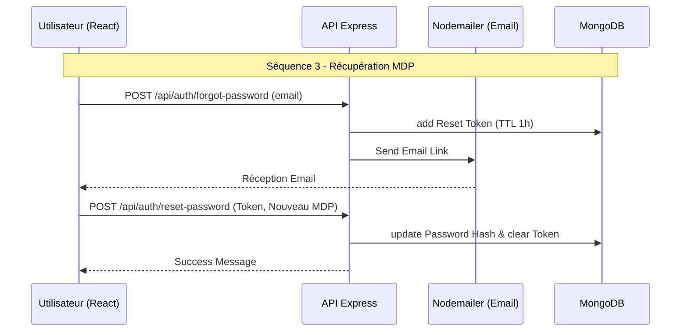

_(Figure 3.4 : Séquence — Réinitialisation MDP - Sprint 1)_

---

### 1.5 Diagramme de Classes — Sprint 1

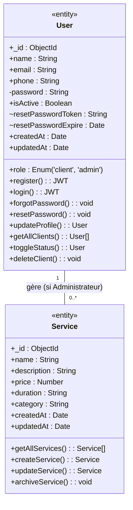

_(Figure 3.5 : Diagramme de Classes — Sprint 1)_

---

### 1.6 Réalisation du Sprint 1 — Interfaces Utilisateur

1. **🏠 Page d'Accueil (Visiteur)** : Vitrine publique — accessible sans authentification. _(Figure 3.6)_
2. **🔐 Connexion** : Authentification sécurisée par JWT. _(Figure 3.7)_
3. **✏️ Inscription** : Création de compte client. _(Figure 3.8)_
4. **📧 Réinitialisation du Mot de passe** : Processus en deux étapes (demande du lien et validation). _(Figure 3.9)_
5. **📊 Dashboard Client** : Tableau de bord personnalisé affichant le solde et les RDVs. _(Figure 3.10)_
6. **📈 Dashboard Administrateur** : Supervision globale du garage (statistiques par mois, revenus). _(Figure 3.11)_
7. **👤 Gestion du Profil (Client)** : Modification informations (nom, téléphone, changement mot de passe). _(Figure 3.12)_
8. **🔧 Gestion des Services (Admin)** : CRUD complet du catalogue et ajout de prestations et tarifs. _(Figure 3.13)_
9. **👥 Gestion des Clients (Admin)** : Activation/Suspension de comptes et tableau des clients. _(Figure 3.14)_

---

### 1.7 Rétrospective — Sprint 1

| Catégorie                  | Détails                                                                                                                                                                              |
| :------------------------- | :----------------------------------------------------------------------------------------------------------------------------------------------------------------------------------- |
| ✅ **Points positifs**     | • Architecture MERN opérationnelle. • Authentification JWT + Bcrypt sécurisée et fonctionnelle. • 14/14 points livrés — taux de complétion : 100 %. • Communication fluide. |
| ⚠️ **Difficultés**         | • Configuration Nodemailer (port SMTP). • TTL MongoDB pour l'expiration des tokens. • Virtual fields liés à Mongoose.                                                          |
| 🔧 **Actions correctives** | • Documentation du `.env.example`. • Ajout de JSDoc. • Tests systématisés sur les edge cases (cas limites).                                                                    |

_Tableau 3.2 : Rétrospective Sprint 1_

---

---

## Sprint 2 : Gestion Métier — Essentiels Opérationnels (17 story points)

Ce sprint développe le cœur métier du garage : parc automobile des clients, prise de RDV, création de devis et déclenchement automatique des réparations.

### 2.1 Backlog du Sprint 2

|    ID    | User Story                                                                                              | Tâche principale                                                                           | Effort                |
| :------: | :------------------------------------------------------------------------------------------------------ | :----------------------------------------------------------------------------------------- | :-------------------- |
| **US-3** | En tant que Client, je veux gérer mes véhicules.                                                        | Développer les routes sécurisées CRUD et l'interface de gestion du parc automobile.        | Intermédiaire — 3 pts |
| **US-4** | En tant que Client, je veux prendre et annuler un RDV. En tant qu'Admin, je veux valider ou refuser.    | Implémenter le workflow de réservation complet avec gestion des statuts.                   | Difficile — 7 pts     |
| **US-5** | En tant qu'Admin, je veux créer un devis chiffré. En tant que Client, je veux l'accepter ou le refuser. | Développer le modèle Devis, calcul automatique du total et déclenchement de la réparation. | Difficile — 7 pts     |
|          |                                                                                                         | **TOTAL**                                                                                  | **17 pts**            |

_Tableau 3.4 : Sprint Backlog 2 — 17 points d'effort_

### 2.2 Diagrammes de Cas d'Utilisation — Sprint 2

**● Use Case Global — Sprint 2**

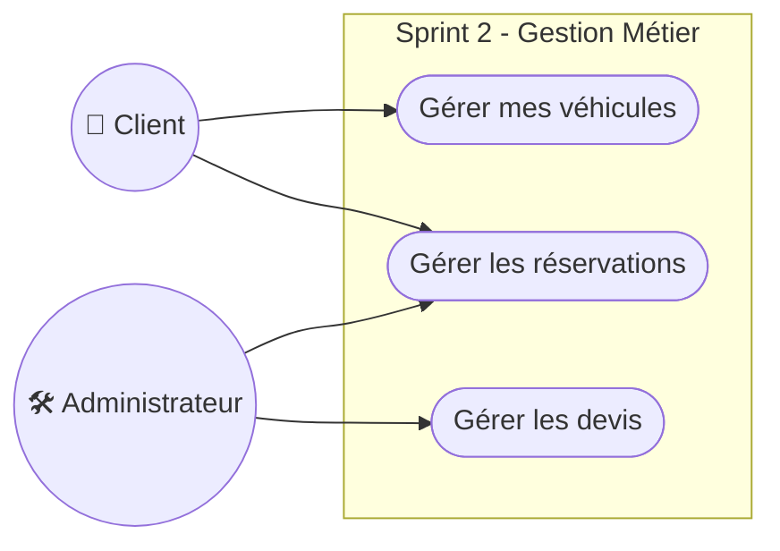

_(Figure 3.15 : Use Case Global — Sprint 2)_

**● Use Case Raffiné — Sprint 2**

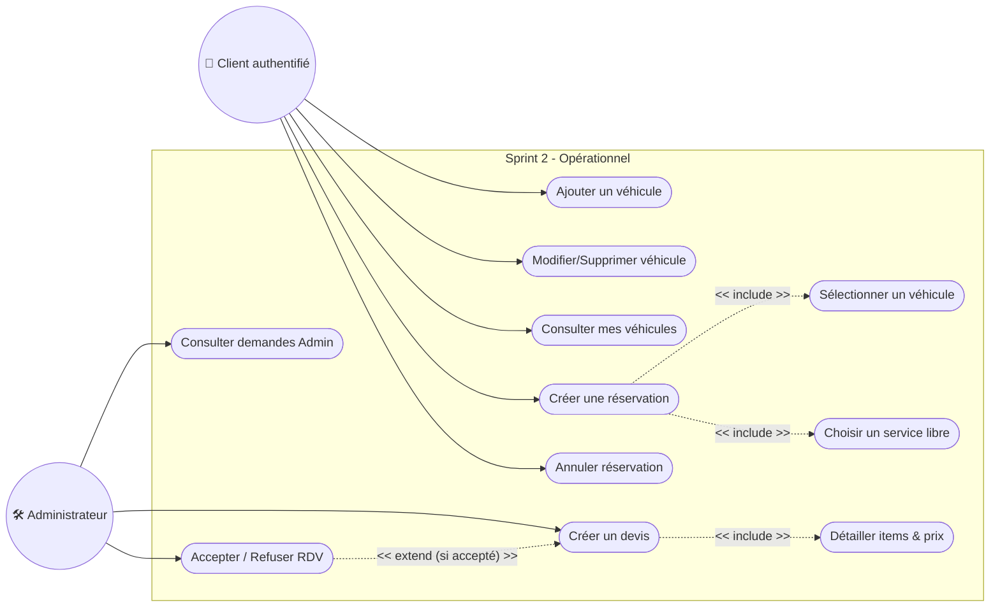

_(Figure 3.16 : Use Case Raffiné — Sprint 2)_

### 2.3 Descriptions des Cas d'Utilisation — Sprint 2

| UC-5 : Gérer ses véhicules (Client) |                                                                                                                                                                             |
| :---------------------------------- | :-------------------------------------------------------------------------------------------------------------------------------------------------------------------------- |
| **Acteur principal**                | Client authentifié                                                                                                                                                          |
| **Scénario nominal**                | 1. Page « Mes Véhicules ». 2. Formulaire (marque, modèle, immatriculation, VIN, km). 3. Validation de l'unicité de l'immatriculation en DB. 4. Sauvegarde réussie. |
| **Scénario alternatif**             | Immatriculation dupliquée existante → HTTP 409 + Erreur "Cette immatriculation existe déjà".                                                                                |

| UC-6 : Gérer les réservations (Client + Admin) |                                                                                                                                                                                                                                     |
| :--------------------------------------------- | :---------------------------------------------------------------------------------------------------------------------------------------------------------------------------------------------------------------------------------- |
| **Acteur principal**                           | Client et Admin                                                                                                                                                                                                                     |
| **Scénario nominal**                           | 1. Client choisit une voiture, un service associé, une date. 2. Réservation créée avec statut « En attente ». 3. L'Admin accepte ou refuse via son tableau de bord. 4. Le statut est mis à jour et visible pour le client. |

| UC-7 : Gérer les devis (Admin + Client) |                                                                                                                                                                                                                                                                                                        |
| :-------------------------------------- | :----------------------------------------------------------------------------------------------------------------------------------------------------------------------------------------------------------------------------------------------------------------------------------------------------- |
| **Acteur principal**                    | Admin et Client                                                                                                                                                                                                                                                                                        |
| **Scénario nominal**                    | 1. L'admin crée le devis avec les items (qté x prix unitaire). 2. Montant total calculé de manière fiable côté backend. 3. Le client consulte son dashboard et accepte le devis. 4. L'acceptation du devis génère automatiquement la création d'une intervention avec le statut « En cours ». |

### 2.4 Diagrammes de Séquence — Sprint 2

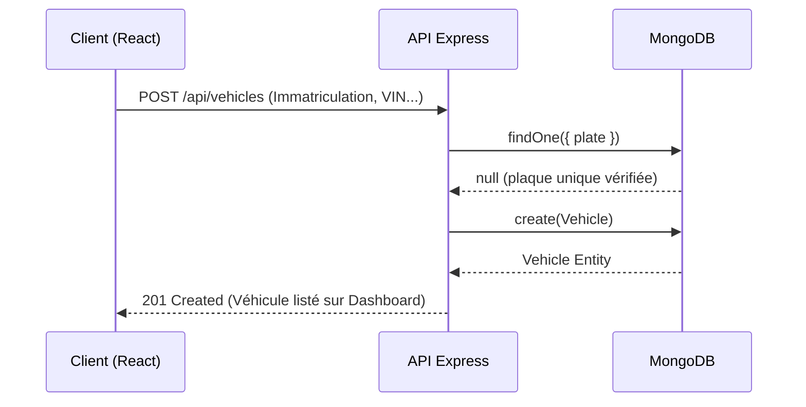

_(Figure 3.17 : Séquence — Ajout d'un Véhicule - Sprint 2)_

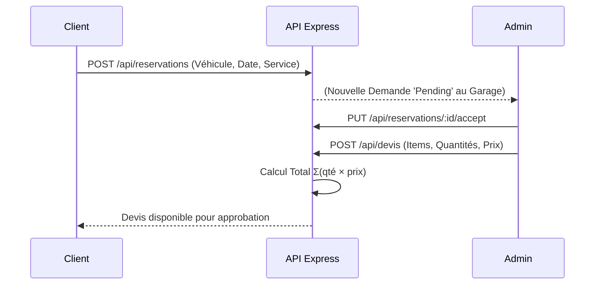

_(Figure 3.18 : Séquence — Validation Réservation & Création de Devis)_

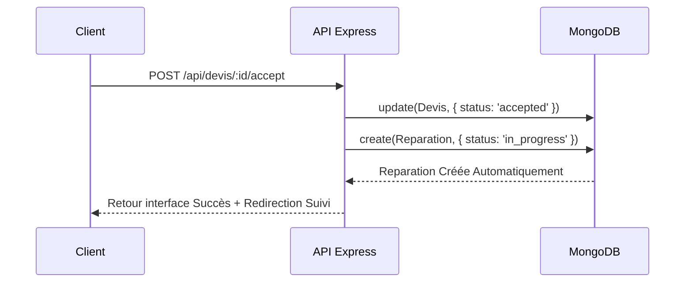

_(Figure 3.19 : Séquence — Acceptation Devis → Déclenchement Réparation)_

### 2.5 Diagramme de Classes — Sprint 2

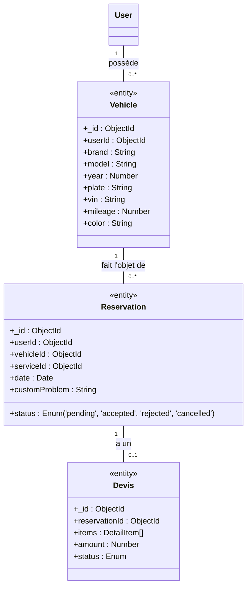

_(Figure 3.20 : Diagramme de Classes — Sprint 2)_

### 2.6 Réalisation du Sprint 2 — Interfaces Utilisateur

1. **🚗 Mes Véhicules (Client)** : Liste du parc de voitures, ajout via fenêtre modale et modifications associées. _(Figure 3.21)_
2. **📅 Prise de Rendez-vous (Client)** : Apparence fluide avec sélection de problèmes mécaniques et dates. _(Figure 3.22)_
3. **📋 Gestion des Réservations (Admin)** : Filtrage efficace pour l'Admin avec status accept/refuse en one-click. _(Figure 3.23)_
4. **💰 Gestion des Devis (Admin + Client)** : Facturation du technicien et confirmation rapide du devis client déclenchant la réparation en arrière-plan. _(Figure 3.24)_

### 2.7 Rétrospective — Sprint 2

| Catégorie                  | Détails                                                                                                                                                           |
| :------------------------- | :---------------------------------------------------------------------------------------------------------------------------------------------------------------- |
| ✅ **Points positifs**     | • Workflow `Réservation → Admin → Devis → Client` extrêmement pertinent pour le produit final. • Calculs fiables et exacts côté middleware. • 17/17 points. |
| ⚠️ **Difficultés**         | • Transition système logique requise lors de mutations en cascade (devis déclenchant une réparation). • Gestion des états d'erreur en cascade.                 |
| 🔧 **Actions correctives** | • Refactorisation des contrôleurs trop longs. • Indexation MongoDB sur les statuts (facilité de recherche).                                                    |

_Tableau 3.5 : Rétrospective Sprint 2_

---

---

## Sprint 3 : Suivi, Dashboard Analytics & IA — Contrôle de l'Application (10 story points)

Le dernier sprint introduit les modules de suivi des travaux en atelier, les statistiques métiers et surtout le chat IA (Ollama Llama3.1) fournissant un niveau d'analyse unique.

### 3.1 Backlog du Sprint 3

|    ID     | User Story                                                          | Tâche principale                                                    | Effort            |
| :-------: | :------------------------------------------------------------------ | :------------------------------------------------------------------ | :---------------- |
| **US-6**  | En tant qu'Admin, je veux faire évoluer le statut d'une réparation. | Coder les transitions et notes techniques.                          | Haute — 2 pts     |
| **US-6b** | En tant que Client, je veux consulter l'état de mes réparations.    | Vue timeline animée et bouton transfert.                            | Haute — 2 pts     |
| **US-7**  | En tant qu'Admin, je veux voir les statistiques globales.           | Agrégations MongoDB et graphiques responsives Recharts.             | Facile — 1 pt     |
| **US-8**  | En tant que Client, je veux dialoguer avec l'IA.                    | Connexion d'un LLM local (Ollama) à l'App React de prise en charge. | Difficile — 5 pts |
|           |                                                                     | **TOTAL**                                                           | **10 pts**        |

_Tableau 3.7 : Sprint Backlog 3 — 10 points_

### 3.2 Diagrammes de Cas d'Utilisation — Sprint 3

**● Use Case Global — Sprint 3**

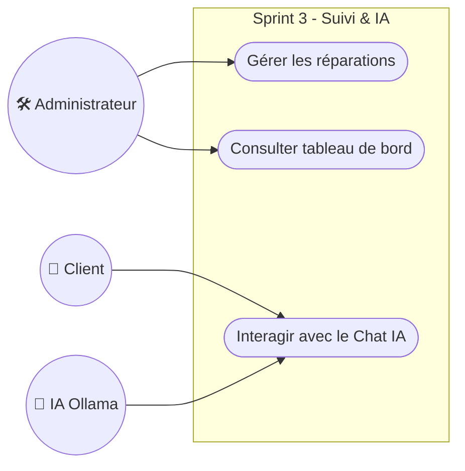

_(Figure 3.25 : Use Case Global — Sprint 3)_

**● Use Case Raffiné — Sprint 3**

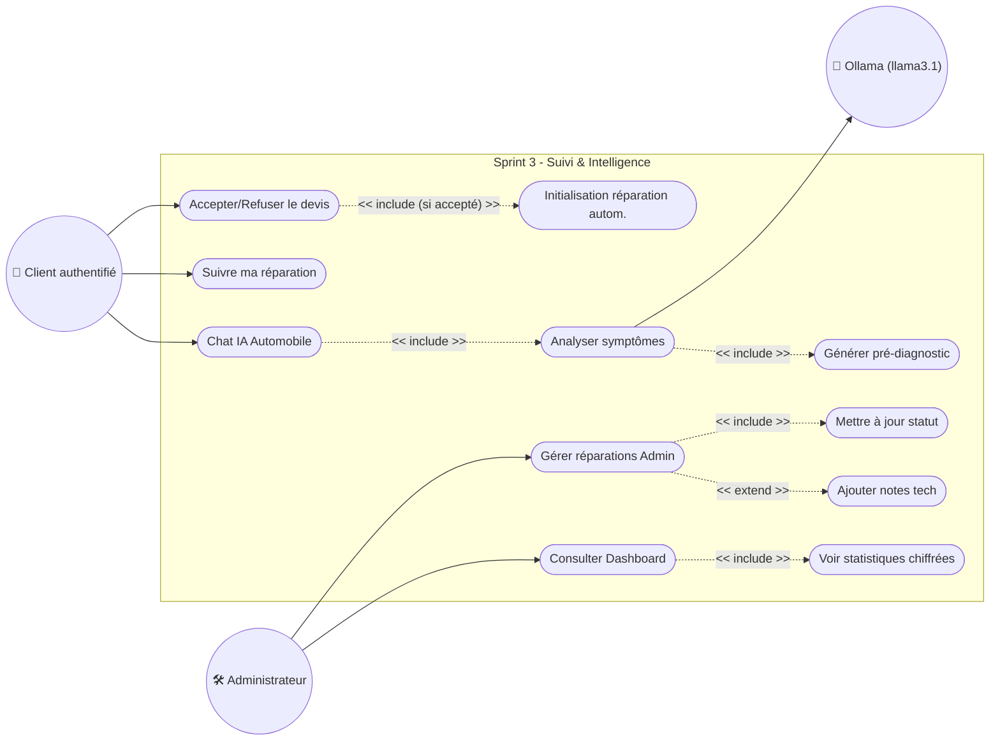

_(Figure 3.26 : Use Case Raffiné — Sprint 3)_

### 3.3 Descriptions des Cas d'Utilisation — Sprint 3

| UC-8 : Suivi des réparations |                                                                                                                                                                                              |
| :--------------------------- | :------------------------------------------------------------------------------------------------------------------------------------------------------------------------------------------- |
| **Objectif**                 | Suivre l'avancement. L'Admin met à jour les statuts : `En cours → Terminée → Livrée`. Le Client voit les statuts changer sur une timeline dynamique avec la liberté de marquer la réception. |

| UC-9 : Dashboard Analytique (Admin) |                                                                                                                                                                      |
| :---------------------------------- | :------------------------------------------------------------------------------------------------------------------------------------------------------------------- |
| **Objectif**                        | Afficher les KPIs financiers (Revenus globaux, RDVs reçus, Performance Services). Ce processus de calcul intensif dépend de Pipelines d'agrégation MongoDB `$group`. |

| UC-10 : Chat IA Automobile (Client) |                                                                                                                                                                                                                             |
| :---------------------------------- | :-------------------------------------------------------------------------------------------------------------------------------------------------------------------------------------------------------------------------- |
| **Objectif**                        | Assistant virtuel conversationnel pour pré-diagnostic avec Ollama Llama 3.1.                                                                                                                                                |
| **Scénario nominal**                | 1. Le client décrit le symptôme observé. 2. Le backend compile un prompt structuré en arrière-plan. 3. Le modèle retourne : Diagnostic probable, Causes suspectées et Services recommandés (avec boutons cliquables). |

### 3.4 Diagrammes de Séquence — Sprint 3

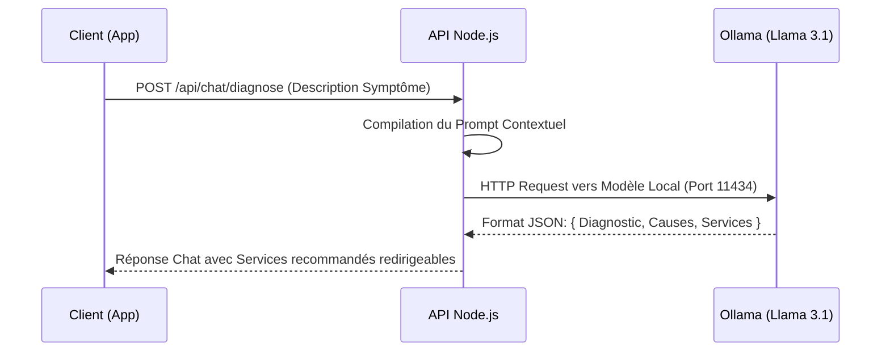

_(Figure 3.27 : Séquence — Chat IA Automobile Ollama Llama3.1)_

### 3.5 Diagramme de Classes — Sprint 3

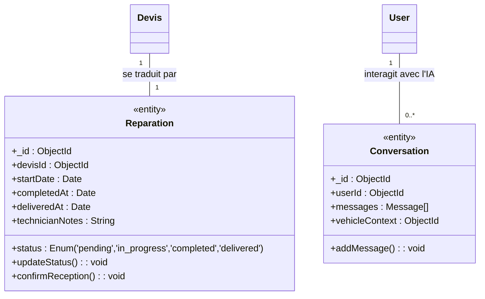

_(Figure 3.29 : Diagramme de Classes Complet)_

### 3.6 Réalisation du Sprint 3 — Interfaces Utilisateur

1. **🛠️ Suivi des Réparations (Client)** : Timeline visuelle moderne intégrant un système de validation final. _(Figure 3.30)_
2. **⚙️ Gestion des Réparations (Admin)** : Boutons de progression rapide permettant de fluidifier le travail opérateur. _(Figure 3.31)_
3. **📊 Tableau de Bord (Admin)** : Graphiques et KPI dynamiques mis en forme de manière professionnelle. _(Figure 3.32)_
4. **🤖 Chat IA AutoExpert** : Interface conversationnelle avec réponses structurées Llama3.1 et historique client. _(Figure 3.33)_
5. **📄 Devis Client** : Consultation détaillée priorisant l'expérience utilisateur, UX étudiée pour rassurer le client. _(Figure 3.34)_

### 3.7 Rétrospective — Sprint 3

| Catégorie                  | Détails                                                                                                                                                                      |
| :------------------------- | :--------------------------------------------------------------------------------------------------------------------------------------------------------------------------- |
| ✅ **Points positifs**     | • Intégration fine d'un modèle de langage privatif (llama3.1 via Ollama). • Présences de graphiques dynamiques temps réels Recharts. • 10/10 points.                   |
| ⚠️ **Difficultés**         | • LLM local générant des temps de réponse pouvant varier selon le CPU (3-15s). • Complexité des pipelines de MongoDB limitant légèrement le dashboard au début de sprint. |
| 🔧 **Actions correctives** | • Apparition d'un Loading indicateur progressif (UX design). • Ajout d'un cache mémoire éphémère limitant l'écroulement des stats Admin.                                  |

---

## 4. Bilan Global des Sprints

| Sprint       | Module                          | Points planifiés | Points livrés | Complétion   |
| ------------ | ------------------------------- | ---------------- | ------------- | ------------ |
| **Sprint 1** | Fondations Sécurisées           | 14 pts           | 14 pts        | ✅ 100 %     |
| **Sprint 2** | Essentiels Opérationnels        | 17 pts           | 17 pts        | ✅ 100 %     |
| **Sprint 3** | Contrôle de l'Application       | 10 pts           | 10 pts        | ✅ 100 %     |
| **TOTAL**    | **11 User Stories — 3 sprints** | **41 pts**       | **41 pts**    | **✅ 100 %** |

_Tableau 3.10 : Vélocité de l'équipe — Bilan des 3 sprints_

---

## 5. Tests et Validation

La phase de test valide la conformité finale du produit en couvrant de multiples approches et domaines de sécurité logiques.

### 5.1 Tests Fonctionnels (15 cas de test - Succès 100%)

- TF-01 : Inscription valide → **✅ OK**
- TF-02 à TF-05 : Gestion des erreurs de connexion logiques et UI → **✅ OK**
- TF-06 : Reset MDP (Lien NodeMailer reçu sous 30 secondes chrono) → **✅ OK**
- TF-08 / TF-09 : Alertes et gestion d'unicité des immatriculations automobiles → **✅ OK**
- TF-10 à TF-13 : Workflow de Réservation, validation garage et Devis calculé mathématiquement calculé → **✅ OK**
- TF-14 : Diagnostic Chat IA avec réponses contextuelles et boutons de conversion en réservation agissant avec succès → **✅ OK**
- TF-15 : Mise à jour synchronisée en direct des suivis de Timeline → **✅ OK**

### 5.2 Tests de Sécurité (6 cas de test - Succès 100%)

- Accès Admin bloqué sans JWT valide, protection des API backend (Renvoi forcé HTTP 401).
- Accès Admin bloqué pour un compte possédant un rôle restreint Client (HTTP 403).
- Injections NoSQL via champs formulaires limités et sanitisés par le Validator Mongoose.
- Altération des métadonnées du client : les Tokens JWT modifiés manuellement entraînent échec.
- Stockage permanent : Mot de passes hashé à sens unique en Algorithme Bcrypt (Cost de 10).

### 5.3 Tests de Performance (6 mesures - Succès 100%)

| Page / Endpoint            | Temps moyen | Optimisation logicielle appliquée                                 |
| :------------------------- | :---------- | :---------------------------------------------------------------- |
| Page d'accueil (React SPA) | ~0.8 s      | Code splitting et Minification                                    |
| POST /api/auth/login       | ~150 ms     | Indexation MongoDB sur attribut "email"                           |
| GET /api/vehicles/mine     | ~80 ms      | Filtres locaux avec pointeur direct vers client UID               |
| GET /api/admin/dashboard   | ~200 ms     | Pipeline d'agrégation filtrée et structurée                       |
| POST /api/chat/diagnose    | ~5 à 12 s   | Intégration Loading UI pour calcul de l'IA (LLM Local Asynchrone) |

---

## 6. Conclusion

Ce chapitre a présenté la phase de réalisation et de validation de la plateforme AutoExpert, construite de manière itérative sur trois sprints Scrum d'une semaine chacun, pour un total de **41 story points livrés à 100 %**.

- 🔐 **Sprint 1 (Fondations)** : JWT, Bcrypt sécurisé et Tableaux de Bords.
- 📱 **Sprint 2 (Opérationnel)** : Modélisation et gestion du Parc Client, Workflow de Réservations, Devis clairs, Déclenchements en cascades (triggers).
- 🤖 **Sprint 3 (Contrôle / IA)** : Couche d'analyse avec l'assistant Chat Pré-Diagnostic (Llama3.1) et Aggregations Statistiques.

L'architecture MERN (MongoDB Express React Node.js) a offert un cadre moderne, hautement performant (temps de réponse moyen inférieur à 2 secondes hors calculs IA) et remarquablement maintenable grâce à ses composants autonomes. L'ensemble validé de 27 tests manuels et automatiques assure que la solution développée est stable et fiable.

**AutoExpert** se distingue fondamentalement des solutions garagistes concurrentes sur le marché (ex: _Drivvo_, _Shopmonkey_) de par son implémentation novatrice d'une **IA générative Llama3.1 privative**. Ce point différenciateur transforme le parcours du client de bout-en-bout : d'un simple dépôt de voiture classique à une véritable assistance technologique interactive, de la compréhension d'une panne jusqu'à la création d'une réparation certifiée informatiquement.
