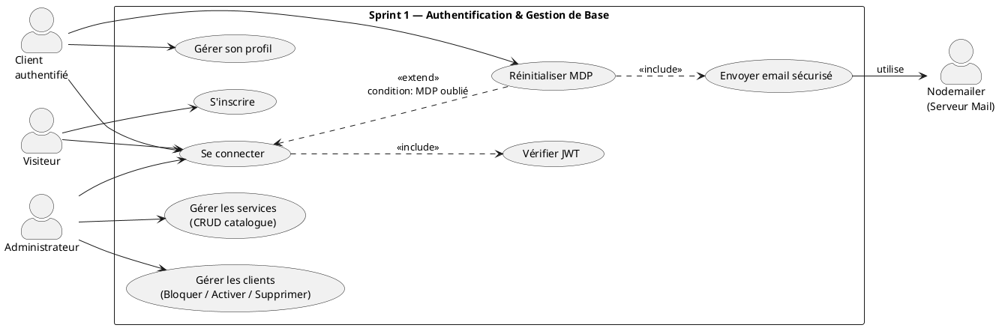
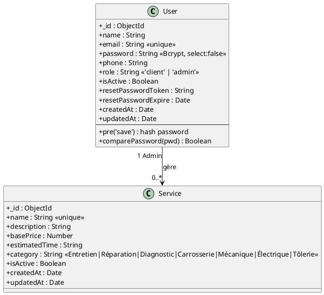
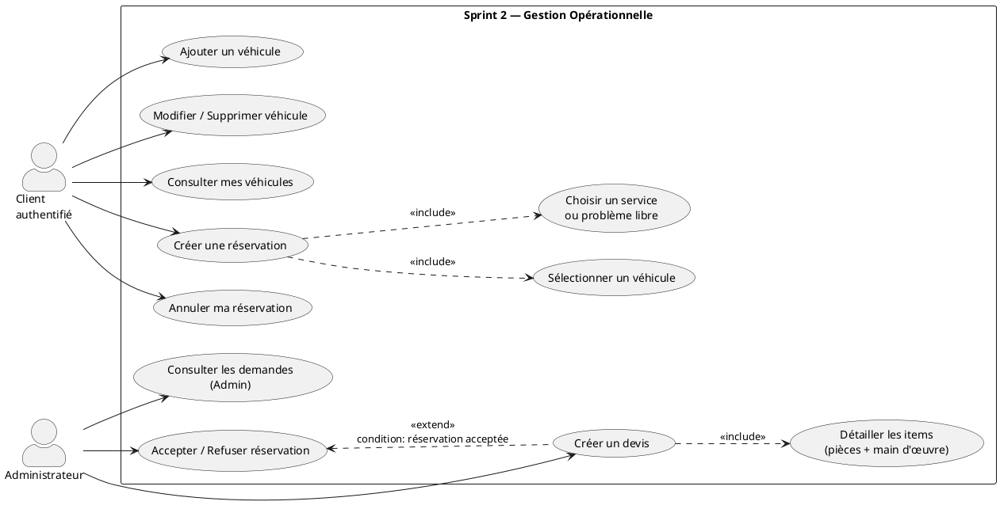
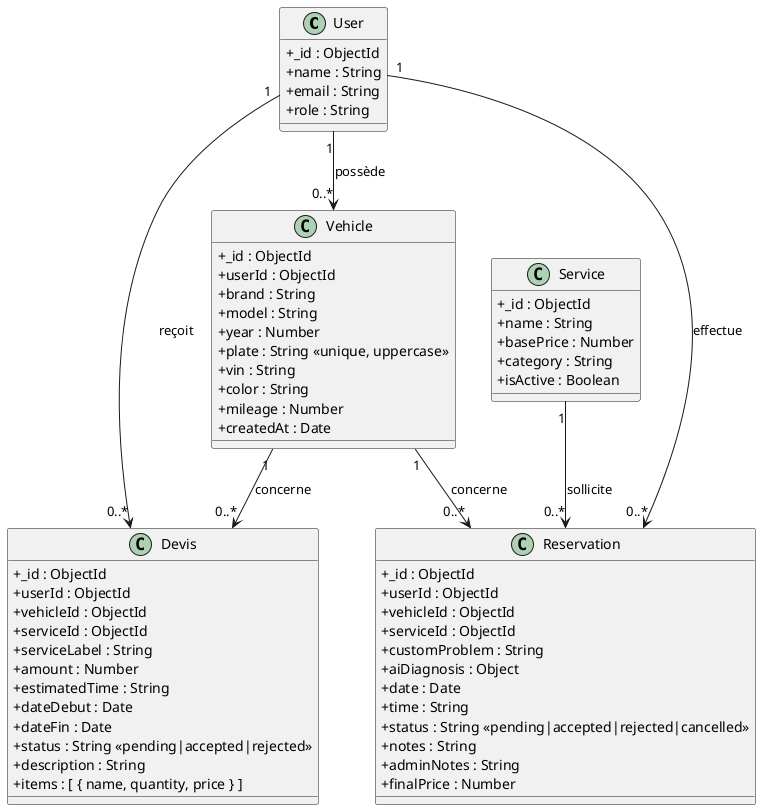
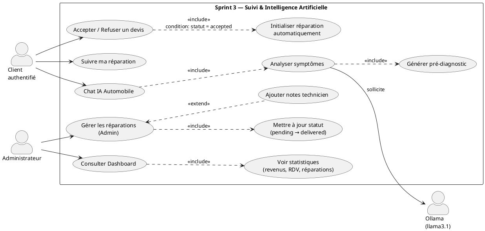
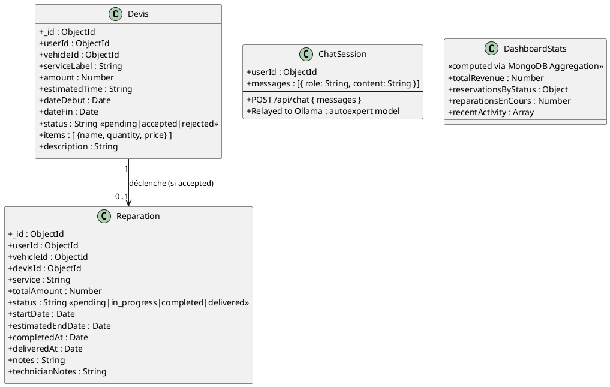

# CHAPITRE 3 : Réalisation et Tests

## Introduction

Ce chapitre présente la phase de réalisation concrète de la plateforme **AutoExpert**, organisée selon la méthodologie Scrum en trois sprints successifs. Pour chaque sprint, nous présentons :

- Le **Backlog du Sprint** (User Stories et effort estimé)
- Les **Diagrammes de Cas d'Utilisation** selon trois niveaux de lecture : Global (vue hélicoptère), Raffiné (actions précises) et Description textuelle (scénarios)
- Le **Diagramme de Classes** modélisant les entités en base de données
- Les **Réalisations** : interfaces livrées avec description fonctionnelle

---

> **💡 Concept du Raffinement — Rappel méthodologique**
>
> Les diagrammes de cas d'utilisation suivent une hiérarchie à trois niveaux :
>
> | Niveau                     | Vue                 | Description                                                                    |
> | -------------------------- | ------------------- | ------------------------------------------------------------------------------ |
> | **Niveau 1 — Global**      | Vue "boîte noire"   | Grands domaines fonctionnels (quoi globalement)                                |
> | **Niveau 2 — Raffiné**     | Vue détaillée       | Actions précises par acteur avec relations `<<include>>` / `<<extend>>`        |
> | **Niveau 3 — Description** | Vue "boîte blanche" | Scénarios écrits : Acteur, But, Pré-condition, Flux principal, Flux alternatif |

---

## SPRINT 1 — Authentification & Base

Le premier sprint pose les fondations sécurisées de l'application. Il couvre l'authentification complète (inscription, connexion, réinitialisation du mot de passe), la gestion des profils clients et le catalogue de services administré par l'admin.

---

### 1.1 Backlog du Sprint 1

Le premier sprint couvre les fondations de la plateforme : authentification sécurisée, gestion des profils et catalogue de services. Il représente **14 points d'effort** répartis sur **5 User Stories**.

| ID          | User Story                                                                                              | Tâches principales                                                                    | Effort                |
| ----------- | ------------------------------------------------------------------------------------------------------- | ------------------------------------------------------------------------------------- | --------------------- |
| **US-1a/b** | En tant que _Visiteur_, je veux m'inscrire et me connecter afin d'accéder à mon espace personnel.       | Implémentation JWT + Bcrypt, formulaires React Login/Register, tests authentification | Difficile (5 pts)     |
| **US-1c**   | En tant qu'_Utilisateur_, je veux réinitialiser mon mot de passe par email afin de récupérer mon accès. | Génération token (1h), envoi Nodemailer, pages Reset Request/Confirm, tests           | Intermédiaire (3 pts) |
| **US-1d**   | En tant que _Client_, je veux gérer mon profil afin de maintenir mes informations à jour.               | Route `PUT /profile`, middleware `verifyToken`, page Profil React, tests              | Intermédiaire (2 pts) |
| **US-1e**   | En tant qu'_Administrateur_, je veux gérer les comptes clients afin de contrôler les accès.             | Bloquer/Activer/Supprimer un compte, interface Gestion Clients                        | Intermédiaire (2 pts) |
| **US-2**    | En tant qu'_Administrateur_, je veux gérer les services afin de définir le catalogue du garage.         | CRUD complet services, interface catalogue Admin, tests fonctionnels                  | Facile (2 pts)        |
|             |                                                                                                         | **Total**                                                                             | **14 pts**            |

_Tableau 3.1 — Sprint Backlog 1_

---

### 1.2 Diagramme de Cas d'Utilisation — Sprint 1

Les diagrammes de cas d'utilisation permettent de représenter visuellement les interactions entre les acteurs et le système. Nous adoptons une approche en deux niveaux : d'abord une vue globale qui donne une vision d'ensemble, puis une vue raffinée qui détaille les actions précises de chaque acteur.

---

#### 🔷 Use Case Global — Sprint 1

Ce diagramme représente une vue d'ensemble abstraite du Sprint 1. Chaque cas d'utilisation est exprimé sous la forme "Gérer..." afin d'identifier les grands domaines fonctionnels sans entrer dans le détail des actions.

```
┌──────────────────────────────────────────────────────┐
│           Sprint 1 — Configuration de Base           │
│                                                      │
│         [ Gérer l'authentification ]                 │
│                                                      │
│         [ Gérer son profil ]                         │
│                                                      │
│         [ Gérer les clients ]                        │
│                                                      │
│         [ Gérer les services ]                       │
│                                                      │
└──────────────────────────────────────────────────────┘
        ↑                              ↑
   Visiteur / Client           Administrateur
   authentifié
```

_Figure 3.1 — Use Case Global Sprint 1_

---

#### 🔷 Use Case Raffiné — Sprint 1

Ce diagramme raffine chaque cas global en actions concrètes par acteur. Il précise les relations `<<extend>>` (action optionnelle déclenchée sous condition) et `<<include>>` (action toujours exécutée).



_Figure 3.2 — Use Case Raffiné Sprint 1_

**Lecture du diagramme :**

- Le **Visiteur** peut s'inscrire et se connecter. La connexion **inclut toujours** la vérification JWT (`<<include>>`).
- Le **Client authentifié** peut réinitialiser son mot de passe et gérer son profil.
- L'**Administrateur** gère les comptes clients et le catalogue de services.
- La réinitialisation du mot de passe **étend** la connexion (`<<extend>>`) car elle n'est déclenchée que si l'utilisateur a oublié ses identifiants.

---

#### 🔷 Use Case Description — Sprint 1

Les tableaux suivants donnent une image précise du fonctionnement de chaque cas d'utilisation : ce que l'acteur peut faire, dans quelles conditions, et comment le système répond.

---

**Use Case 1 : S'inscrire**

| Élément                         | Description                                                                                                                                                                                                                                                                                                                                                                                          |
| ------------------------------- | ---------------------------------------------------------------------------------------------------------------------------------------------------------------------------------------------------------------------------------------------------------------------------------------------------------------------------------------------------------------------------------------------------- |
| **Acteur principal**            | Visiteur (non connecté)                                                                                                                                                                                                                                                                                                                                                                              |
| **Objectif**                    | Créer un nouveau compte client sur la plateforme AutoExpert                                                                                                                                                                                                                                                                                                                                          |
| **Pré-condition**               | L'utilisateur n'a pas encore de compte. L'adresse email saisie n'existe pas en base.                                                                                                                                                                                                                                                                                                                 |
| **Scénario principal (succès)** | 1. Le visiteur accède à la page d'inscription. 2. Il saisit : nom, email, téléphone, mot de passe. 3. Le frontend valide les champs en temps réel. 4. Le backend vérifie l'unicité de l'email. 5. Le mot de passe est hashé via Bcrypt (10 rounds). 6. Un compte avec le rôle `"client"` est créé en base. 7. Un JWT est généré et retourné. 8. L'utilisateur est redirigé vers son tableau de bord. |
| **Scénario alternatif**         | Si l'email existe déjà → le backend retourne HTTP 409 et le message _"Cet email est déjà utilisé"_ s'affiche.                                                                                                                                                                                                                                                                                        |

---

**Use Case 2 : Se connecter**

| Élément                         | Description                                                                                                                                                                                                                                                                                                 |
| ------------------------------- | ----------------------------------------------------------------------------------------------------------------------------------------------------------------------------------------------------------------------------------------------------------------------------------------------------------- |
| **Acteur principal**            | Visiteur (possédant un compte)                                                                                                                                                                                                                                                                              |
| **Objectif**                    | Accéder à son espace personnel via une authentification sécurisée                                                                                                                                                                                                                                           |
| **Pré-condition**               | L'utilisateur possède un compte actif avec email et mot de passe valides.                                                                                                                                                                                                                                   |
| **Scénario principal (succès)** | 1. L'utilisateur saisit son email et son mot de passe. 2. Le backend vérifie l'existence du compte. 3. Bcrypt compare le mot de passe avec le hash stocké. 4. Un JWT est généré et renvoyé au frontend. 5. L'utilisateur est redirigé selon son rôle (Client → Dashboard Client / Admin → Dashboard Admin). |
| **Scénario alternatif**         | Si les identifiants sont incorrects → message _"Identifiants invalides"_. Si le compte est désactivé (`isActive: false`) → message _"Compte bloqué, contactez l'administrateur"_.                                                                                                                           |

---

**Use Case 3 : Réinitialiser le mot de passe**

| Élément                         | Description                                                                                                                                                                                                                                                                                                                                                                                                                                            |
| ------------------------------- | ------------------------------------------------------------------------------------------------------------------------------------------------------------------------------------------------------------------------------------------------------------------------------------------------------------------------------------------------------------------------------------------------------------------------------------------------------ |
| **Acteur principal**            | Utilisateur (Client ou Admin ayant oublié son mot de passe)                                                                                                                                                                                                                                                                                                                                                                                            |
| **Objectif**                    | Retrouver l'accès à son compte via un lien sécurisé envoyé par email                                                                                                                                                                                                                                                                                                                                                                                   |
| **Pré-condition**               | L'utilisateur possède un compte actif avec un email valide enregistré en base.                                                                                                                                                                                                                                                                                                                                                                         |
| **Scénario principal (succès)** | 1. L'utilisateur clique _"Mot de passe oublié"_. 2. Il saisit son email. 3. Le backend génère un token unique valable 1 heure (`resetPasswordToken`, `resetPasswordExpire`). 4. Nodemailer envoie le lien de réinitialisation par email. 5. L'utilisateur clique sur le lien → saisit son nouveau mot de passe. 6. Le backend vérifie la validité du token, hash le nouveau mot de passe, supprime le token. 7. Redirection vers la page de connexion. |
| **Scénario alternatif**         | Si le token est expiré (> 1h) → _"Lien expiré, veuillez recommencer"_. Si le lien est déjà utilisé → _"Lien invalide"_.                                                                                                                                                                                                                                                                                                                                |

---

**Use Case 4 : Gérer les services (Admin)**

| Élément                         | Description                                                                                                                                                                                                                                                                                                           |
| ------------------------------- | --------------------------------------------------------------------------------------------------------------------------------------------------------------------------------------------------------------------------------------------------------------------------------------------------------------------- |
| **Acteur principal**            | Administrateur authentifié                                                                                                                                                                                                                                                                                            |
| **Objectif**                    | Créer, modifier, consulter et archiver les prestations du garage                                                                                                                                                                                                                                                      |
| **Pré-condition**               | L'administrateur est connecté avec le rôle `"admin"`.                                                                                                                                                                                                                                                                 |
| **Scénario principal (succès)** | 1. L'admin accède à la page _"Gestion des Services"_. 2. Il consulte le catalogue existant. 3. Il peut créer un nouveau service (nom, description, prix, durée, catégorie). 4. Il peut modifier ou désactiver (`isActive: false`) un service existant. 5. Les modifications sont sauvegardées en base via le backend. |
| **Scénario alternatif**         | Si un champ obligatoire est manquant → message de validation. Si le service est lié à une réservation active → désactivation proposée à la place de la suppression définitive.                                                                                                                                        |

---

### 1.3 Diagramme de Classes — Sprint 1

Le diagramme de classes modélise les entités manipulées durant ce sprint ainsi que leurs attributs et méthodes. Il constitue la base de données relationnelle qui supporte toutes les fonctionnalités du Sprint 1.



_Figure 3.3 — Diagramme de Classes Sprint 1_

| classe    | Attributs clés                                                | Contraintes notables                                                |
| --------- | ------------------------------------------------------------- | ------------------------------------------------------------------- |
| `User`    | `email`, `password`, `role`, `isActive`, `resetPasswordToken` | Email unique, password non sélectionné par défaut, 10 rounds Bcrypt |
| `Service` | `name`, `basePrice`, `category`, `isActive`                   | Nom unique, 7 catégories possibles (enum)                           |

---

### 1.4 Réalisation du Sprint 1

Cette section présente les interfaces utilisateur livrées à l'issue du Sprint 1. Chaque interface est accompagnée d'une description fonctionnelle.

---

**Interface de Connexion**

Cette page constitue le point d'entrée sécurisé de la plateforme. Elle propose un formulaire avec champ email, champ mot de passe masquable, et un lien _"Mot de passe oublié"_. En cas d'erreur, un message explicite s'affiche sous le formulaire sans recharger la page.

_(Insérer Figure 3.4 — Interface Connexion)_

---

**Interface d'Inscription**

Le formulaire d'inscription permet à tout visiteur de créer un compte client en saisissant son nom, email, téléphone et mot de passe. Une validation en temps réel signale les erreurs de format avant l'envoi. Tout compte créé reçoit automatiquement le rôle `"client"`.

_(Insérer Figure 3.5 — Interface Inscription)_

---

**Interface de Réinitialisation du Mot de Passe**

Le processus se déroule en deux étapes : d'abord la saisie de l'email pour recevoir le lien, puis la saisie du nouveau mot de passe après réception. Le lien est valable 1 heure et ne peut être utilisé qu'une seule fois.

_(Insérer Figure 3.6 — Interface Reset MDP)_

---

**Interface de Gestion des Services (Admin)**

L'administrateur visualise le catalogue complet sous forme de cartes. Il peut créer un nouveau service via un formulaire modal, modifier ou désactiver un service existant. Chaque carte affiche : nom, catégorie, prix de base et durée estimée.

_(Insérer Figure 3.7 — Interface Gestion Services)_

---

**Interface de Gestion des Clients (Admin)**

Un tableau paginé affiche tous les clients avec leurs informations principales. Les actions disponibles sont : bloquer/activer (bascule `isActive`) et supprimer. Un champ de recherche permet de filtrer par nom ou email.

_(Insérer Figure 3.8 — Interface Gestion Clients)_

---

**Interface de Gestion du Profil (Client)**

Le client peut modifier ses informations personnelles (nom, téléphone) et changer son mot de passe depuis cette page. Les modifications sont sauvegardées immédiatement via une requête `PUT /api/auth/profile` sécurisée par JWT.

_(Insérer Figure 3.9 — Interface Profil Client)_

---

## SPRINT 2 — Gestion Métier

Le deuxième sprint implémente le cœur opérationnel de la plateforme : gestion des véhicules, prise de rendez-vous, validation des réservations par l'admin et création des devis. Ces fonctionnalités constituent la valeur principale pour l'utilisateur.

---

### 2.1 Backlog du Sprint 2

Ce sprint porte sur les **interactions transactionnelles** de la plateforme. Il représente **14 points d'effort** répartis sur **4 User Stories**.

| ID       | User Story                                                                                            | Tâches principales                                                                                                               | Effort                |
| -------- | ----------------------------------------------------------------------------------------------------- | -------------------------------------------------------------------------------------------------------------------------------- | --------------------- |
| **US-3** | En tant que _Client_, je veux gérer mes véhicules afin de les associer à mes demandes d'intervention. | CRUD véhicules (`brand`, `model`, `year`, `plate`, `vin`), validation unicité immatriculation, interface React                   | Intermédiaire (3 pts) |
| **US-4** | En tant que _Client_, je veux prendre un rendez-vous afin de planifier une intervention au garage.    | Sélection véhicule + service ou problème personnalisé + créneau date/heure, route `POST /api/reservations`, interface calendrier | Difficile (4 pts)     |
| **US-5** | En tant qu'_Administrateur_, je veux gérer les réservations afin d'organiser le planning du garage.   | Interface demandes en attente, actions Accepter/Refuser/Annuler, notes admin, route `PUT /api/reservations/:id`                  | Intermédiaire (3 pts) |
| **US-6** | En tant qu'_Administrateur_, je veux créer des devis afin de chiffrer les interventions.              | Création devis liée à véhicule + items détaillés (pièces, main d'œuvre), calcul montant total, route `POST /api/devis`           | Difficile (4 pts)     |
|          |                                                                                                       | **Total**                                                                                                                        | **14 pts**            |

_Tableau 3.2 — Sprint Backlog 2_

---

### 2.2 Diagramme de Cas d'Utilisation — Sprint 2

---

#### 🔷 Use Case Global — Sprint 2

```
┌──────────────────────────────────────────────────────┐
│             Sprint 2 — Gestion Métier                │
│                                                      │
│         [ Gérer mes véhicules ]                      │
│                                                      │
│         [ Gérer les réservations ]                   │
│                                                      │
│         [ Gérer les devis ]                          │
│                                                      │
└──────────────────────────────────────────────────────┘
        ↑                              ↑
      Client                    Administrateur
```

_Figure 3.10 — Use Case Global Sprint 2_

---

#### 🔷 Use Case Raffiné — Sprint 2



_Figure 3.11 — Use Case Raffiné Sprint 2_

**Lecture du diagramme :**

- Le **Client** gère son garage de véhicules (ajout, modification, consultation). Pour créer une réservation, il **doit obligatoirement** sélectionner un véhicule et choisir un service ou décrire son problème (`<<include>>`).
- L'**Administrateur** consulte les demandes en attente et les accepte ou refuse. Lors d'une acceptation, il peut **optionnellement** créer un devis associé (`<<extend>>`).
- La création d'un devis **inclut toujours** le détail des items (pièces et main d'œuvre) pour calculer le montant total.

---

#### 🔷 Use Case Description — Sprint 2

---

**Use Case 5 : Gérer ses véhicules (Client)**

| Élément                         | Description                                                                                                                                                                                                                                                                                                                 |
| ------------------------------- | --------------------------------------------------------------------------------------------------------------------------------------------------------------------------------------------------------------------------------------------------------------------------------------------------------------------------- |
| **Acteur principal**            | Client authentifié                                                                                                                                                                                                                                                                                                          |
| **Objectif**                    | Enregistrer et administrer ses véhicules pour faciliter les demandes d'intervention                                                                                                                                                                                                                                         |
| **Pré-condition**               | Le client est connecté. Son JWT est valide.                                                                                                                                                                                                                                                                                 |
| **Scénario principal (succès)** | 1. Le client accède à _"Mes véhicules"_. 2. Il clique _"Ajouter un véhicule"_. 3. Il saisit : marque, modèle, année, immatriculation, VIN, couleur, kilométrage. 4. Le backend valide l'unicité de la plaque (`plate: unique`). 5. Le véhicule est enregistré avec son `userId`. 6. La liste se met à jour automatiquement. |
| **Scénario alternatif**         | Si la plaque existe déjà → _"Ce véhicule est déjà enregistré"_. Si le format VIN est invalide → message de validation frontend.                                                                                                                                                                                             |

---

**Use Case 6 : Créer une réservation (Client)**

| Élément                         | Description                                                                                                                                                                                                                                                                                                                                  |
| ------------------------------- | -------------------------------------------------------------------------------------------------------------------------------------------------------------------------------------------------------------------------------------------------------------------------------------------------------------------------------------------- |
| **Acteur principal**            | Client authentifié                                                                                                                                                                                                                                                                                                                           |
| **Objectif**                    | Planifier une intervention au garage en choisissant un créneau                                                                                                                                                                                                                                                                               |
| **Pré-condition**               | Le client possède au moins un véhicule enregistré.                                                                                                                                                                                                                                                                                           |
| **Scénario principal (succès)** | 1. Le client accède à _"Prendre un RDV"_. 2. Il sélectionne un de ses véhicules. 3. Il choisit un service dans le catalogue **ou** décrit son problème librement (`customProblem`). 4. Il choisit une date et une heure. 5. Le système enregistre la réservation avec le statut `"pending"`. 6. Le client reçoit une confirmation à l'écran. |
| **Scénario alternatif**         | Si aucun véhicule n'existe → invitation à en créer un d'abord. Si la date est dans le passé → erreur de validation.                                                                                                                                                                                                                          |

---

**Use Case 7 : Gérer les réservations (Admin)**

| Élément                         | Description                                                                                                                                                                                                                                                                                                         |
| ------------------------------- | ------------------------------------------------------------------------------------------------------------------------------------------------------------------------------------------------------------------------------------------------------------------------------------------------------------------- |
| **Acteur principal**            | Administrateur authentifié                                                                                                                                                                                                                                                                                          |
| **Objectif**                    | Organiser le planning du garage en traitant toutes les demandes clients                                                                                                                                                                                                                                             |
| **Pré-condition**               | L'administrateur est connecté. Des réservations au statut `"pending"` existent.                                                                                                                                                                                                                                     |
| **Scénario principal (succès)** | 1. L'admin accède au tableau de bord des réservations. 2. Il consulte la liste filtrée par statut. 3. Il peut **Accepter** (`"accepted"`), **Refuser** (`"rejected"`) ou **Annuler** (`"cancelled"`) toute demande. 4. Il peut ajouter des notes dans `adminNotes`. 5. Le statut est mis à jour en base de données. |
| **Scénario alternatif**         | Si la réservation est déjà traitée → les boutons d'action sont désactivés.                                                                                                                                                                                                                                          |

---

**Use Case 8 : Créer un devis (Admin)**

| Élément                         | Description                                                                                                                                                                                                                                                                                                                                                      |
| ------------------------------- | ---------------------------------------------------------------------------------------------------------------------------------------------------------------------------------------------------------------------------------------------------------------------------------------------------------------------------------------------------------------- |
| **Acteur principal**            | Administrateur authentifié                                                                                                                                                                                                                                                                                                                                       |
| **Objectif**                    | Chiffrer précisément une intervention et la soumettre au client                                                                                                                                                                                                                                                                                                  |
| **Pré-condition**               | L'admin est connecté. Il a identifié le véhicule à traiter.                                                                                                                                                                                                                                                                                                      |
| **Scénario principal (succès)** | 1. L'admin accède à _"Créer un Devis"_. 2. Il sélectionne le client et son véhicule. 3. Il saisit le libellé du service (`serviceLabel`) et ajoute les items (pièce, quantité, prix unitaire). 4. Le montant total (`amount`) est calculé automatiquement. 5. Il fixe les dates de début et de fin estimées. 6. Le devis est créé en base au statut `"pending"`. |
| **Scénario alternatif**         | Si un champ requis est absent → validation côté backend avec HTTP 400. Si le montant est nul → alerte de confirmation avant envoi.                                                                                                                                                                                                                               |

---

### 2.3 Diagramme de Classes — Sprint 2



_Figure 3.12 — Diagramme de Classes Sprint 2_

| Classe        | Attributs clés                                              | Contraintes notables                               |
| ------------- | ----------------------------------------------------------- | -------------------------------------------------- |
| `Vehicle`     | `plate`, `vin`, `brand`, `model`, `year`                    | Plaque unique et en majuscules automatique         |
| `Reservation` | `status`, `date`, `time`, `customProblem`, `aiDiagnosis`    | 4 statuts possibles, objet `aiDiagnosis` embarqué  |
| `Devis`       | `amount`, `items[]`, `serviceLabel`, `dateDebut`, `dateFin` | Items détaillés (pièces + MO), 3 statuts possibles |

---

### 2.4 Réalisation du Sprint 2

---

**Interface de Gestion des Véhicules (Client)**

Le client visualise tous ses véhicules sous forme de cartes avec marque, modèle, année et immatriculation. Il peut ajouter un véhicule via un formulaire modal et supprimer les véhicules inutilisés.

_(Insérer Figure 3.13 — Interface Mes Véhicules)_

---

**Interface de Prise de Rendez-vous (Client)**

Un formulaire guidé permet au client de sélectionner son véhicule, choisir un service ou saisir un problème personnalisé, puis choisir une date et un horaire. La réservation est créée au statut _"En attente"_.

_(Insérer Figure 3.14 — Interface Prise de RDV)_

---

**Interface de Gestion des Réservations (Admin)**

Un tableau filtrable par statut (pending / accepted / rejected / cancelled) permet à l'admin de traiter chaque demande. Un système de notes permet de communiquer des informations complémentaires au client.

_(Insérer Figure 3.15 — Interface Gestion Réservations Admin)_

---

**Interface de Création des Devis (Admin)**

L'admin compose un devis détaillé en ajoutant des lignes d'items (pièces, main d'œuvre) avec quantités et prix unitaires. Le total est calculé automatiquement. Le devis est ensuite soumis au client pour acceptation.

_(Insérer Figure 3.16 — Interface Gestion Devis Admin)_

---

**Interface de Consultation des Devis (Client)**

Le client visualise les devis reçus avec tous les détails (service, items, montant, dates). Il peut **Accepter** ou **Refuser** le devis. En cas d'acceptation, une réparation est automatiquement initialisée.

_(Insérer Figure 3.17 — Interface Devis Client)_

---

## SPRINT 3 — Suivi, Dashboard & Intelligence Artificielle

Le troisième et dernier sprint finalise la plateforme avec les fonctionnalités avancées : suivi du cycle de vie des réparations, tableau de bord analytique pour l'administrateur et l'intégration du Chat IA de diagnostic automobile basé sur **Ollama (llama3.1)**.

---

### 3.1 Backlog du Sprint 3

Ce sprint apporte la **couche analytique et d'intelligence** à la plateforme. Il représente **11 points d'effort** répartis sur **4 User Stories**.

| ID        | User Story                                                                                                    | Tâches principales                                                                                                       | Effort                |
| --------- | ------------------------------------------------------------------------------------------------------------- | ------------------------------------------------------------------------------------------------------------------------ | --------------------- |
| **US-7**  | En tant que _Client_, je veux accepter ou refuser un devis afin de valider l'intervention.                    | Route `PUT /api/devis/:id/accept`, création automatique de `Reparation`, mise à jour statut devis                        | Intermédiaire (3 pts) |
| **US-8**  | En tant qu'_Administrateur_, je veux gérer les réparations afin de suivre l'avancement des travaux.           | Transitions d'état (`pending → in_progress → completed → delivered`), notes technicien, route `PUT /api/reparations/:id` | Facile (2 pts)        |
| **US-9**  | En tant qu'_Administrateur_, je veux consulter un tableau de bord afin d'avoir les statistiques globales.     | Agrégations MongoDB (revenus, réservations, réparations), graphiques Recharts, route `GET /api/admin/dashboard`          | Intermédiaire (3 pts) |
| **US-10** | En tant que _Client_, je veux discuter avec une IA afin d'obtenir un diagnostic préliminaire de mon véhicule. | Intégration Ollama (modèle `autoexpert`), interface Chat React, route `POST /api/chat`, historique conversation          | Intermédiaire (3 pts) |
|           |                                                                                                               | **Total**                                                                                                                | **11 pts**            |

_Tableau 3.3 — Sprint Backlog 3_

---

### 3.2 Diagramme de Cas d'Utilisation — Sprint 3

---

#### 🔷 Use Case Global — Sprint 3

```
┌──────────────────────────────────────────────────────┐
│         Sprint 3 — Suivi & Intelligence              │
│                                                      │
│         [ Gérer les réparations ]                    │
│                                                      │
│         [ Consulter le tableau de bord ]             │
│                                                      │
│         [ Interagir avec le Chat IA ]                │
│                                                      │
└──────────────────────────────────────────────────────┘
        ↑                              ↑
      Client                  Administrateur / IA Ollama
```

_Figure 3.18 — Use Case Global Sprint 3_

---

#### 🔷 Use Case Raffiné — Sprint 3



_Figure 3.19 — Use Case Raffiné Sprint 3_

**Lecture du diagramme :**

- Le **Client** accepte ou refuse un devis. Si accepté, la création de réparation est **incluse automatiquement** (`<<include>>`).
- L'**Administrateur** gère les réparations en mettant à jour leur statut (inclus). Il peut **optionnellement** ajouter des notes technicien (`<<extend>>`).
- La consultation du Dashboard **inclut toujours** l'affichage des statistiques agrégées.
- Le **Chat IA** inclut systématiquement l'analyse des symptômes et la génération d'un pré-diagnostic, en sollicitant le modèle **Ollama (llama3.1)**.

---

#### 🔷 Use Case Description — Sprint 3

---

**Use Case 9 : Accepter / Refuser un devis (Client)**

| Élément                         | Description                                                                                                                                                                                                                                                                                               |
| ------------------------------- | --------------------------------------------------------------------------------------------------------------------------------------------------------------------------------------------------------------------------------------------------------------------------------------------------------- |
| **Acteur principal**            | Client authentifié                                                                                                                                                                                                                                                                                        |
| **Objectif**                    | Valider ou rejeter une proposition de devis et déclencher la réparation                                                                                                                                                                                                                                   |
| **Pré-condition**               | Un devis au statut `"pending"` a été créé par l'administrateur pour ce client.                                                                                                                                                                                                                            |
| **Scénario principal (succès)** | 1. Le client accède à _"Mes Devis"_. 2. Il consulte les détails : items, montant total, dates. 3. Il clique _"Accepter"_. 4. Le backend passe le devis à `status: "accepted"`. 5. Une entité `Reparation` est créée automatiquement au statut `"pending"`. 6. Une notification de confirmation s'affiche. |
| **Scénario alternatif**         | Si le client clique _"Refuser"_ → statut `"rejected"`, pas de réparation créée. Si le devis est déjà traité → les boutons sont désactivés.                                                                                                                                                                |

---

**Use Case 10 : Gérer les réparations (Admin)**

| Élément                         | Description                                                                                                                                                                                                                                                                                                                                                                             |
| ------------------------------- | --------------------------------------------------------------------------------------------------------------------------------------------------------------------------------------------------------------------------------------------------------------------------------------------------------------------------------------------------------------------------------------- |
| **Acteur principal**            | Administrateur authentifié                                                                                                                                                                                                                                                                                                                                                              |
| **Objectif**                    | Suivre et mettre à jour l'avancement de chaque réparation en atelier                                                                                                                                                                                                                                                                                                                    |
| **Pré-condition**               | Une ou plusieurs réparations existent en base (issues de devis acceptés).                                                                                                                                                                                                                                                                                                               |
| **Scénario principal (succès)** | 1. L'admin accède à _"Gestion des Réparations"_. 2. Il visualise les réparations par statut. 3. Il fait progresser le statut : `pending → in_progress → completed → delivered`. 4. À chaque étape, les dates (`startDate`, `estimatedEndDate`, `completedAt`, `deliveredAt`) sont enregistrées automatiquement. 5. Il peut ajouter des `technicianNotes` pour journaliser l'avancement. |
| **Scénario alternatif**         | Si la réparation est déjà au statut `"delivered"` → aucune modification possible.                                                                                                                                                                                                                                                                                                       |

---

**Use Case 11 : Consulter le tableau de bord (Admin)**

| Élément                         | Description                                                                                                                                                                                                                                                                                                                |
| ------------------------------- | -------------------------------------------------------------------------------------------------------------------------------------------------------------------------------------------------------------------------------------------------------------------------------------------------------------------------- |
| **Acteur principal**            | Administrateur authentifié                                                                                                                                                                                                                                                                                                 |
| **Objectif**                    | Obtenir une vision globale des activités et des performances du garage                                                                                                                                                                                                                                                     |
| **Pré-condition**               | L'admin est connecté. Des données existent en base (réservations, devis, réparations).                                                                                                                                                                                                                                     |
| **Scénario principal (succès)** | 1. L'admin accède au Dashboard. 2. Le backend exécute des agrégations MongoDB pour calculer : revenus totaux, nombre de réservations par statut, réparations en cours. 3. Les résultats sont affichés sous forme de KPI cards et graphiques Recharts (courbes, barres). 4. Les données se raffraîchissent à chaque visite. |
| **Scénario alternatif**         | Si aucune donnée n'existe → graphiques vides avec message _"Aucune donnée disponible"_.                                                                                                                                                                                                                                    |

---

**Use Case 12 : Chat IA Automobile (Client)**

| Élément                         | Description                                                                                                                                                                                                                                                                                                                                                                                                                                                                                     |
| ------------------------------- | ----------------------------------------------------------------------------------------------------------------------------------------------------------------------------------------------------------------------------------------------------------------------------------------------------------------------------------------------------------------------------------------------------------------------------------------------------------------------------------------------- |
| **Acteur principal**            | Client authentifié                                                                                                                                                                                                                                                                                                                                                                                                                                                                              |
| **Objectif**                    | Obtenir un diagnostic préliminaire de son véhicule via un assistant IA spécialisé                                                                                                                                                                                                                                                                                                                                                                                                               |
| **Pré-condition**               | Le client est connecté. Le service Ollama est actif sur le serveur (`autoexpert` model chargé).                                                                                                                                                                                                                                                                                                                                                                                                 |
| **Scénario principal (succès)** | 1. Le client accède à _"Chat IA"_. 2. Il décrit son problème (ex : _"Mon moteur fume blanc"_). 3. Le frontend envoie `POST /api/chat` avec l'historique de la conversation. 4. Le backend transmet le message au modèle Ollama (`autoexpert` basé sur `llama3.1`) avec un contexte système garage. 5. Le modèle génère une réponse diagnostique. 6. La réponse est retournée au frontend et affichée dans l'interface de chat. 7. L'historique de conversation est conservé pendant la session. |
| **Scénario alternatif**         | Si Ollama est indisponible → message d'erreur _"Service IA temporairement indisponible"_ (HTTP 503). Si le message est vide → validation empêche l'envoi.                                                                                                                                                                                                                                                                                                                                       |

---

### 3.3 Diagramme de Classes — Sprint 3



_Figure 3.20 — Diagramme de Classes Sprint 3_

| Classe           | Attributs clés                                        | Contraintes notables                                                     |
| ---------------- | ----------------------------------------------------- | ------------------------------------------------------------------------ |
| `Reparation`     | `status`, `devisId`, `totalAmount`, `technicianNotes` | 4 statuts en cycle (pending → delivered), dates auto à chaque transition |
| `ChatSession`    | `messages[]` avec `role` + `content`                  | Non persisté en base, historique géré en mémoire côté frontend           |
| `DashboardStats` | Calculé via Aggregation Pipeline                      | Pas de modèle Mongoose, résultat de requêtes agrégées                    |

---

### 3.4 Réalisation du Sprint 3

---

**Interface de Suivi des Réparations (Admin)**

Un tableau kanban ou liste filtrée par statut permet à l'admin de faire progresser chaque réparation. Il peut ajouter des notes technicien et les dates clés sont enregistrées automatiquement à chaque changement d'état.

_(Insérer Figure 3.21 — Interface Gestion Réparations)_

---

**Interface de Suivi des Réparations (Client)**

Le client voit l'état actuel de sa réparation avec un indicateur de progression visuel (pending → in_progress → completed → delivered). Les notes de l'atelier sont visibles pour transmettre les informations.

_(Insérer Figure 3.22 — Interface Suivi Réparation Client)_

---

**Interface du Tableau de Bord (Admin)**

Le Dashboard présente des KPI cards (chiffre d'affaires, clients actifs, réservations du mois, réparations en cours) et des graphiques Recharts interactifs (courbe des revenus, répartition des statuts en barres).

_(Insérer Figure 3.23 — Interface Dashboard Admin)_

---

**Interface du Chat IA (Client)**

Une interface de messagerie moderne permet au client de converser avec l'assistant IA. Le modèle `autoexpert` répond avec un langage accessible et spécialisé en mécanique automobile. Un indicateur de chargement (2 à 3 secondes) s'affiche pendant la génération de la réponse.

_(Insérer Figure 3.24 — Interface Chat IA)_

---

## 4. Tests et Validation

Après avoir développé l'ensemble des fonctionnalités, nous validons la qualité de la solution sur trois axes : fonctionnel, sécuritaire et performance.

---

### 4.1 Tests Fonctionnels

Les tests fonctionnels ont été réalisés manuellement via **Postman** pour les API REST et en navigation réelle pour le frontend React.

| Fonctionnalité                 | Méthode testée                                  | Résultat                             |
| ------------------------------ | ----------------------------------------------- | ------------------------------------ |
| Inscription (email unique)     | `POST /api/auth/register`                       | ✅ Compte créé, JWT retourné         |
| Connexion (JWT)                | `POST /api/auth/login`                          | ✅ Redirection selon rôle            |
| Reset MDP (token 1h)           | `POST /api/auth/forgot-password` + `PUT /reset` | ✅ Email envoyé, token unique        |
| CRUD Véhicules                 | `POST/PUT/DELETE /api/vehicles`                 | ✅ Immatriculation unique vérifiée   |
| Prise de RDV                   | `POST /api/reservations`                        | ✅ Statut `pending` créé             |
| Gestion réservation (Admin)    | `PUT /api/reservations/:id`                     | ✅ Transition statut correcte        |
| Création Devis (Admin)         | `POST /api/devis`                               | ✅ Items + montant calculé           |
| Acceptation Devis → Réparation | `PUT /api/devis/:id/accept`                     | ✅ Réparation créée automatiquement  |
| Suivi réparations              | `PUT /api/reparations/:id`                      | ✅ Transitions `pending → delivered` |
| Chat IA                        | `POST /api/chat`                                | ✅ Réponse Ollama reçue en ~2.5s     |
| Dashboard statistiques         | `GET /api/admin/dashboard`                      | ✅ Agrégations MongoDB correctes     |

_Tableau 3.4 — Tests Fonctionnels_

---

### 4.2 Tests de Sécurité

La sécurité de la plateforme repose sur trois mécanismes vérifiés systématiquement :

**Protection JWT :**

- Route protégée sans token → `401 Unauthorized`
- Client accédant à une route admin → `403 Forbidden`
- Token JWT expiré (> 30 jours) → déconnexion automatique

**Hachage des mots de passe :**

- Stockage exclusif via `bcryptjs` (10 rounds de salage)
- Champ `password` jamais retourné dans les réponses API (`select: false`)

**Tokens de réinitialisation :**

- Token unique validé avec `resetPasswordExpire > Date.now()`
- Usage unique : token supprimé après utilisation
- Token expiré (> 1h) → message d'erreur explicite

**Protection CORS :**

- Seule l'origine frontend autorisée (localhost:5173 en dev)

---

### 4.3 Tests de Performance

| Endpoint / Action            | Temps moyen | Optimisation appliquée        | Statut        |
| ---------------------------- | ----------- | ----------------------------- | ------------- |
| `POST /api/auth/login`       | ~300 ms     | Index MongoDB sur `email`     | ✅            |
| `GET /api/admin/dashboard`   | ~450 ms     | Aggregation Pipeline MongoDB  | ✅            |
| `POST /api/chat` (IA Ollama) | ~2.5 s      | Loading Spinner côté UI       | ⚠️ Acceptable |
| `GET /api/vehicles`          | ~200 ms     | Index `userId` + pagination   | ✅            |
| `GET /api/reservations`      | ~250 ms     | Populate Vehicle + Service    | ✅            |
| Chargement React (Vite)      | ~0.8 s      | Code splitting + Lazy Loading | ✅            |

_Tableau 3.5 — Tests de Performance_

---

### 4.4 Tableau Récapitulatif des Tests

| Fonctionnalité                 | Type        | Résultat | Observations                 |
| ------------------------------ | ----------- | -------- | ---------------------------- |
| Inscription & Connexion        | Fonctionnel | ✅       | JWT + Bcrypt                 |
| Réinitialisation MDP           | Fonctionnel | ✅       | Nodemailer + token 1h        |
| CRUD Véhicules                 | Fonctionnel | ✅       | Plaque unique                |
| Flux Réservation → Devis       | Fonctionnel | ✅       | États cohérents              |
| Acceptation Devis → Réparation | Fonctionnel | ✅       | Création automatique         |
| Suivi réparations (4 états)    | Fonctionnel | ✅       | Dates auto enregistrées      |
| Chat IA (Ollama)               | Fonctionnel | ✅       | Modèle `autoexpert`          |
| Dashboard statistiques         | Fonctionnel | ✅       | Recharts dynamiques          |
| Contrôle accès Admin           | Sécurité    | ✅       | Erreur 403 Forbidden         |
| Contrôle accès Client          | Sécurité    | ✅       | Redirect `/login`            |
| Token JWT expiré               | Sécurité    | ✅       | Déconnexion automatique      |
| Validation formulaires         | Sécurité    | ✅       | React Hook Form              |
| Protection CORS                | Sécurité    | ✅       | Origine autorisée uniquement |
| Temps de réponse API           | Performance | ✅       | < 500 ms hors IA             |
| Responsive Design              | UI/UX       | ✅       | Tailwind CSS                 |

_Tableau 3.6 — Récapitulatif des Tests_

---

## 5. Rétrospectives Scrum

Conformément à la méthodologie Scrum, une rétrospective a été organisée à la fin de chaque sprint pour analyser le déroulement et identifier les axes d'amélioration.

| Sprint       | ✅ Points positifs                                                                                     | ⚠️ Difficultés rencontrées                                                             | 🔄 Actions correctives                                                  |
| ------------ | ------------------------------------------------------------------------------------------------------ | -------------------------------------------------------------------------------------- | ----------------------------------------------------------------------- |
| **Sprint 1** | Authentification JWT robuste · Reset email fonctionnel · Bcrypt sécurisé                               | Configuration initiale React/Vite · Gestion asynchrone Bcrypt · Validation formulaires | Standardisation Axios interceptors · Amélioration gestion erreurs       |
| **Sprint 2** | Relations Mongoose complexes maîtrisées · Validation plaque unique · Workflow RDV → Devis fluide       | Validation devis imbriqués · Gestion créneau date/heure · Calcul automatique total     | Refactorisation validation · Méthodes Mongoose `pre-save`               |
| **Sprint 3** | Intégration Ollama IA réussie · Graphiques Recharts dynamiques · Workflow Devis→Réparation automatique | Temps de réponse IA (~2.5s) · Agrégations MongoDB complexes · Historique Chat          | Loading states UI · Optimisation Pipeline Mongo · Streaming réponses IA |

_Tableau 3.7 — Rétrospectives des trois sprints_

---

## Conclusion

Ce chapitre a présenté en détail la phase de réalisation technique du projet **AutoExpert**, structurée en trois sprints Scrum successifs totalisant **39 points d'effort**.

Le **Sprint 1** a établi les fondations sécurisées de la plateforme avec un système d'authentification complet (JWT + Bcrypt), la réinitialisation de mot de passe par email (Nodemailer) et la gestion du catalogue de services par l'administrateur.

Le **Sprint 2** a implémenté le cœur métier transactionnel : gestion des véhicules avec validation d'unicité de l'immatriculation, système de réservations avec workflow client-admin, et création des devis détaillés avec items pièces et main d'œuvre.

Le **Sprint 3** a finalisé la plateforme avec le cycle de vie complet des réparations, le tableau de bord analytique avec agrégations MongoDB et visualisations Recharts, et l'innovation majeure du projet : le **Chat IA de diagnostic automobile** basé sur Ollama (modèle `autoexpert` — llama3.1).

La démarche de raffinement des cas d'utilisation en trois niveaux (Global → Raffiné → Description textuelle) a permis de structurer la conception de manière progressive et lisible, garantissant une implémentation fidèle aux besoins spécifiés au chapitre précédent.

La phase de tests a validé la qualité de la solution sur les axes fonctionnel, sécuritaire et performance avec un temps de réponse API inférieur à 500 ms pour l'ensemble des endpoints critiques.

---

## Webographie

| Source                   | URL                                  |
| ------------------------ | ------------------------------------ |
| Documentation Mongoose   | https://mongoosejs.com               |
| Documentation React      | https://react.dev                    |
| Documentation Ollama     | https://ollama.com                   |
| Documentation Express    | https://expressjs.com                |
| Documentation Nodemailer | https://nodemailer.com               |
| Documentation Recharts   | https://recharts.org                 |
| Documentation Bcrypt.js  | https://github.com/dcodeIO/bcrypt.js |

---

## Liste des Abréviations

| Abréviation | Signification                       |
| ----------- | ----------------------------------- |
| API         | Application Programming Interface   |
| IA          | Intelligence Artificielle           |
| JWT         | JSON Web Token                      |
| MERN        | MongoDB · Express · React · Node.js |
| MDP         | Mot De Passe                        |
| SMTP        | Simple Mail Transfer Protocol       |
| UML         | Unified Modeling Language           |
| CRUD        | Create, Read, Update, Delete        |
| KPI         | Key Performance Indicator           |
| VIN         | Vehicle Identification Number       |

---

**Rédigé par :** Yassine Aounallah  
**Encadré par :** M. Skander Belloum  
**Date :** Mars 2026
