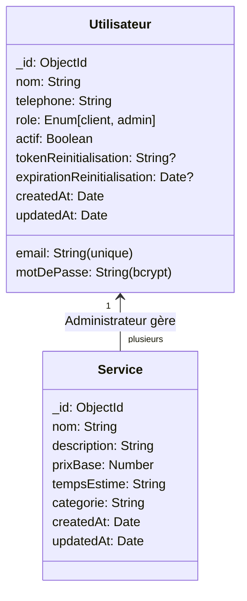
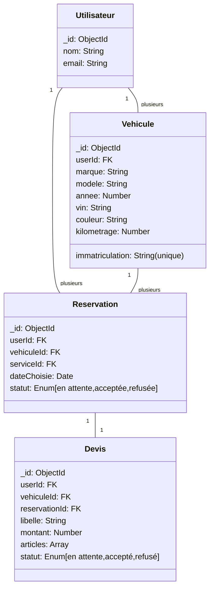
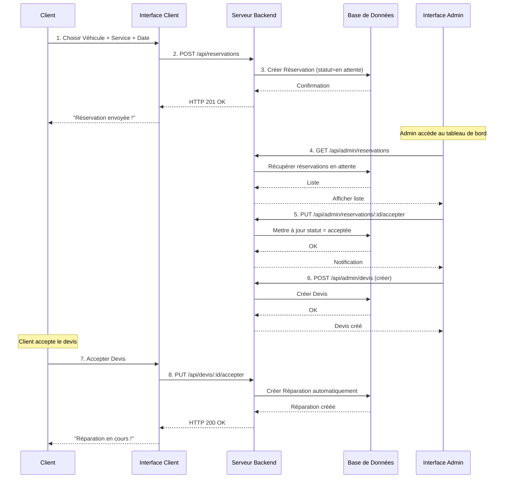
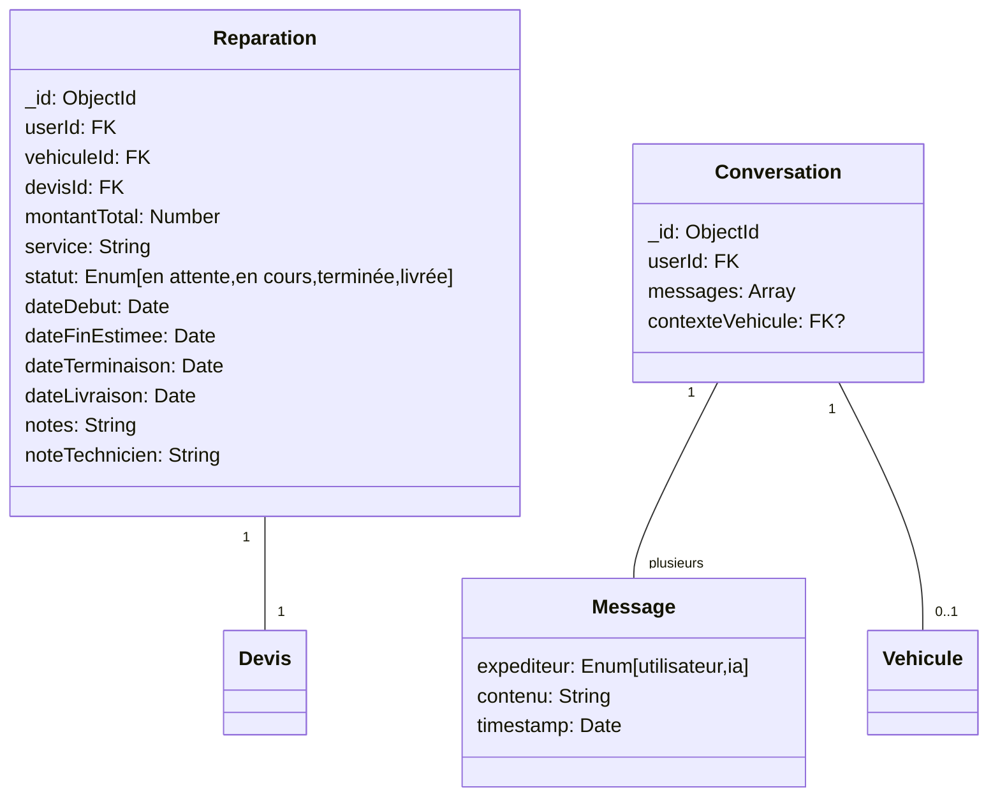
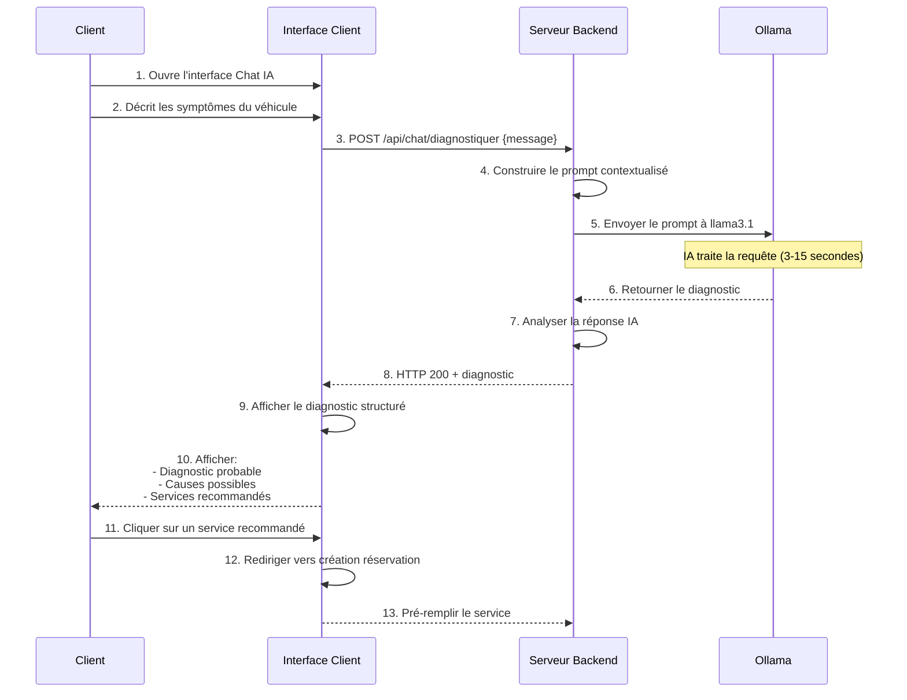
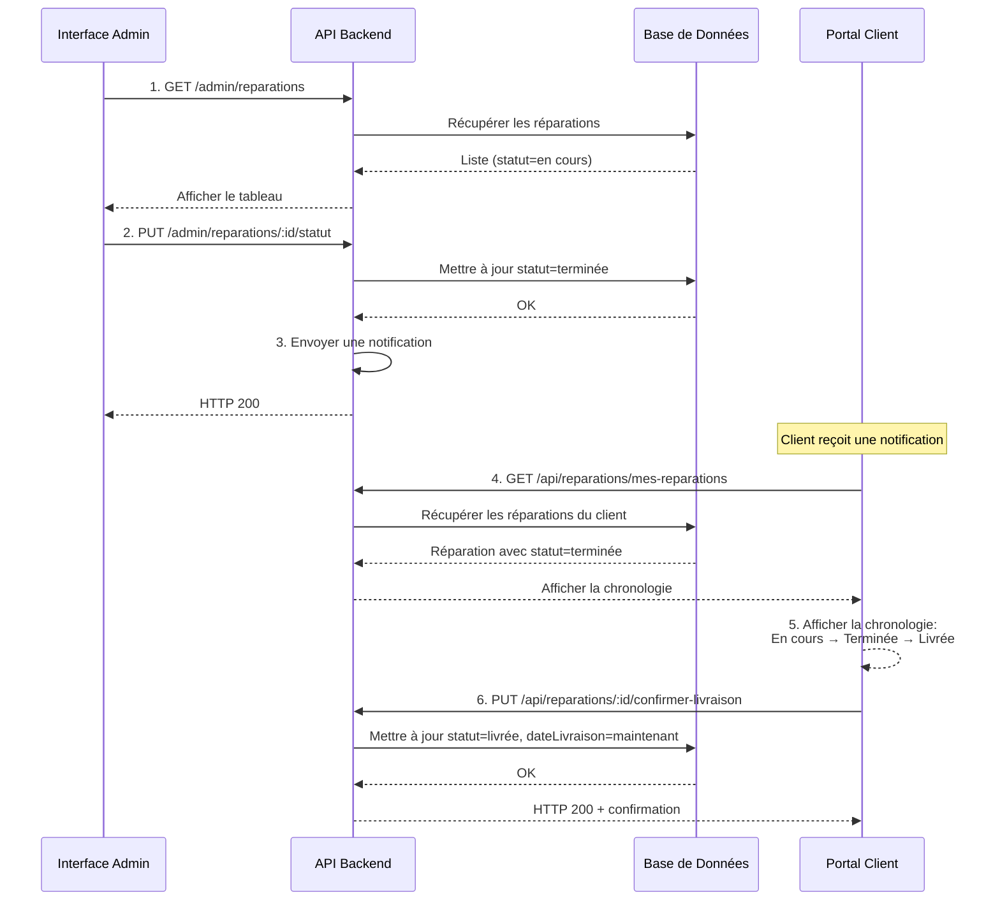

# Diagrammes Visuels UML - AutoExpert

## SPRINT 1 : Diagrammes Cas d'Utilisation

### Diagramme Global - Sprint 1

```mermaid
usecase
    actor Visiteur
    actor Client
    actor Admin
    actor Email["Système Email"]
    
    Visiteur --> (S'inscrire)
    Visiteur --> (Se connecter)
    Visiteur --> (Réinitialiser MDP)
    
    Client --> (Gérer Mon Profil)
    Client --> (Consulter Services)
    
    Admin --> (Gérer Comptes Clients)
    Admin --> (Gérer Services)
    Admin --> (Tableau de Bord Admin)
    
    (S'inscrire) .> (Valider Email) : <<inclure>>
    (Réinitialiser MDP) --> Email
    (Se connecter) .> (Générer JWT) : <<inclure>>
```

### Diagramme Raffiné - Sprint 1

```mermaid
usecase
    actor V["Visiteur"]
    actor C["Client"]
    actor A["Administrateur"]
    
    rectangle "Authentification & Accès" {
        V --> (US-1a: S'inscrire)
        V --> (US-1b: Se connecter)
        V --> (US-1c: Réinitialiser MDP)
        (S'inscrire) .> (Hash Bcrypt) : <<inclure>>
        (Se connecter) .> (Vérifier JWT) : <<inclure>>
        (Réinitialiser MDP) .> (Envoyer Email) : <<inclure>>
    }
    
    rectangle "Gestion Profil & Comptes" {
        C --> (US-1d: Gérer Mon Profil)
        A --> (US-1e: Gérer Comptes Clients)
    }
    
    rectangle "Gestion Catalogue Services" {
        A --> (US-2: CRUD Services)
        C --> (Consulter Catalogue)
        (CRUD Services) .> (Consulter Catalogue) : <<inclure>>
    }
    
    rectangle "Tableaux de Bord" {
        C --> (Tableau de Bord Client)
        A --> (Tableau de Bord Admin)
    }
```

### Diagramme de Classes - Sprint 1



---

## SPRINT 2 : Diagrammes Cas d'Utilisation

### Diagramme Global - Sprint 2

```mermaid
usecase
    actor Client
    actor Admin
    
    Client --> (Gérer Mes Véhicules)
    Client --> (Créer une Réservation)
    Client --> (Consulter Les Devis)
    
    Admin --> (Valider Réservations)
    Admin --> (Créer Devis)
    Admin --> (Consulter Les Devis Clients)
    
    (Créer une Réservation) .> (Sélectionner Véhicule) : <<inclure>>
    (Créer une Réservation) .> (Sélectionner Service) : <<inclure>>
    (Consulter Les Devis) .> (Accepter Devis) : <<extension>>
    (Accepter Devis) .> (Créer Réparation Auto) : <<inclure>>
```

### Diagramme Raffiné - Sprint 2

```mermaid
usecase
    actor C["Client"]
    actor A["Administrateur"]
    
    rectangle "Gestion Mes Véhicules" {
        C --> (US-3a: Ajouter Véhicule)
        C --> (US-3b: Modifier Véhicule)
        C --> (US-3c: Supprimer Véhicule)
        C --> (US-3d: Consulter Mes Véhicules)
        (Ajouter Véhicule) .> (Valider Immatriculation) : <<inclure>>
    }
    
    rectangle "Workflow Réservations" {
        C --> (US-4a: Créer Réservation)
        A --> (US-4b: Valider Réservation)
        A --> (US-4c: Refuser Réservation)
        C --> (US-4d: Annuler Réservation)
        (Créer Réservation) .> (Choisir Date) : <<inclure>>
    }
    
    rectangle "Workflow Devis & Réparation" {
        A --> (US-5a: Générer Devis)
        C --> (US-5b: Accepter Devis)
        C --> (US-5c: Refuser Devis)
        (Accepter Devis) .> (AUTO-Créer Réparation) : <<inclure>>
    }
```

### Diagramme de Classes - Sprint 2



### Diagramme Séquence - Workflow Réservation



---

## SPRINT 3 : Diagrammes Cas d'Utilisation

### Diagramme Global - Sprint 3

```mermaid
usecase
    actor Client
    actor Admin
    actor IA["Ollama (Intelligence Artificielle)"]
    
    Client --> (Suivre Réparation)
    Client --> (Chat IA pour Diagnostic)
    Client --> (Confirmer Récupération)
    
    Admin --> (Gérer Statut Réparation)
    Admin --> (Ajouter Notes Techniques)
    Admin --> (Consulter Tableau Analytique)
    
    (Chat IA pour Diagnostic) --> IA
```

### Diagramme Raffiné - Sprint 3

```mermaid
usecase
    actor C["Client"]
    actor A["Administrateur"]
    actor LLM["Ollama llama3.1"]
    
    rectangle "Suivi Réparations" {
        C --> (US-6b: Voir Chronologie Statut)
        C --> (US-6b: Consulter Notes Techniques)
        C --> (US-6b: Confirmer Récupération)
        A --> (US-6a: Changer le Statut)
        A --> (US-6a: Ajouter Notes Techniques)
        (Changer le Statut) .> (Notifier Client) : <<inclure>>
    }
    
    rectangle "Chat IA Automobile" {
        C --> (US-8: Décrire les Symptômes)
        (Décrire les Symptômes) --> LLM
        LLM --> (US-8: Générer Diagnostic)
        (Générer Diagnostic) .> (Recommander Services) : <<inclure>>
    }
    
    rectangle "Tableau de Bord Analytique" {
        A --> (US-7: Visualiser KPI)
        A --> (US-7: Voir Graphiques Revenus)
        A --> (US-7: Voir Activité Hebdomadaire)
        (Visualiser KPI) .> (Filtrer par Dates) : <<extension>>
    }
```

### Diagramme de Classes - Sprint 3



### Diagramme Séquence - Chat IA & Diagnostic



### Diagramme Séquence - Workflow Statut Réparation



---

## Résumé des Diagrammes UML

| Sprint | Type | Nombre | Format |
|--------|------|--------|--------|
| **Sprint 1** | Diagramme Cas d'Utilisation Global + Raffiné | 2 | Mermaid (Français) |
| **Sprint 1** | Diagramme de Classes | 1 | Mermaid (Français) |
| **Sprint 2** | Diagramme Cas d'Utilisation Global + Raffiné | 2 | Mermaid (Français) |
| **Sprint 2** | Diagramme de Classes | 1 | Mermaid (Français) |
| **Sprint 2** | Diagramme Séquence (Workflow Réservation) | 1 | Mermaid (Français) |
| **Sprint 3** | Diagramme Cas d'Utilisation Global + Raffiné | 2 | Mermaid (Français) |
| **Sprint 3** | Diagramme de Classes | 1 | Mermaid (Français) |
| **Sprint 3** | Diagramme Séquence (Chat IA) | 1 | Mermaid (Français) |
| **Sprint 3** | Diagramme Séquence (Statut Réparation) | 1 | Mermaid (Français) |
| | **TOTAL** | **12 diagrammes** | **✅ 100% en Français** |

---

✅ Tous les diagrammes sont maintenant entièrement en **français** pour une meilleure lisibilité et professionnalisme !

