# CHAPITRE 2 : Spécification des Besoins et Modélisation de la Solution

## Introduction

Ce chapitre est consacré à la spécification des besoins de la plateforme AutoExpert et à la modélisation de la solution. Il définit précisément ce que l'application doit faire avant de s'intéresser à sa réalisation technique.

On commence par cadrer le projet selon Scrum (vision, acteurs et besoins). On identifie ensuite les besoins fonctionnels et non fonctionnels, puis on modélise le système à l'aide de diagrammes UML. On présente également le Product Backlog, la planification des sprints et l'environnement technique retenu.

---

## 1. Cadrage du Projet selon Scrum

Avant de spécifier les besoins détaillés, il est essentiel de définir la vision globale du produit et d'identifier les acteurs qui interagiront avec le système.

### 1.1 Vision du produit

**Objectif global d'AutoExpert**

AutoExpert est une application web full-stack conçue pour digitaliser et automatiser intégralement la gestion d'un garage automobile. L'objectif est de moderniser la prise de rendez-vous, la gestion des devis et le suivi des réparations, en offrant une plateforme centralisée, intuitive et accessible en permanence.

**Valeur apportée aux utilisateurs**

Le produit vise à transformer l'expérience client en leur offrant la transparence sur l'état de leurs réparations, la facilité de planification via un système de réservation en ligne, et une assistance instantanée via une IA intégrée. Pour l'administrateur (garagiste), la valeur réside dans l'optimisation de son temps, l'organisation rigoureuse de son planning et une vision claire des indicateurs de performance de l'atelier.

---

### 1.2 Identification des acteurs

Avant d'identifier les exigences du système, il est essentiel de définir les acteurs principaux :

| Acteur | Définition | Tâches principales |
|--------|------------|-------------------|
| **Visiteur** | Personne non authentifiée ayant accès aux pages publiques uniquement. | Consulter l'accueil, consulter les services, s'inscrire, se connecter, demander un lien de réinitialisation de mot de passe par email. |
| **Utilisateur Authentifié** | Utilisateur ayant réussi la connexion, disposant d'un accès aux fonctionnalités privées. Hérite des capacités du Visiteur. | Gérer son profil, modifier ses informations personnelles, changer son mot de passe. |
| **Client** | Utilisateur authentifié interagissant avec les services du garage pour ses véhicules. Hérite des capacités de l'Utilisateur Authentifié. | Gérer ses véhicules, ses réservations, ses devis, ses réparations et utiliser le Chat IA. |
| **Administrateur** | Gestionnaire du garage disposant d'un accès complet au système. Hérite des capacités de l'Utilisateur Authentifié. | Gérer les clients, services, réservations, devis, réparations et consulter le tableau de bord analytique. |
| **Serveur Mail (Nodemailer)** | Acteur secondaire (système externe) utilisé pour l'envoi d'emails. | Envoyer les emails de réinitialisation de mot de passe. |

*Tableau 2.1 : Description des acteurs du système AutoExpert*

#### Hiérarchie des acteurs

Le système AutoExpert définit une hiérarchie d'acteurs basée sur le principe de généralisation UML :

**Niveau 0 : Visiteur**
- Acteur de base non authentifié
- Accès aux fonctionnalités publiques uniquement

**Niveau 1 : Utilisateur Authentifié**
- Hérite des capacités du Visiteur
- Accès aux fonctionnalités privées après connexion
- Peut gérer son profil

**Niveau 2 : Rôles spécialisés**
- **Client** : Hérite de Utilisateur Authentifié + gestion véhicules, réservations, devis et accès au Chat IA
- **Administrateur** : Hérite de Utilisateur Authentifié + gestion complète du système (clients, services, validation, statistiques)

Cette hiérarchie permet de factoriser les fonctionnalités communes et de respecter le principe DRY (Don't Repeat Yourself) dans la modélisation UML.

---

### 1.3 Les besoins fonctionnels par acteur

Après avoir identifié les acteurs, on détaille maintenant les besoins fonctionnels spécifiques à chaque rôle. Ces besoins décrivent ce que le système doit faire pour répondre aux attentes de chaque acteur.

#### A. Besoins fonctionnels du Visiteur

**Consultation publique :**
- L'application doit permettre à un visiteur de consulter la page d'accueil présentant les services du garage.
- L'application doit permettre à un visiteur de consulter le catalogue complet des services proposés.

**Gestion de l'authentification :**
- L'application doit permettre à un visiteur de s'inscrire (nom, téléphone, email unique, mot de passe ≥ 6 caractères).
- L'application doit permettre à un visiteur de se connecter (email / mot de passe).

**Gestion de la réinitialisation du mot de passe :**
1. L'application doit permettre à un utilisateur de demander la réinitialisation en saisissant son email.
2. Le système génère un token unique et envoie un email contenant un lien sécurisé (usage unique, expire après 24h).
3. L'utilisateur clique sur le lien et définit un nouveau mot de passe.

#### B. Besoins fonctionnels de l'Utilisateur Authentifié

**Gestion du profil :**
- L'application doit permettre à l'utilisateur authentifié de consulter ses informations personnelles.
- L'application doit permettre à l'utilisateur authentifié de mettre à jour ses informations (nom, téléphone, email).
- L'application doit permettre à l'utilisateur authentifié de modifier son mot de passe.

#### C. Besoins fonctionnels du Client

**Gestion des véhicules :**
- L'application doit permettre au client d'ajouter un véhicule (Marque, Modèle, Année, Immatriculation, VIN, Kilométrage, Couleur).
- L'application doit permettre au client de consulter la liste de ses véhicules.
- L'application doit permettre au client de modifier les informations d'un véhicule.
- L'application doit permettre au client de supprimer un véhicule.

**Gestion des réservations :**
- L'application doit permettre au client de créer une réservation en sélectionnant un véhicule, un service et une date.
- L'application doit permettre au client de consulter l'historique de ses réservations.
- L'application doit permettre au client d'annuler une réservation en attente ou confirmée.

**Gestion des devis :**
- L'application doit permettre au client de demander un devis pour un service spécifique.
- L'application doit permettre au client de consulter les détails d'un devis (services, prix, date de validité).
- L'application doit permettre au client d'accepter ou de refuser un devis formalisé.

**Suivi des réparations :**
- L'application doit permettre au client de suivre l'avancement de ses réparations en temps réel.
- L'application doit afficher le statut actuel de chaque réparation (En cours, Terminée, Livrée).

**Assistance virtuelle :**
- L'application doit permettre au client d'interagir avec une IA spécialisée (llama3.1 via Ollama).
- L'IA doit analyser les symptômes saisis par le client.
- L'IA doit générer un pré-diagnostic automobile personnalisé.
- L'IA doit recommander les services appropriés avant toute prise de rendez-vous.

#### D. Besoins fonctionnels de l'Administrateur

**Tableau de bord analytique :**
- L'application doit permettre à l'administrateur de consulter les revenus totaux.
- L'application doit permettre à l'administrateur de visualiser le nombre de réservations (aujourd'hui, cette semaine, ce mois).
- L'application doit permettre à l'administrateur de consulter des statistiques en temps réel sous forme de graphiques (Recharts).

**Gestion des clients :**
- L'application doit permettre à l'administrateur de consulter la liste complète des clients.
- L'application doit permettre à l'administrateur de bloquer ou activer un compte client.
- L'application doit permettre à l'administrateur de supprimer un compte client.

**Gestion des services :**
- L'application doit permettre à l'administrateur de créer un nouveau service (nom, description, prix de base, durée estimée, catégorie).
- L'application doit permettre à l'administrateur de modifier un service existant.
- L'application doit permettre à l'administrateur d'archiver ou d'activer un service.

**Gestion des réservations :**
- L'application doit permettre à l'administrateur de consulter toutes les réservations (tous statuts confondus).
- L'application doit permettre à l'administrateur d'accepter une réservation en attente.
- L'application doit permettre à l'administrateur de refuser une réservation.

**Gestion des devis :**
- L'application doit permettre à l'administrateur de créer un devis chiffré pour un client.
- Le devis doit inclure la liste des services requis avec quantités et prix unitaires.
- L'application doit calculer automatiquement le prix total du devis.
- L'application doit permettre à l'administrateur de suivre l'état du devis (En attente, Accepté, Refusé).

**Gestion des réparations :**
- L'application doit déclencher automatiquement une réparation suite à l'acceptation d'un devis par le client.
- L'application doit permettre à l'administrateur de faire évoluer le statut d'une réparation : En cours → Terminée → Livrée.
- L'application doit permettre à l'administrateur d'ajouter des notes techniques sur une réparation.

---

### 1.4 Besoins non fonctionnels

Au-delà des fonctionnalités métier, le système doit respecter des contraintes de qualité transversales. Ces besoins non fonctionnels garantissent la sécurité, la performance et l'ergonomie de la plateforme.

| ID | Attribut | Description |
|----|----------|-------------|
| **BNF1** | Sécurité | Routes API protégées par JWT, hachage des mots de passe via Bcrypt (10 rounds). Liens de réinitialisation à usage unique expirant après 24 heures. Protection CORS configurée. |
| **BNF2** | Authentification | Accès aux fonctionnalités privées conditionné à l'authentification obligatoire. Token JWT valide pendant 30 jours. Redirection automatique vers la page de connexion si non authentifié. |
| **BNF3** | Ergonomie | Interface intuitive avec rétroactions immédiates (toasts, validation en temps réel via React Hook Form), design moderne et navigation fluide. Feedback visuel pour toutes les actions utilisateur. |
| **BNF4** | Portabilité | Application responsive et compatible avec les navigateurs modernes (Chrome, Firefox, Edge, Safari) sur mobile, tablette et desktop. Design adaptatif via Tailwind CSS. |
| **BNF5** | Performance | Temps de réponse du serveur inférieur à 2–3 secondes pour toutes les opérations classiques. Optimisation des requêtes MongoDB via indexes. Lazy loading des composants React. |
| **BNF6** | Disponibilité | L'assistant IA doit être disponible 24/7 pour fournir des pré-diagnostics instantanés aux clients. |
| **BNF7** | Maintenabilité | Code structuré selon l'architecture MERN. Séparation claire des responsabilités (MVC). Documentation inline et commentaires explicatifs. |

*Tableau 2.2 : Besoins non fonctionnels du système AutoExpert*

---

## 2. Modélisation UML

Après avoir défini les besoins, on passe à la modélisation du système à l'aide du langage UML. Cette modélisation permet de visualiser les interactions entre acteurs et système, ainsi que la structure des données.

### 2.1 Diagramme de cas d'utilisation global

Le diagramme de cas d'utilisation (Use Case Diagram) est un outil UML qui représente les interactions entre les acteurs externes et le système. Chaque ellipse représente une fonctionnalité observable par un acteur, et les relations modélisent les dépendances entre cas d'utilisation.

#### Relations UML utilisées

**`<<include>>` : Relation d'inclusion obligatoire**
- Le cas inclus s'exécute systématiquement.
- Exemple : "Demander réinitialisation MDP" inclut toujours "Envoyer email réinitialisation".

**`<<extend>>` : Relation d'extension conditionnelle**
- Le cas étendu s'exécute uniquement si une condition est remplie.
- Exemple : "Réinitialiser le mot de passe" étend "Envoyer email réinitialisation" si l'utilisateur clique sur le lien.

**Généralisation (héritage) : `<|--`**
- Indique qu'un acteur hérite des capacités d'un autre acteur.
- Exemple : Client hérite de Utilisateur Authentifié (Client `<|--` UA).
- Le Client peut faire tout ce que fait un Utilisateur Authentifié + ses fonctionnalités spécifiques.

**Association simple (→) :**
- Indique qu'un acteur initie directement un cas d'utilisation ou qu'un cas utilise un acteur secondaire.

---

#### Code source PlantUML — Figure 2.1

Coller ce code sur [planttext.com](https://www.planttext.com) pour générer le diagramme :

```plantuml
@startuml UseCaseGlobal_AutoExpert_Final
skinparam actorStyle awesome
skinparam usecase {
  BackgroundColor #D6E4F7
  BorderColor #2E5DA8
  FontSize 11
}
skinparam packageStyle rectangle
skinparam shadowing false

' ===== ACTEURS AVEC HIÉRARCHIE =====
actor "Visiteur" as V
actor "Utilisateur\nAuthentifié" as UA
actor "Client" as C
actor "Administrateur" as A
actor "Serveur Mail\n(Nodemailer)" as MAIL

' ===== HIÉRARCHIE D'HÉRITAGE =====
V <|-- UA
UA <|-- C
UA <|-- A

' ===== SYSTÈME AUTOEXPERT =====
rectangle "AutoExpert" {
 
  package "Accès Public" {
    usecase "Consulter l'accueil" as UC_HOME
    usecase "Consulter les services" as UC_SERV
    usecase "S'inscrire" as UC_REG
    usecase "Se connecter" as UC_LOG
    usecase "Demander réinitialisation MDP" as UC_FORGOT
    usecase "Envoyer email réinitialisation" as UC_SEND_EMAIL
    usecase "Réinitialiser le mot de passe" as UC_RESET
  }
 
  package "Fonctionnalités Authentifiées" {
    usecase "Gérer son Profil" as UC_PROFIL
  }
 
  package "Espace Client" {
    usecase "Gérer ses Véhicules" as UC_VEHI
    usecase "Créer une Réservation" as UC_RESA
    usecase "Consulter ses Réservations" as UC_RESA_V
    usecase "Annuler une Réservation" as UC_RESA_C
    usecase "Demander un Devis" as UC_DV_REQ
    usecase "Accepter / Refuser un Devis" as UC_DV_ACC
    usecase "Suivre ses Réparations" as UC_REP
    usecase "Chat IA Automobile" as UC_CHAT
  }
 
  package "Espace Administration" {
    usecase "Tableau de Bord" as UC_DASH
    usecase "Gérer les Clients" as UC_AD_CLI
    usecase "Gérer les Services" as UC_AD_SRV
    usecase "Valider les Réservations" as UC_AD_RES
    usecase "Créer un Devis" as UC_AD_DV
    usecase "Gérer les Réparations" as UC_AD_REP
  }
  
  package "Intelligence Artificielle" {
    usecase "Analyser symptômes" as UC_IA_ANALYZE
    usecase "Générer pré-diagnostic" as UC_IA_DIAG
  }
}

' ===== RELATIONS VISITEUR =====
V --> UC_HOME
V --> UC_SERV
V --> UC_REG
V --> UC_LOG
V --> UC_FORGOT

' ===== RELATIONS RÉINITIALISATION MDP =====
UC_FORGOT ..> UC_SEND_EMAIL : <<include>>
UC_SEND_EMAIL --> MAIL : utilise
UC_RESET ..> UC_SEND_EMAIL : <<extend>>\ncondition: lien cliqué

' ===== RELATIONS UTILISATEUR AUTHENTIFIÉ =====
UA --> UC_PROFIL

' ===== RELATIONS CLIENT =====
C --> UC_VEHI
C --> UC_RESA
C --> UC_RESA_V
C --> UC_RESA_C
C --> UC_DV_REQ
C --> UC_DV_ACC
C --> UC_REP
C --> UC_CHAT

' ===== RELATIONS ADMINISTRATEUR =====
A --> UC_DASH
A --> UC_AD_CLI
A --> UC_AD_SRV
A --> UC_AD_RES
A --> UC_AD_DV
A --> UC_AD_REP

' ===== RELATIONS IA INTERNE =====
UC_CHAT ..> UC_IA_ANALYZE : <<include>>
UC_IA_ANALYZE ..> UC_IA_DIAG : <<include>>

' ===== NOTES EXPLICATIVES =====
note right of UC_RESET
  Extension conditionnelle :
  S'exécute uniquement si
  l'utilisateur clique sur
  le lien dans l'email
end note

note bottom of UA
  Utilisateur Authentifié :
  Hérite des capacités du Visiteur
  + accès aux fonctionnalités privées
end note

note right of UC_CHAT
  Le Chat IA analyse les symptômes
  et génère un pré-diagnostic
  automatique pour le client
end note

@enduml
```

*Figure 2.1 : Diagramme de cas d'utilisation global d'AutoExpert avec hiérarchie d'acteurs*

---

## 3. Modèle des Données

Le diagramme de cas d'utilisation ayant défini les interactions fonctionnelles, on s'intéresse maintenant à la structure des données. Le modèle de données décrit les entités manipulées par le système et leurs relations.

### 3.1 Tableau des Entités et Attributs

| Entité | Attributs principaux | Type | Contrainte |
|--------|---------------------|------|------------|
| **User** | _id, name, email, password, phone, role, isActive, resetPasswordToken, resetPasswordExpires, createdAt | String, Boolean, Date | email unique ; role ∈ {client, admin} ; password haché Bcrypt |
| **Vehicle** | _id, userId, make, model, year, licensePlate, VIN, mileage, color | String, Number, ObjectId | licensePlate unique ; userId référence User |
| **Service** | _id, name, description, basePrice, estimatedTime, category, isActive | String, Number, Boolean | category ∈ {Entretien, Réparation, Diagnostic, Carrosserie} |
| **Reservation** | _id, userId, vehicleId, serviceId, date, status, notes | ObjectId, Date, String | status ∈ {pending, confirmed, completed, cancelled} |
| **Devis** | _id, userId, vehicleId, services[], totalPrice, status, validUntil, description | ObjectId, Number, Date | status ∈ {pending, accepted, rejected} ; services = [{serviceId, quantity, unitPrice}] |
| **Reparation** | _id, vehicleId, devisId, services[], status, startDate, endDate, notes | ObjectId, Date, String | status ∈ {in_progress, completed, delivered} |

*Tableau 2.3 : Entités et attributs du système AutoExpert*

**Note :** Les ObjectId représentent des références entre collections MongoDB (équivalent des clés étrangères). Les tableaux services[] dans Devis et Reparation contiennent des sous-documents avec les détails de chaque service.

---

## 4. Gestion de Projet avec Scrum

Les besoins et le modèle de données étant définis, on organise maintenant le travail selon la méthodologie Scrum. Cette section présente l'équipe, le Product Backlog et la planification des sprints.

### 4.1 L'équipe Scrum

| Rôle | Nom | Responsabilités |
|------|-----|-----------------|
| **Scrum Master** | Abir Ben Cheikh | Faciliter le processus Scrum, animer les cérémonies, éliminer les obstacles. |
| **Product Owner** | Skander Belloum | Définir la vision du produit, prioriser le Product Backlog. |
| **Équipe de développement** | Yassine Aounallah | Développer les fonctionnalités, concevoir l'architecture, exécuter les tests. |

*Tableau 2.4 : Composition de l'équipe Scrum*

---

### 4.2 Le Product Backlog

| Module | ID | Histoire Utilisateur | Priorité | Pts |
|--------|----|--------------------|----------|-----|
| **Foundational Setup** | 1a | **En tant que** Visiteur, **je veux** m'inscrire **afin de** créer un compte client. | Haute | 3 |
| | 1b | **En tant que** Visiteur, **je veux** me connecter **afin d'** accéder à mon espace. | Haute | 2 |
| | 1c | **En tant qu'** Utilisateur, **je veux** réinitialiser mon MDP par email **afin de** retrouver mon accès. | Haute | 3 |
| | 1d | **En tant que** Client, **je veux** modifier mon profil **afin de** maintenir mes infos à jour. | Haute | 2 |
| | 2 | **En tant qu'** Admin, **je veux** gérer les services **afin de** définir le catalogue. | Haute | 2 |
| **Operational Essentials** | 3 | **En tant que** Client, **je veux** gérer mes véhicules **afin de** suivre mon parc auto. | Haute | 3 |
| | 4 | **En tant que** Client/Admin, **je veux** gérer les réservations **afin d'** organiser le planning. | Haute | 7 |
| | 5 | **En tant qu'** Admin/Client, **je veux** gérer les devis **afin de** valider les travaux. | Haute | 7 |
| **Application Control** | 6 | **En tant qu'** Admin, **je veux** gérer les réparations **afin d'** informer le client. | Haute | 2 |
| | 7 | **En tant qu'** Admin, **je veux** consulter le dashboard **afin d'** avoir une vue d'ensemble. | Moyenne | 3 |
| | 8 | **En tant que** Client, **je veux** utiliser le Chat IA **afin d'** obtenir un pré-diagnostic. | Moyenne | 3 |

*Tableau 2.5 : Product Backlog d'AutoExpert*

---

### 4.3 Planification des Sprints

| Sprint | Module | Fonctionnalités | Durée |
|--------|--------|----------------|-------|
| **Sprint 1** | Foundational Setup | US 1a, 1b, 1c, 1d, 2 | 1 semaine |
| **Sprint 2** | Operational Essentials | US 3, 4, 5 | 1 semaine |
| **Sprint 3** | Application Control | US 6, 7, 8 | 1 semaine |

*Tableau 2.6 : Sprint Planning*

---

## 5. Environnement de Travail

Pour mener à bien ce projet, un environnement de développement adapté a été mis en place. Cette section décrit le matériel, les logiciels et l'architecture technique utilisés.

### 5.1 Environnement matériel

| Composant | Spécification |
|-----------|---------------|
| **Processeur** | Intel Core i5-11400H |
| **RAM** | 16 Go DDR4 |
| **Stockage** | SSD 512 Go NVMe |
| **OS** | Windows 11 Pro |
| **Écran** | 1920 × 1080 Full HD |

*Tableau 2.7 : Environnement matériel*

---

### 5.2 Environnement logiciel

#### A. Outils de développement

| Outil | Description |
|-------|-------------|
| **VS Code** | Éditeur principal avec extensions (ESLint, Prettier, MongoDB) |
| **GitHub** | Versioning et collaboration |
| **Postman** | Tests API REST |

*Tableau 2.8 : Outils de développement*

---

#### B. Frameworks et Bibliothèques

| Technologie | Rôle | Description |
|-------------|------|-------------|
| **Node.js** | Runtime Backend | Environnement JavaScript côté serveur |
| **Express.js** | Framework Backend | API REST minimaliste |
| **React.js** | Framework Frontend | Composants réutilisables + Vite |
| **Tailwind CSS** | Stylisation | Framework CSS utilitaire |
| **Mongoose** | ODM MongoDB | Schémas typés et validation |
| **Axios** | Client HTTP | Requêtes asynchrones |
| **Nodemailer** | Service Email | Envoi emails SMTP |
| **Ollama** | Moteur IA | LLM local (llama3.1) |
| **Recharts** | Visualisation | Graphiques React |

*Tableau 2.9 : Technologies utilisées*

---

### 5.3 Architecture MERN

**Composants :**
- **Frontend :** React.js (Port 5173) — SPA avec Vite + Tailwind CSS
- **Backend :** Node.js + Express.js (Port 5000) — API REST sécurisée par JWT
- **Base de données :** MongoDB (Port 27017) — Documents JSON via Mongoose
- **Moteur IA :** Ollama llama3.1 (Port 11434) — Assistant de diagnostic

Cette architecture assure une séparation claire entre les couches tout en maintenant une homogénéité JavaScript de bout en bout.

**Flux de communication :**
1. Le Frontend (React) envoie des requêtes HTTP avec token JWT
2. Le Backend (Express) valide le token et traite la requête
3. MongoDB stocke et récupère les données via Mongoose
4. Ollama fournit les réponses IA pour le Chat automobile

---

## Conclusion

Ce chapitre a formalisé l'ensemble des besoins et spécifications du projet AutoExpert. On a d'abord défini la vision du produit et identifié cinq acteurs avec une hiérarchie claire (Visiteur → Utilisateur Authentifié → Client/Admin). Les besoins fonctionnels ont été détaillés pour chaque acteur, complétés par sept besoins non fonctionnels garantissant la qualité du système.

La modélisation UML a permis de visualiser les interactions via un diagramme de cas d'utilisation intégrant les relations d'inclusion, d'extension et de généralisation. Le modèle de données a structuré six entités principales avec leurs attributs et contraintes.

La gestion de projet Scrum a organisé le travail en un Product Backlog de 37 points répartis sur trois sprints d'une semaine. Enfin, l'environnement technique basé sur l'architecture MERN (MongoDB, Express, React, Node.js) et enrichi par Ollama pour l'IA constitue une base solide et moderne.

Le chapitre suivant détaillera la phase de réalisation technique, sprint par sprint, avec les diagrammes de séquence et les tests de validation.

---

**Rédigé par :** Yassine Aounallah  
**Encadré par :** M. Skander Belloum  
**Date :** Janvier 2026
