# CHAPITRE 3 : Réalisation et Tests

## Introduction

Ce chapitre décrit la mise en œuvre pratique d'AutoExpert, découpée en trois sprints successifs selon Scrum. Pour chaque sprint, on présente le backlog, les diagrammes UML (Use Case, Classes, Séquences) et les interfaces réalisées. On conclut par les tests de validation.

Suite à la spécification des besoins et à la modélisation présentées au chapitre précédent, on passe maintenant à la phase de développement concret. Chaque sprint sera détaillé avec ses objectifs, ses diagrammes techniques et ses réalisations.

---

## Sprint 1 : Foundational Setup (Auth & Services)

Le premier sprint pose les fondations sécurisées de l'application. On y développe l'authentification complète (inscription, connexion, réinitialisation MDP) et la gestion des services par l'administrateur.

### 📋 Fonctionnalités – Sprint 1

| ID | Fonctionnalité | Statut |
|----|----------------|--------|
| **1a-1d** | Inscription, Connexion, Reset MDP, Profil | ✅ |
| **2** | Gestion des services (Admin) | ✅ |

---

### 1.1 Backlog du Sprint 1

| ID | User Story | Tâches | Effort |
|----|-----------|--------|--------|
| **1** | Visiteur : créer compte et se connecter | • Backend auth (JWT, Bcrypt) • UI formulaires • Tests | Difficile (5 pts) |
| **2** | Utilisateur : réinitialiser MDP via email | • Backend token + Nodemailer • UI reset • Tests | Intermédiaire (3 pts) |
| **3** | Client : gérer son profil | • Backend update profil • UI paramètres • Tests | Facile (2 pts) |
| **4** | Admin : gérer les services | • Backend CRUD services • UI catalogue • Tests | Facile (2 pts) |

*Tableau 3.1 : Sprint Backlog 1*

---

### 1.2 Diagramme de Cas d'Utilisation – Sprint 1

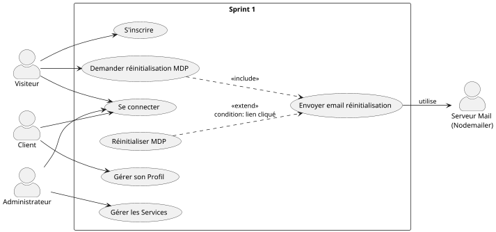

*Figure 3.1 : Use Case Sprint 1*

---

### 1.3 Diagramme de Classes – Sprint 1

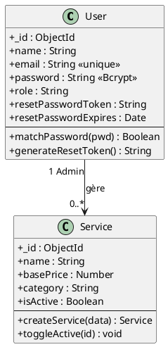

*Figure 3.2 : Classes Sprint 1*

---

### 1.4 Séquence – Inscription

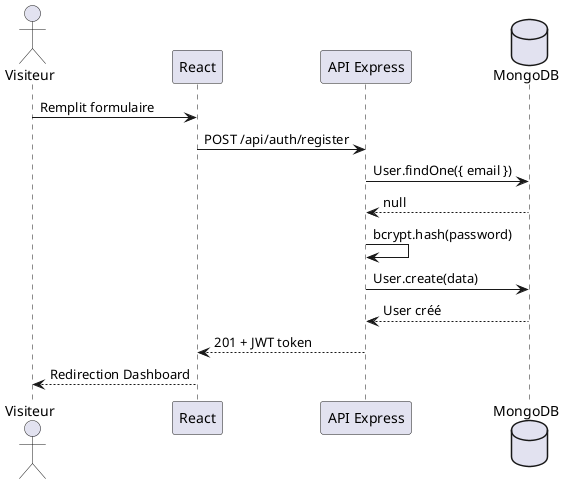

*Figure 3.3 : Séquence Inscription*

---

### 1.5 Séquence – Réinitialisation MDP

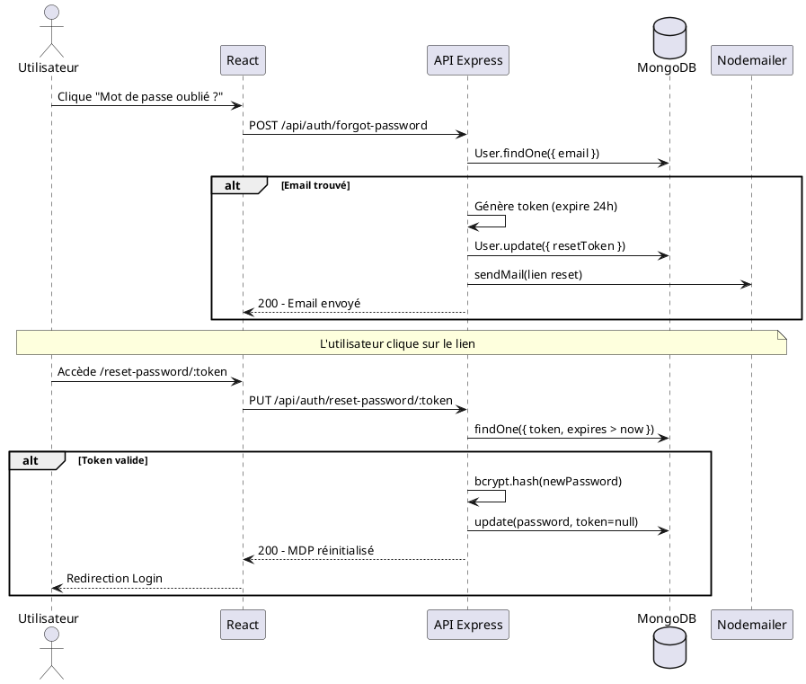

*Figure 3.4 : Séquence Reset MDP*

Le Sprint 1 a permis de mettre en place une base sécurisée avec JWT et Bcrypt. On passe maintenant au Sprint 2 qui implémente le cœur métier de l'application.

---

## Sprint 2 : Operational Essentials

Le deuxième sprint se concentre sur les fonctionnalités opérationnelles essentielles : la gestion des véhicules, des réservations et des devis. Ces modules constituent le cœur métier de la plateforme.

### 📋 Fonctionnalités – Sprint 2

| ID | Fonctionnalité | Statut |
|----|----------------|--------|
| **3** | Gestion des véhicules | ✅ |
| **4** | Gestion des réservations | ✅ |
| **5** | Gestion des devis | ✅ |

---

### 2.1 Backlog du Sprint 2

| ID | User Story | Tâches | Effort |
|----|-----------|--------|--------|
| **5** | Client : gérer mes véhicules | • Backend CRUD véhicules • UI formulaire • Tests | Intermédiaire (3 pts) |
| **6** | Client : créer une réservation | • Backend réservation • UI sélection date/service • Tests | Difficile (4 pts) |
| **7** | Admin : valider les réservations | • Backend validation • UI demandes en attente • Tests | Intermédiaire (3 pts) |
| **8** | Admin : créer des devis | • Backend devis • UI élaboration devis • Tests | Difficile (4 pts) |

*Tableau 3.2 : Sprint Backlog 2*

---

### 2.2 Diagramme de Cas d'Utilisation – Sprint 2

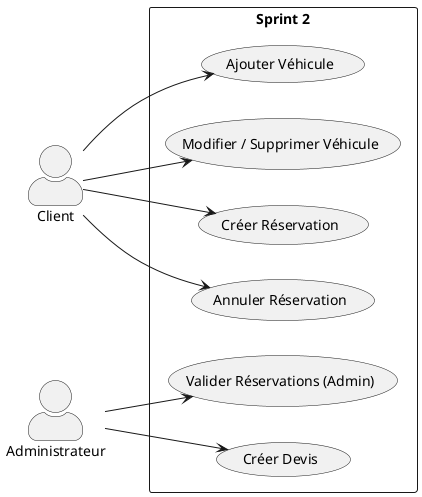

*Figure 3.5 : Use Case Sprint 2*

---

### 2.3 Diagramme de Classes – Sprint 2

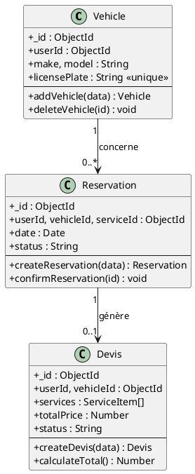

*Figure 3.6 : Classes Sprint 2*

---

### 2.4 Séquence – Ajout Véhicule

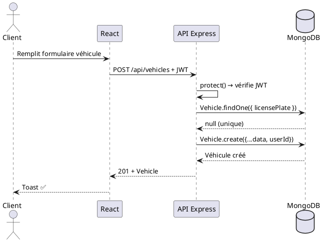

*Figure 3.7 : Séquence Ajout Véhicule*

---

### 2.5 Séquence – Prise de RDV

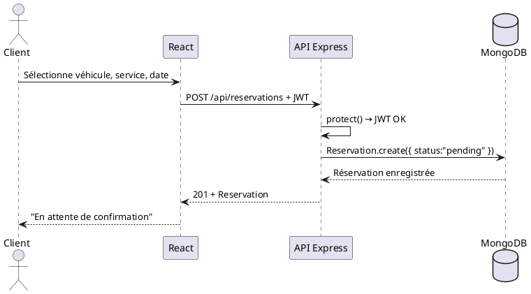

*Figure 3.8 : Séquence Réservation*

Le Sprint 2 a implémenté les fonctionnalités transactionnelles principales. On passe maintenant au Sprint 3 qui apporte l'intelligence artificielle et les outils de pilotage.

---

## Sprint 3 : Application Control (Suivi & IA)

Le troisième et dernier sprint finalise la plateforme avec les fonctionnalités avancées : suivi des réparations, tableau de bord analytique et l'innovation majeure du projet, le Chat IA de diagnostic automobile.

### 📋 Fonctionnalités – Sprint 3

| ID | Fonctionnalité | Statut |
|----|----------------|--------|
| **6** | Suivi des réparations | ✅ |
| **7** | Dashboard admin | ✅ |
| **8** | Chat IA diagnostic | ✅ |

---

### 3.1 Backlog du Sprint 3

| ID | User Story | Tâches | Effort |
|----|-----------|--------|--------|
| **9** | Client : accepter/refuser devis | • Backend décision devis • Création auto réparation • Tests | Intermédiaire (3 pts) |
| **10** | Admin : suivre les réparations | • Backend transitions état • UI mise à jour • Tests | Facile (2 pts) |
| **11** | Admin : consulter dashboard | • Backend agrégations • UI Recharts • Tests | Intermédiaire (3 pts) |
| **12** | Client : Chat IA | • Backend Ollama • UI Chat • Tests | Intermédiaire (3 pts) |

*Tableau 3.3 : Sprint Backlog 3*

---

### 3.2 Diagramme de Cas d'Utilisation – Sprint 3

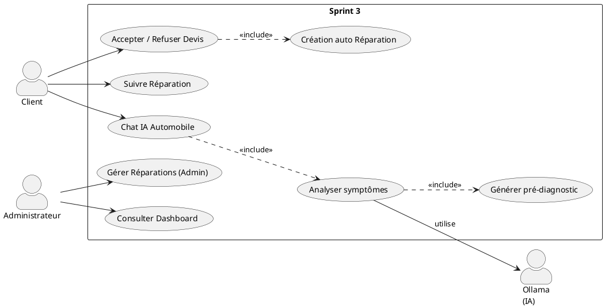

*Figure 3.9 : Use Case Sprint 3*

---

### 3.3 Diagramme de Classes – Sprint 3

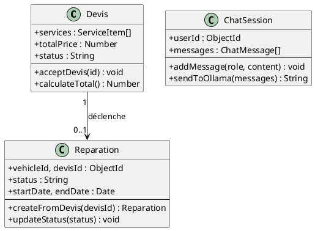

*Figure 3.10 : Classes Sprint 3*

---

### 3.4 Séquence – Acceptation Devis

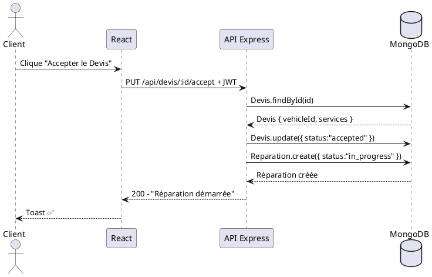

*Figure 3.11 : Séquence Accepter Devis*

---

### 3.5 Séquence – Chat IA

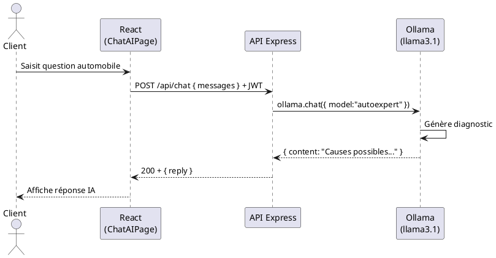

*Figure 3.12 : Séquence Chat IA*

Le Sprint 3 a finalisé l'application avec l'intégration de l'IA et du dashboard. On analyse maintenant les rétrospectives de chaque sprint pour identifier les leçons apprises.

---

## 3.7 Rétrospectives Scrum

Conformément à la méthodologie Scrum, une rétrospective a été organisée à la fin de chaque sprint pour analyser le déroulement et identifier les axes d'amélioration.

### Sprint 1 — Rétrospective

| Aspect | Détails |
|--------|---------|
| **✅ Points positifs** | • Authentification JWT robuste • Réinitialisation Email fonctionnelle • Hachage Bcrypt sécurisé |
| **⚠️ Difficultés** | • Configuration initiale React/Vite • Gestion asynchrone Bcrypt • Validation formulaires complexe |
| **🔄 Actions** | • Standardisation Axios interceptors • Amélioration gestion erreurs • Documentation middleware |

### Sprint 2 — Rétrospective

| Aspect | Détails |
|--------|---------|
| **✅ Points positifs** | • Relations Mongoose complexes maîtrisées • CRUD Véhicules fluide • Validation immatriculation unique |
| **⚠️ Difficultés** | • Validation imbriquée Devis • Gestion dates Réservations • Calcul automatique prix total |
| **🔄 Actions** | • Refactorisation validation • Utilisation date-fns • Méthodes Mongoose pre-save |

### Sprint 3 — Rétrospective

| Aspect | Détails |
|--------|---------|
| **✅ Points positifs** | • Intégration Ollama IA réussie • Graphiques Recharts dynamiques • Workflow Devis→Réparation automatique |
| **⚠️ Difficultés** | • Temps de réponse IA (~2.5s) • Agrégations MongoDB complexes • Gestion historique Chat |
| **🔄 Actions** | • Loading states (UI) • Optimisation Pipeline Mongo • Streaming réponses IA |

*Tableau 3.6 : Rétrospectives des trois sprints*

Les rétrospectives ont permis d'améliorer continuellement le processus de développement. On passe maintenant à la phase de validation par les tests.

---

## 4. Tests et Validation

Après avoir développé l'ensemble des fonctionnalités, il est essentiel de valider la qualité de la solution. Cette section présente les tests fonctionnels, de sécurité et de performance réalisés.

### 4.1 Tests fonctionnels

Les tests fonctionnels ont été réalisés manuellement via Postman pour les API et en navigation réelle côté client.

**Validation des formulaires (React Hook Form) :**
- Champs obligatoires (soumission impossible si vide)
- Validation format email
- Unicité plaque d'immatriculation
- Force du mot de passe

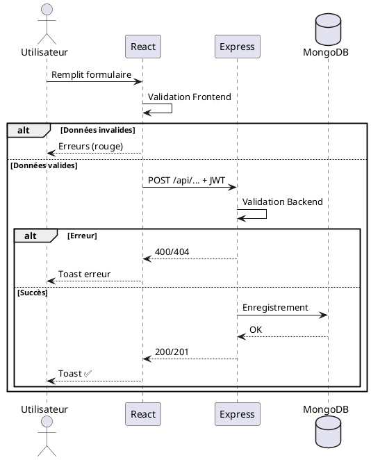

*Figure 3.13 : Flux de validation*

Les tests fonctionnels ayant validé le comportement de l'application, on vérifie maintenant les aspects sécuritaires.

---

### 4.2 Tests de sécurité

La sécurité étant une priorité absolue, plusieurs tests ont été réalisés pour garantir la protection des données et des accès.

**Protection JWT :**
- Utilisateur non authentifié → 401 Unauthorized
- Client accédant route admin → 403 Forbidden

**Hachage des mots de passe :**
- Stockage et comparaison via bcryptjs (10 rounds)
- Jamais en clair dans MongoDB

**Tokens de réinitialisation :**
- Rejet des tokens expirés (> 24h)
- Usage unique

La sécurité étant assurée, on évalue maintenant les performances de l'application.

---

### 4.3 Tests de performance

Les performances ont été mesurées sur les endpoints critiques pour garantir une expérience utilisateur fluide.

| Endpoint / Action | Temps moyen | Optimisation | Statut |
|-------------------|-------------|--------------|--------|
| `POST /api/auth/login` | ~300ms | Index email MongoDB | ✅ |
| `GET /api/admin/dashboard` | ~450ms | Aggregation Pipeline | ✅ |
| `POST /api/chat` (IA) | ~2.5s | Loading Spinner | ⚠️ Acceptable |
| `GET /api/vehicles` | ~200ms | Index userId + Pagination | ✅ |
| Chargement React | ~0.8s | Vite + Lazy Loading | ✅ |

*Tableau 3.4 : Temps de réponse*

Les résultats de performance sont satisfaisants. On synthétise maintenant l'ensemble des tests réalisés.

---

### 4.4 Tableau récapitulatif des tests

Le tableau suivant synthétise l'ensemble des tests réalisés sur la plateforme AutoExpert, couvrant les aspects fonctionnels, sécuritaires et de performance.

| Fonctionnalité | Type | Résultat | Observations |
|----------------|------|----------|--------------|
| Inscription & Connexion | Fonctionnel | ✅ | JWT + Bcrypt |
| Réinitialisation MDP | Fonctionnel | ✅ | Nodemailer + token 24h |
| CRUD Véhicules | Fonctionnel | ✅ | Immatriculation unique |
| Flux Réservation → Devis | Fonctionnel | ✅ | États cohérents |
| Acceptation Devis → Réparation | Fonctionnel | ✅ | Création automatique |
| Chat IA | Fonctionnel | ✅ | Llama3.1 mécanique |
| Dashboard statistiques | Fonctionnel | ✅ | Recharts dynamiques |
| Contrôle accès Admin | Sécurité | ✅ | Erreur 403 |
| Contrôle accès Client | Sécurité | ✅ | Redirect /login |
| Token JWT expiration | Sécurité | ✅ | Renouvellement 30j |
| Validation formulaires | Sécurité | ✅ | React Hook Form |
| Protection CORS | Sécurité | ✅ | Origin autorisée |
| Temps de réponse | Performance | ✅ | MERN asynchrone |
| Responsive Design | UI/UX | ✅ | Tailwind CSS |

*Tableau 3.5 : Récapitulatif des tests*

L'ensemble des tests ayant validé la qualité de la solution, on peut conclure ce chapitre de réalisation.

---

## Conclusion

Ce chapitre a détaillé la phase de réalisation technique du projet AutoExpert, organisée en trois sprints Scrum d'une semaine chacun.

Le **Sprint 1** a établi les fondations sécurisées avec un système d'authentification complet (inscription, connexion, réinitialisation MDP par email) utilisant JWT et Bcrypt, ainsi que la gestion des services par l'administrateur.

Le **Sprint 2** a implémenté le cœur métier transactionnel avec la gestion des véhicules (CRUD complet avec validation d'unicité), le système de réservations (workflow client-admin) et la gestion des devis chiffrés.

Le **Sprint 3** a finalisé la plateforme avec les fonctionnalités avancées : le workflow automatique devis-réparation, le tableau de bord analytique avec graphiques Recharts, et l'innovation majeure du projet, le Chat IA de diagnostic automobile basé sur Ollama (llama3.1).

Les rétrospectives Scrum ont permis d'identifier et de résoudre les difficultés rencontrées (configuration Vite, agrégations MongoDB, temps de réponse IA) et d'améliorer continuellement le processus de développement.

La phase de tests a validé la qualité de la solution sur trois axes : les tests fonctionnels ont confirmé le bon fonctionnement de toutes les user stories, les tests de sécurité ont vérifié la protection JWT et le hachage Bcrypt, et les tests de performance ont démontré des temps de réponse satisfaisants (< 500ms hors IA).

L'architecture MERN (MongoDB, Express, React, Node.js) s'est révélée performante et homogène, facilitant le développement full-stack JavaScript. L'application AutoExpert est désormais opérationnelle, sécurisée et prête pour un déploiement en production.

---

## Webographie

| Source | URL |
|--------|-----|
| Documentation Mongoose | https://mongoosejs.com |
| Documentation React | https://reactjs.org |
| Documentation Ollama | https://ollama.com |
| Documentation Express | https://expressjs.com |
| Documentation Nodemailer | https://nodemailer.com |

---

## Liste des abréviations

| Abréviation | Signification |
|-------------|---------------|
| API | Application Programming Interface |
| IA | Intelligence Artificielle |
| JWT | JSON Web Token |
| MERN | MongoDB · Express · React · Node.js |
| MDP | Mot De Passe |
| SMTP | Simple Mail Transfer Protocol |
| UML | Unified Modeling Language |

---

**Rédigé par :** Yassine Aounallah  
**Encadré par :** M. Skander Belloum  
**Date :** Janvier 2026
