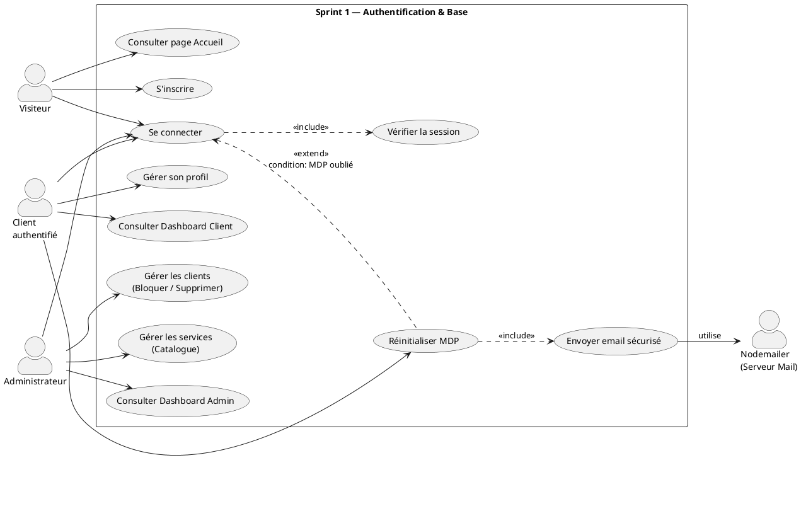
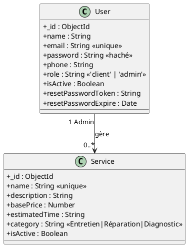
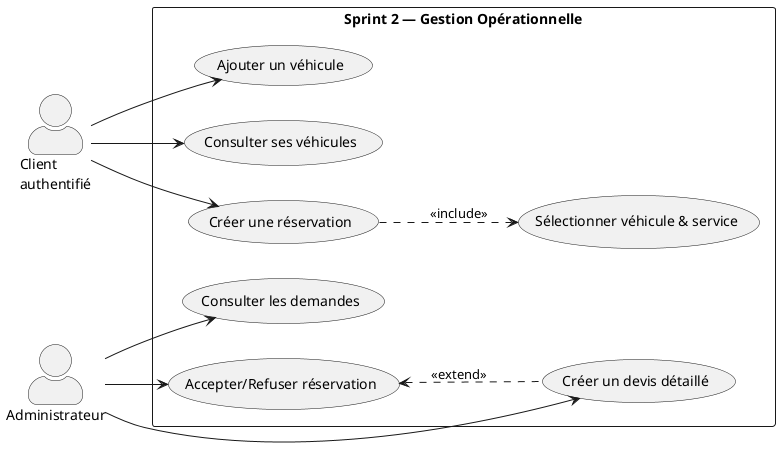
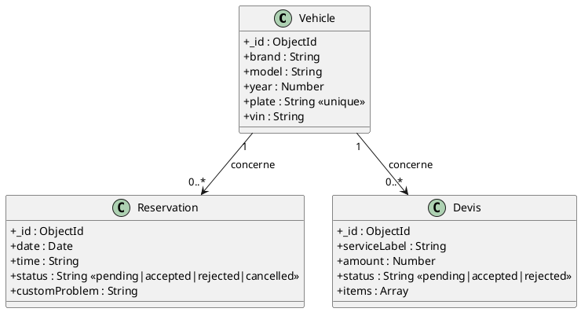
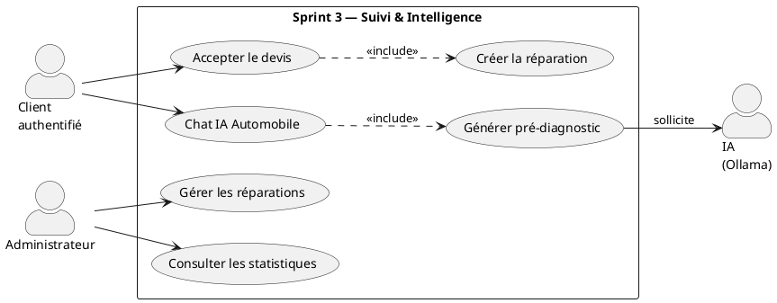
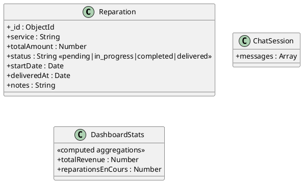

# CHAPITRE 3 : Réalisation et Tests

## Introduction

Ce chapitre présente la phase de réalisation concrète de la plateforme **AutoExpert**, organisée selon la méthodologie Scrum en trois sprints successifs. Pour chaque sprint, nous présentons :

- Le **Backlog du Sprint** (User Stories et tâches associées)
- Les **Diagrammes de Cas d'Utilisation** (vus par niveaux de raffinement)
- Le **Diagramme de Classes** modélisant la base de données
- Les **Réalisations** avec les captures des interfaces

---

## SPRINT 1 — Authentification, Accueil & Base

Le premier sprint pose les fondations de l'application. Il couvre l'authentification complète (inscription, connexion, mot de passe oublié), la mise en place de l'interface d'accueil, des tableaux de bord et de la gestion du catalogue des services.

### 1.1 Backlog du Sprint 1

Ce sprint représente **14 points d'effort** répartis sur **5 User Stories**.

**US-1a/b :** En tant que _Visiteur_, je veux m'inscrire et me connecter afin d'accéder à mon espace personnel. (5 pts)

- Développement des routes de création de compte et d'authentification sécurisée.
- Conception du formulaire d'inscription et de la page de connexion.
- Tests fonctionnels de l'accès à la plateforme.

**US-1c :** En tant qu'_Utilisateur_, je veux réinitialiser mon mot de passe par email afin de récupérer mon accès. (3 pts)

- Implémentation de l'envoi d'email sécurisé avec lien temporaire.
- Création des vues de réinitialisation de mot de passe.
- Tests du processus de récupération de compte.

**US-1d :** En tant que _Client_, je veux gérer mon profil afin de maintenir mes informations à jour. (2 pts)

- Création de la route de mise à jour des données personnelles.
- Développement de l'interface des paramètres du profil.
- Mise en place de l'interface d'Accueil de la plateforme et du Dashboard Client.

**US-1e :** En tant qu'_Administrateur_, je veux gérer les comptes clients afin de contrôler les accès. (2 pts)

- Mise en place de la liste des utilisateurs et du contrôle des accès (bloquer / supprimer).
- Création de l'interface d'administration des clients et du Dashboard Admin.

**US-2 :** En tant qu'_Administrateur_, je veux gérer les services afin de définir le catalogue du garage. (2 pts)

- Développement de la gestion complète du catalogue des prestations.
- Ajout de l'interface de gestion et de la création des services.

---

### 1.2 Diagramme de Cas d'Utilisation — Sprint 1

**Use Case Global — Sprint 1**

```
┌──────────────────────────────────────────────────────┐
│           Sprint 1 — Configuration de Base           │
│                                                      │
│         [ Gérer l'authentification ]                 │
│                                                      │
│         [ Consulter l'Accueil et le Tableau de bord ]│
│                                                      │
│         [ Gérer son profil ]                         │
│                                                      │
│         [ Gérer les clients ]                        │
│                                                      │
│         [ Gérer les services ]                       │
└──────────────────────────────────────────────────────┘
        ↑                              ↑
   Visiteur / Client           Administrateur
   authentifié
```

**Use Case Raffiné — Sprint 1**



| **Cas d'utilisation**         | **Acteur principal** | **Scénario de succès**                                                                            |
| ----------------------------- | -------------------- | ------------------------------------------------------------------------------------------------- |
| S'inscrire                    | Visiteur             | Le visiteur remplit le formulaire. Le système crée le compte et redirige vers le tableau de bord. |
| Se connecter                  | Client / Admin       | L'utilisateur saisit ses identifiants. Le système valide et accorde l'accès à son espace dédié.   |
| Réinitialiser le mot de passe | Utilisateur          | L'utilisateur reçoit un email, clique sur le lien et saisit son nouveau mot de passe.             |
| Consulter le Dashboard        | Client / Admin       | L'utilisateur accède à la page principale de son espace et consulte le résumé de son activité.    |
| Gérer les services            | Administrateur       | L'administrateur crée, modifie ou désactive une prestation du catalogue depuis l'interface.       |

---

### 1.3 Diagramme de Classes — Sprint 1



---

### 1.4 Réalisation du Sprint 1

1. **Interface d'Accueil de la plateforme**
   La page d'accueil d'AutoExpert présentant l'entreprise et les services aux visiteurs.
   _(Insérer Figure : Interface Accueil)_

2. **Interface d'Inscription et de Connexion**
   Les formulaires de sécurité permettant la création et l'accès sécurisé aux comptes.
   _(Insérer Figure : Interface Connexion)_

3. **Interface de Réinitialisation du Mot de Passe**
   Formulaire d'envoi du lien de récupération par email.
   _(Insérer Figure : Interface Reset MDP)_

4. **Interface Dashboard Client**
   Le tableau de bord central utilisé par le client après connexion.
   _(Insérer Figure : Dashboard Client)_

5. **Interface Dashboard Administrateur**
   Le tableau de bord global utilisé par l'administrateur pour la supervision.
   _(Insérer Figure : Dashboard Admin)_

6. **Interface de Gestion des Services et des Clients (Admin)**
   La vue permettant à l'administrateur de maintenir le catalogue ainsi que la liste des utilisateurs de la plateforme.
   _(Insérer Figure : Gestion Services/Clients)_

---

## SPRINT 2 — Gestion Métier

Le deuxième sprint implémente le cœur opérationnel : l'ajout des véhicules clients, la prise de rendez-vous en ligne, sa validation et la génération des devis détaillés.

### 2.1 Backlog du Sprint 2

Ce sprint représente **14 points d'effort** répartis sur **4 User Stories**.

**US-3 :** En tant que _Client_, je veux gérer mes véhicules afin de les associer à mes interventions. (3 pts)

- Développement des routes sécurisées de gestion (ajout, modification, suppression).
- Conception de l'interface de gestion du garage virtuel.
- Tests de la validation et l'unicité des plaques d'immatriculation.

**US-4 :** En tant que _Client_, je veux prendre un rendez-vous afin de planifier une intervention. (4 pts)

- Implémentation de l'enregistrement de la demande de rendez-vous avec la date et le motif.
- Création de l'interface de prise de rendez-vous.

**US-5 :** En tant qu'_Administrateur_, je veux gérer les réservations afin d'organiser le planning. (3 pts)

- Ajout de la validation des demandes (accepter, refuser, annuler).
- Mise en place de l'interface listant les réservations en attente.

**US-6 :** En tant qu'_Administrateur_, je veux créer des devis afin de chiffrer les interventions. (4 pts)

- Développement du système constructeur de devis incluant les prix et quantités.
- Création de l'interface d'édition et d'envoi du devis au client.

---

### 2.2 Diagramme de Cas d'Utilisation — Sprint 2

**Use Case Global — Sprint 2**

```
┌──────────────────────────────────────────────────────┐
│             Sprint 2 — Gestion Métier                │
│                                                      │
│         [ Gérer mes véhicules ]                      │
│         [ Gérer les réservations ]                   │
│         [ Gérer les devis ]                          │
└──────────────────────────────────────────────────────┘
```

**Use Case Raffiné — Sprint 2**



| **Cas d'utilisation**  | **Acteur principal** | **Scénario de succès**                                                                                 |
| ---------------------- | -------------------- | ------------------------------------------------------------------------------------------------------ |
| Gérer ses véhicules    | Client               | Le client saisit les informations de son véhicule, qui est ajouté à son espace personnel.              |
| Créer une réservation  | Client               | Le client sélectionne un véhicule, une prestation, et une date. La réservation s'enregistre.           |
| Gérer les réservations | Administrateur       | L'administrateur consulte la liste des demandes et en modifie le statut.                               |
| Créer un devis         | Administrateur       | L'administrateur détaille les pièces et la main d'œuvre pour une réparation, et le devis est transmis. |

---

### 2.3 Diagramme de Classes — Sprint 2



---

### 2.4 Réalisation du Sprint 2

1. **Interface Mes Véhicules (Client)**
   La page permettant de voir et de gérer la flotte de véhicules du client.
   _(Insérer Figure : Mes Véhicules)_

2. **Interface Prise de Rendez-vous (Client)**
   Le formulaire pour planifier une nouvelle intervention.
   _(Insérer Figure : Prise de Rendez-vous)_

3. **Interface Gestion des Réservations et Devis (Admin)**
   La vue permettant d'approuver les rendez-vous et de rédiger le devis correspondant.
   _(Insérer Figure : Gestion Réservations / Devis)_

---

## SPRINT 3 — Suivi, Dashboard Analytics & IA

Le troisième sprint ajoute le système de suivi des réparations, complète le Dashboard avec l'intégration des graphiques, et introduit l'assistant IA de diagnostic.

### 3.1 Backlog du Sprint 3

Ce sprint représente **11 points d'effort** répartis sur **4 User Stories**.

**US-7 :** En tant que _Client_, je veux accepter ou refuser un devis afin de valider l'intervention. (3 pts)

- Ajout de la fonctionnalité de décision par le client sur un devis.
- Automatisation du passage en réparation dès l'acceptation du devis.

**US-8 :** En tant qu'_Administrateur_, je veux gérer les réparations afin de suivre l'avancement. (2 pts)

- Développement du système de statut pour suivre le cycle de réparation.
- Conception de l'interface de mise à jour des travaux en atelier.

**US-9 :** En tant qu'_Administrateur_, je veux finaliser le Dashboard afin de voir les statistiques globales. (3 pts)

- Programmation des calculs et requêtes d'agrégation de base de données.
- Intégration des graphiques visuels et des indicateurs de performance.

**US-10 :** En tant que _Client_, je veux discuter avec une IA afin d'obtenir un diagnostic préliminaire de mon véhicule. (3 pts)

- Connexion du backend au modèle LLM d'intelligence artificielle locale.
- Développement de l'interface du "Chat IA" pour échanger avec l'assistant.

---

### 3.2 Diagramme de Cas d'Utilisation — Sprint 3

**Use Case Raffiné — Sprint 3**



| **Cas d'utilisation**    | **Acteur principal** | **Scénario de succès**                                                                       |
| ------------------------ | -------------------- | -------------------------------------------------------------------------------------------- |
| Accepter un devis        | Client               | Le client valide un prix. Le système génère automatiquement l'ordre de réparation.           |
| Gérer les réparations    | Administrateur       | L'administrateur fait avancer le statut de l'intervention vers "Terminé", puis "Livré".      |
| Consulter les graphiques | Administrateur       | Les graphiques (revenus, activité) sont affichés et calculés en temps réel sur le Dashboard. |
| Chat IA Automobile       | Client               | Le client explique sa panne et l'IA répond avec une proposition de diagnostic immédiate.     |

---

### 3.3 Diagramme de Classes — Sprint 3



---

### 3.4 Réalisation du Sprint 3

1. **Interface Consultation des Devis (Client)**
   La vue affichant les détails d'un devis permettant au client de valider ou de refuser.
   _(Insérer Figure : Vue Devis)_

2. **Interface de Suivi des Réparations (Admin et Client)**
   Le tableau de suivi permettant de connaître en temps réel l'avancée du mécanicien sur le véhicule.
   _(Insérer Figure : Suivi des Réparations)_

3. **Tableau de Bord enrichi avec Graphiques (Admin)**
   La vue incluant les diagrammes et statistiques intégrés.
   _(Insérer Figure : Dashboard Graphiques)_

4. **Interface du Chat IA Assistant Virtuel (Client)**
   La messagerie au travers de laquelle le propriétaire du véhicule échange avec l'intelligence artificielle.
   _(Insérer Figure : Interface Chat IA)_

---

## 4. Tests et Validation

La qualité de l'application AutoExpert a été validée selon les aspects de **Fonctionnalité, de Sécurité et de Performance**.

| Fonctionnalité                           | Type        | Résultat | Observation                                         |
| ---------------------------------------- | ----------- | -------- | --------------------------------------------------- |
| Création de compte et connexion          | Fonctionnel | ✅       | Testé et opérationnel                               |
| Oubli de mot de passe (Email)            | Fonctionnel | ✅       | Testé avec un délai d'expiration                    |
| Gestion des plaques d'immatriculation    | Fonctionnel | ✅       | Rejet des plaques de véhicules dupliquées           |
| Cycle Réservation -> Devis -> Réparation | Fonctionnel | ✅       | Transition des états correcte                       |
| Dialogue Chat IA Automobile              | Fonctionnel | ✅       | Réponses générées correctement                      |
| Statistiques dynamiques Dashboard        | Fonctionnel | ✅       | Mises à jour en direct approuvées                   |
| Protection des pages "Admin"             | Sécurité    | ✅       | Redirection si l'accès est interdit                 |
| Cryptage et Masquage Mot de passe        | Sécurité    | ✅       | Utilisations des normes actuelles                   |
| Temps de réponse global                  | Performance | ✅       | Navigation très rapide, IA de l'ordre de 2 secondes |

---

## Conclusion

Ce chapitre détaille la transformation du cahier des charges et de l'analyse en une solution opérationnelle, construite itérativement sur 3 Sprints. L'application AutoExpert dispose d'une fondation solide (Sprint 1), de fonctionnalités métier riches orientées autour des véhicules et rendez-vous (Sprint 2), et d'une intelligence avancée avec automatisation des réparations et conseil mécanique via Chat IA (Sprint 3).
La suite exhaustive de tests menés démontre la fluidité et la fiabilité de la solution livrée.
