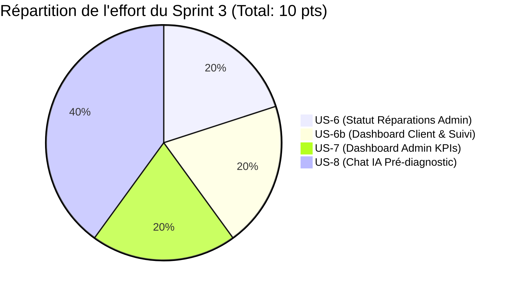
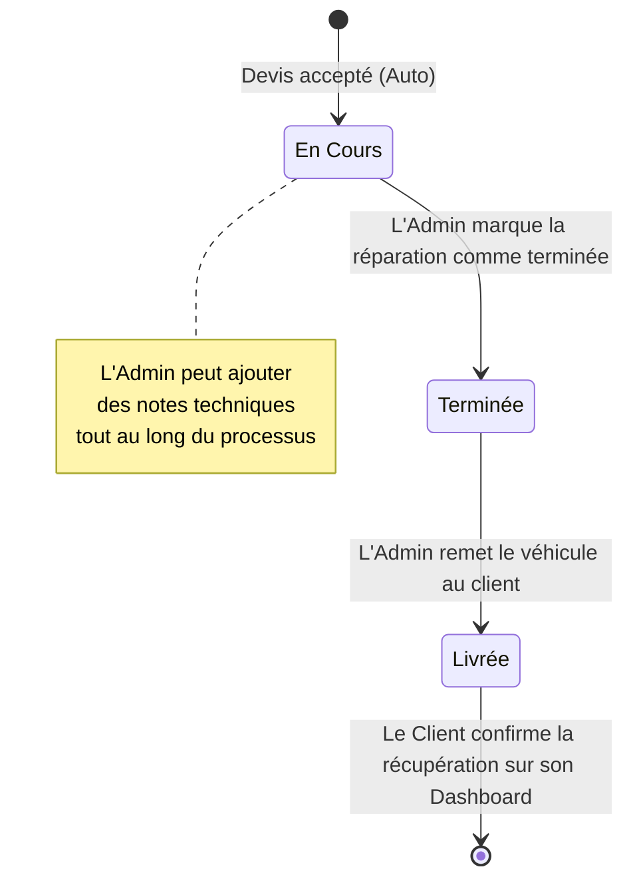
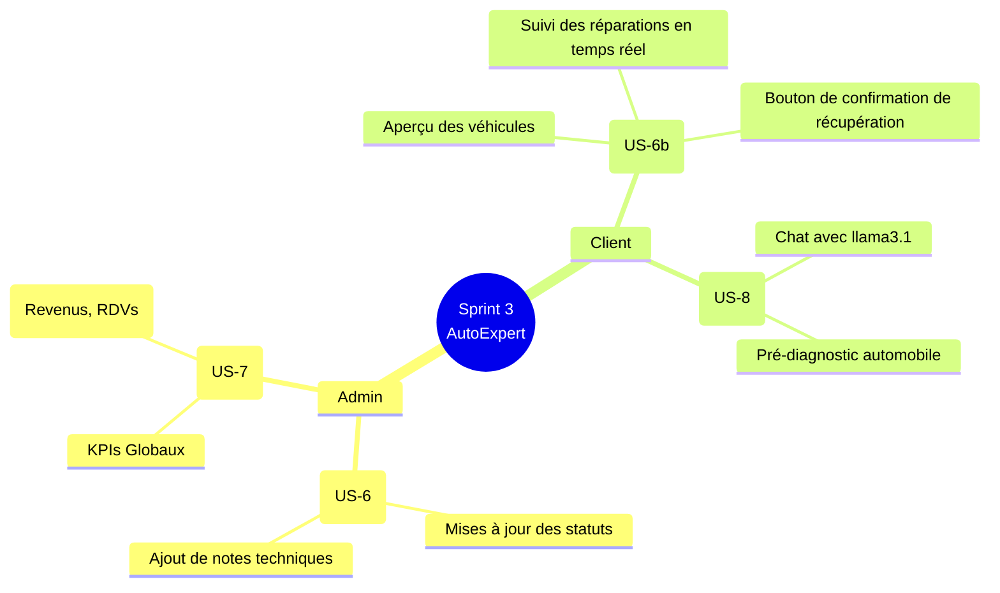
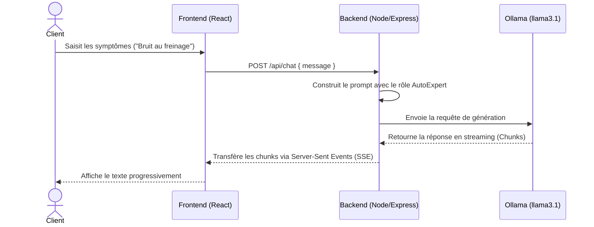

# 🏃‍♂️ Sprint 3 : Tableau de Bord, Suivi des Réparations et Intégration IA

Ce fichier détaille le contenu clair et réel du Sprint 3 du projet AutoExpert, incluant le backlog raffiné, la répartition de l'effort des User Stories, et les schémas explicatifs utilisant **Mermaid** pour une visualisation directe dans Markdown.

## 📋 1. Product Backlog du Sprint 3

| ID        | User Story                                                                                                                                                     | Tâche principale                                                                                                                                                                       | Complexité / Effort   |
| :-------- | :------------------------------------------------------------------------------------------------------------------------------------------------------------- | :------------------------------------------------------------------------------------------------------------------------------------------------------------------------------------- | :-------------------- |
| **US-6**  | En tant qu'Admin, je veux faire évoluer le statut d'une réparation.                                                                                            | Développer le système de transitions (En cours → Terminée → Livrée) et les notes techniques.                                                                                           | Intermédiaire — 2 pts |
| **US-6b** | En tant que Client, je veux consulter le tableau de bord et l’état de mes réparations afin de suivre l’évolution et confirmer la récupération de mon véhicule. | Implémenter l’interface Dashboard Client affichant les statistiques principales (véhicules, rendez-vous, devis) ainsi que la section de suivi des réparations avec leur statut actuel. | Intermédiaire — 2 pts |
| **US-7**  | En tant qu'Admin, je veux visualiser les statistiques globales du garage sur le tableau de bord.                                                               | Implémentation des agrégations MongoDB pour calculer les KPIs et affichage des résultats sous forme des cartes.                                                                        | Intermédiaire — 2 pts |
| **US-8**  | En tant que Client, je veux dialoguer avec une IA pour obtenir un pré-diagnostic de mon véhicule.                                                              | Connecter le backend à Ollama llama3.1 et développer l'interface Chat IA avec historique.                                                                                              | Difficile — 4 pts     |
| **TOTAL** | **Toutes les fonctionnalités ont été implémentées et testées.**                                                                                                |                                                                                                                                                                                        | **10 pts**            |

---

## 📊 2. Répartition de l'effort (Story Points)

Ce graphique illustre le poids de chaque fonctionnalité dans le sprint.

---

## 🔄 3. Cycle de vie d'une Réparation (US-6 & US-6b)

Ce schéma d'état (State Diagram) illustre comment le statut d'une réparation évolue dans le système grâce aux actions de l'Administrateur, et comment le Client interagit à la fin.

---

## 🧠 4. Répartition des Fonctionnalités par Acteur (Mindmap)

Une carte heuristique (Mindmap) qui résume parfaitement qui fait quoi durant ce Sprint 3.

---

## ⚙️ 5. Séquence de Communication de l'IA (US-8)

Ce diagramme de séquence montre l'interaction technique et l'implication d'Ollama (llama3.1) en temps réel pour générer le pré-diagnostic client.

