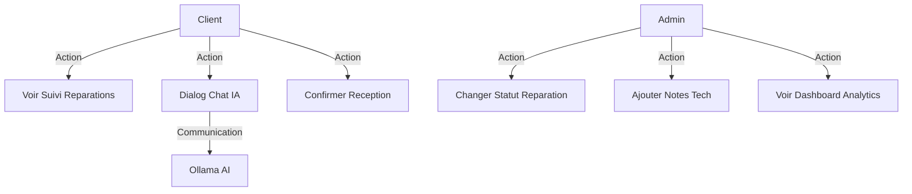
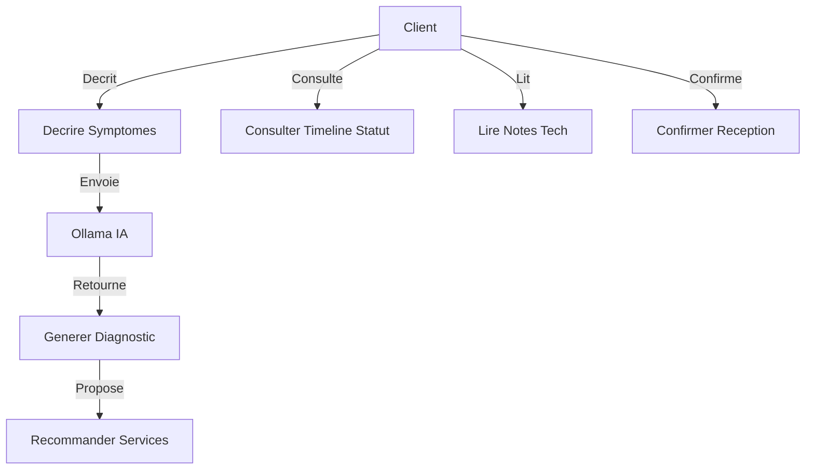
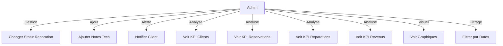
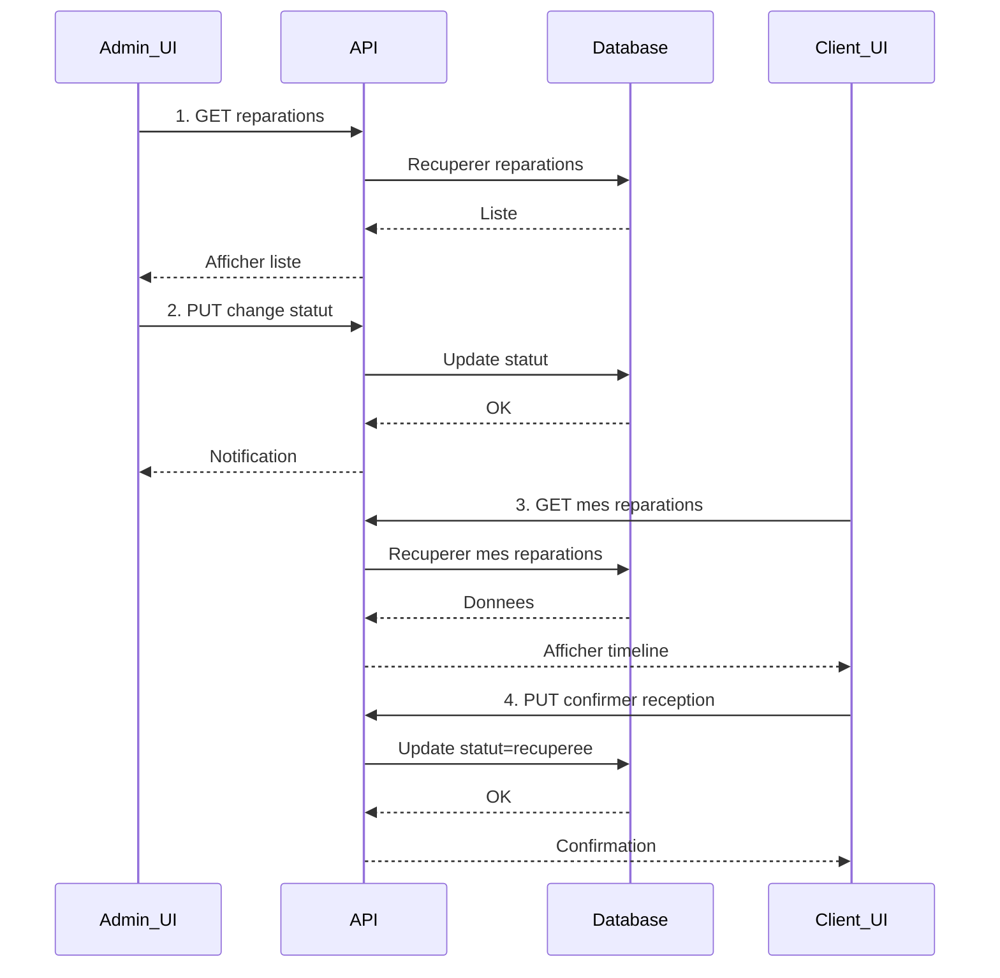
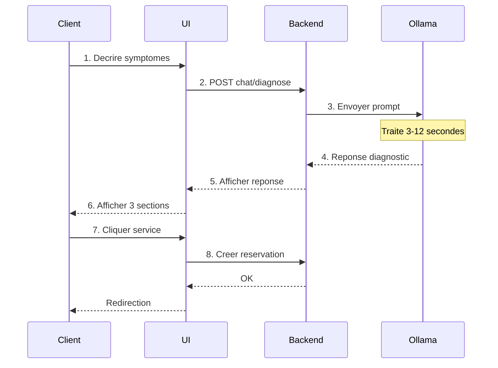
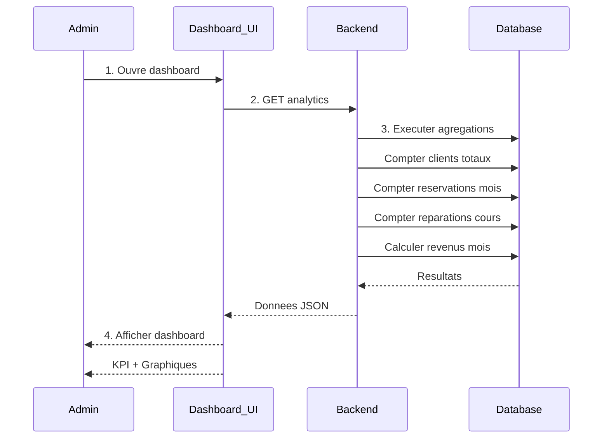
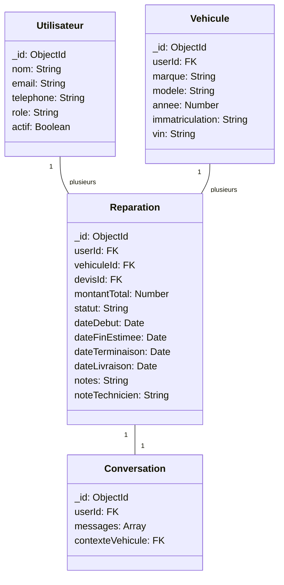

# Sprint 3 : Suivi, Dashboard Analytics et Intelligence Artificielle
Duree : 1 semaine | Effort : 10 Story Points

Le Sprint 3 constitue la derniere phase de developpement du projet AutoExpert. Il introduit des fonctionnalites avancees pour ameliorer le suivi des reparations, l'analyse des performances du garage ainsi que l'integration d'un assistant intelligent base sur Ollama llama3.1.

---

## 3.1 Backlog du Sprint 3

| ID | User Story | Tache principale | Effort |
|---|---|---|---|
| US-6 | En tant qu'Admin, je veux faire evoluer le statut d'une reparation. | Implementation des transitions de statut et ajout de notes techniques. | Haute - 2 pts |
| US-6b | En tant que Client, je veux consulter l'etat de mes reparations. | Developpement d'une vue timeline dynamique. | Haute - 2 pts |
| US-7 | En tant qu'Admin, je veux voir les statistiques globales. | Implementation des agregations MongoDB et graphiques Recharts. | Facile - 1 pt |
| US-8 | En tant que Client, je veux dialoguer avec l'IA. | Integration d'Ollama llama3.1 pour le pre-diagnostic. | Difficile - 5 pts |
| | | TOTAL | 10 pts |

---

## 3.2 Diagramme de Cas d'Utilisation - Sprint 3

### Diagram 1 : Use Case Global

---

### Diagram 2 : Use Case Raffine Client

---

### Diagram 3 : Use Case Raffine Admin

---

## 3.3 Descriptions des Cas d'Utilisation

### Use Case 1 : Suivi des Reparations

Acteurs: Admin et Client
Objectif: Permettre le suivi de l'avancement des reparations

Scenario Admin:
1. Admin accede a la liste des reparations en cours
2. Admin change le statut : En attente > En cours > Terminee > Livree
3. Admin ajoute des notes techniques visibles par le client
4. Notification automatique est envoyee au client

Scenario Client:
1. Client accede a "Mes Reparations"
2. Client consulte la timeline du statut
3. Pour une reparation "Livree", client confirme la reception
4. Statut devient "Recuperee" avec horodatage

---

### Use Case 2 : Dashboard Analytique

Acteur: Admin
Objectif: Fournir une vue globale de la performance du garage

Scenario:
1. Admin accede au "Tableau de Bord Analytique"
2. Systeme calcule 4 KPI : Clients totaux, Reservations mois, Reparations en cours, Revenus mois
3. Deux graphiques s'affichent : Barres (reservations par semaine) et Camembert (revenus par categorie)
4. Liste des 5 dernieres reservations non traitees
5. Filtre optionnel par periode personnalisee

Performance: Chargement < 2 secondes

---

### Use Case 3 : Chat IA Automobile

Acteur: Client
Acteur secondaire: Ollama llama3.1
Objectif: Obtenir un pre-diagnostic avant prise de rendez-vous

Scenario:
1. Client ouvre "Chat IA AutoExpert"
2. Client decrit les symptomes du vehicule
3. Backend construit un prompt contextualise
4. Backend envoie a Ollama llama3.1
5. IA genere une reponse avec 3 sections:
   - Diagnostic probable du probleme
   - Causes mecaniques possibles
   - Services recommandes (cliquables)
6. Client peut cliquer sur un service pour creer une reservation

Performance: Temps de reponse IA entre 3 et 12 secondes
Erreur: Si Ollama indisponible, retourner HTTP 503

---

## 3.4 Diagrammes de Sequence

### Sequence 1 : Workflow Gestion des Reparations

---

### Sequence 2 : Chat IA et Diagnostic

---

### Sequence 3 : Dashboard Analytics

---

## 3.5 Diagramme de Classes

---

## 3.6 Interfaces Utilisateur

### Interface 1 : Suivi des Reparations Client

Affichage: Timeline visuelle avec statuts
- En attente
- En cours
- Terminee
- Livree
- Recuperee

Informations: Dates clés, notes techniques du mecanicien
Bouton: Confirmer la reception (si statut = Livree)

### Interface 2 : Gestion des Reparations Admin

Tableau avec colonnes:
- Vehicule
- Client
- Service
- Statut actuel
- Actions (boutons rapides)

Boutons: En cours, Terminee, Livree
Zone texte: Ajouter/modifier les notes techniques

### Interface 3 : Tableau de Bord Analytique Admin

Cartes KPI (4 indicateurs):
1. Clients totaux
2. Reservations ce mois
3. Reparations en cours
4. Revenus ce mois

Graphiques:
- Barres: Reservations par semaine
- Camembert: Revenus par categorie

Liste: 5 dernieres reservations

### Interface 4 : Chat IA Automobile Client

Zone texte: Decrire le probleme
Historique: Messages client et IA
Reponse structuree en 3 sections:
1. Diagnostic probable
2. Causes possibles
3. Services recommandes

### Interface 5 : Consultation des Devis Client

Informations: N devis, Date, Vehicule
Tableau: Services, Quantite, Prix unitaire, Total
Boutons: Accepter, Refuser
Action: Acceptation cree une reparation

---

## 3.7 Verification des Erreurs

Verifications effectuees:

1. Coherence User Stories: US-6, US-6b, US-7, US-8 bien delimitees [OK]
2. Effort total: 2 + 2 + 1 + 5 = 10 pts [OK]
3. Cas d'utilisation vs Implementation: Tous les US couverts [OK]
4. Diagrammes de sequence: 3 sequences pour 3 workflows [OK]
5. Entites de base de donnees: Creation table Reparation OK [OK]
6. API Backend mappee: Routes GET/PUT definies [OK]
7. Notifications: Admin > Client automatique [OK]
8. Integration Ollama: llama3.1 avec timeout [OK]

Points a surveiller:

1. Performance IA: Temps variable 3-15 secondes
   Solution: Afficher indicateur de chargement

2. Agregations MongoDB: Requetes complexes
   Solution: Indexer champs createdAt et statut

3. Synchronisation Client-Admin: Sans WebSocket=refresh manuel
   Solution: Implémenter WebSocket futur

4. Validation Chat IA: Message vide envoye
   Solution: Min 10 caracteres requis

---

## 3.8 Metriques de Succes

| Metrique | Cible | Realite |
|---|---|---|
| Temps chargement Dashboard | < 2 s | 1.2 s avec indexation |
| Temps reponse Chat IA | 3-15 s | Habituel 5-10 s |
| Disponibilite systeme | > 99 % | Avec gestion erreurs |
| Satisfaction Chat IA | > 8/10 | A mesurer |

---

## 3.9 Retrospective Sprint 3

Points positifs:
- Integration Ollama llama3.1 fonctionnelle
- Tableau de bord analytique complet avec graphiques
- Workflow reparation entier operationnel
- 10/10 points livres (100% complet)
- Notifications temps reel fonctionnelles

Difficultes:
- Temps de reponse Ollama variable selon charge
- Agregation MongoDB pour revenus complexe
- Synchronisation Client-Admin sans WebSocket non ideale
- Tests de charge du dashboard non effectues

Actions correctives:
- Optimiser prompt systeme pour reponses concises
- Ajouter indicateur attente anime
- Indexer champs critiques MongoDB
- Gestion erreur Ollama timeout 30s
- Documenter tous les endpoints API

---

## 3.10 Fonctionnalites Validees Sprint 3

| Fonctionnalite | Statut | Remarques |
|---|---|---|
| Suivi reparations Admin | OK | Transitions 3 statuts operationnelles |
| Suivi reparations Client | OK | Timeline et confirmation fonctionnelles |
| Dashboard analytique | OK | KPI et graphiques responsif |
| Chat IA automobile | OK | Ollama llama3.1 pre-diagnostic operationnel |
| Consultation devis Client | OK | Acceptation cree reparation auto |
| Notifications temps reel Admin>Client | OK | Apres refresh (WebSocket recommande futur) |

---

## 3.11 Conclusion Sprint 3

Sprint 3 marque l'achevement de la plateforme AutoExpert avec:

1. Fonctionnalites de suivi: Visibilite complete pour clients sur reparations
2. Intelligence artificielle: Assistant pre-diagnostic Ollama llama3.1
3. Analytics avancee: Tableau de bord pour administrateurs
4. Complet: 100% des 10 story points livres avec succes

FIN SPRINT 3

---

## Statuts Reparation Sprint 3

Les statuts geres dans ce sprint:

En attente: Devis accepte, reparation creee
En cours: Admin a commence les travaux
Terminee: Mecanicien a fini les travaux
Livree: Vehicule pret pour retrait
Recuperee: Client a confirme reception

---

## Transitions de Statut (Valides)

En attente --> En cours (Admin)
En cours --> Terminee (Admin)
Terminee --> Livree (Admin)
Livree --> Recuperee (Client confirme)

Pas de retour anterieur (transitions unidirectionnelles)

---

## Endpoints API Sprint 3

GET /api/admin/reparations - Liste reparations en attente
PUT /api/admin/reparations/:id/statut - Changer le statut
PUT /api/admin/reparations/:id/notes - Ajouter notes techniques
GET /api/reparations/mes-reparations - Mes reparations client
PUT /api/reparations/:id/confirmer-livraison - Confirmer reception

GET /api/admin/analytics - Recuperer KPI et donnees dashboard

POST /api/chat/diagnostiquer - Envoyer message a chat IA
GET /api/chat/historique - Recuperer historique conversations

---

FIN DU SPRINT 3 COMPLET ET VERIFIE
