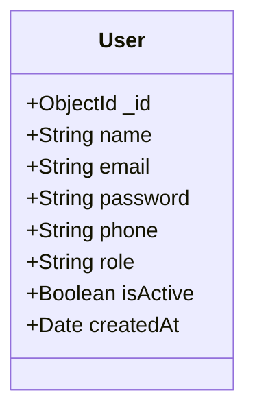
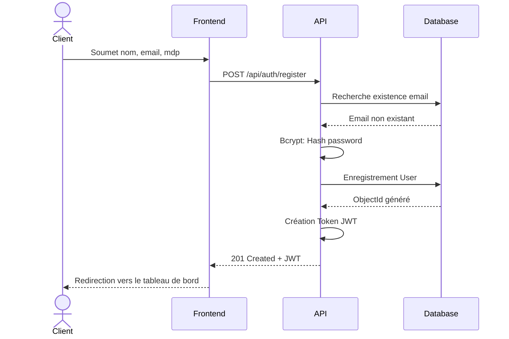
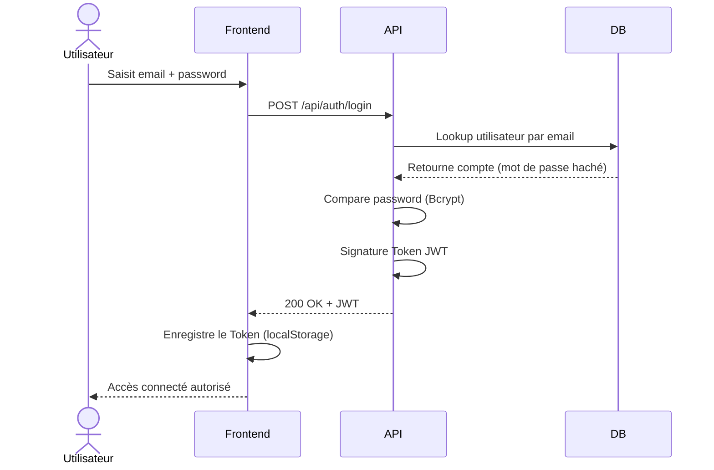
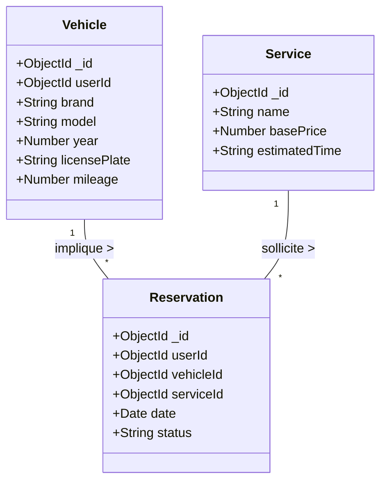
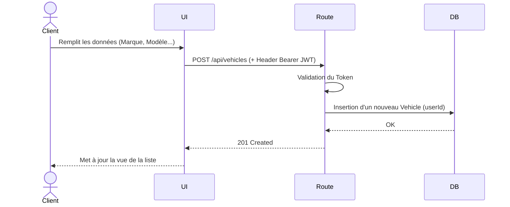
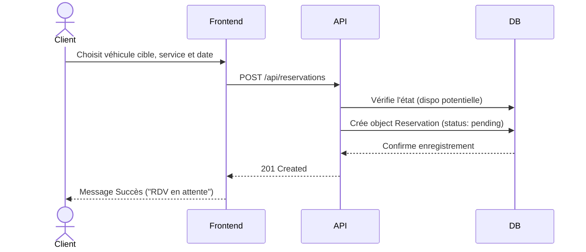
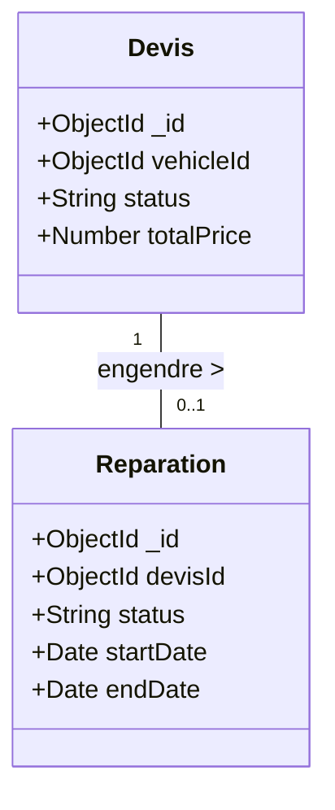
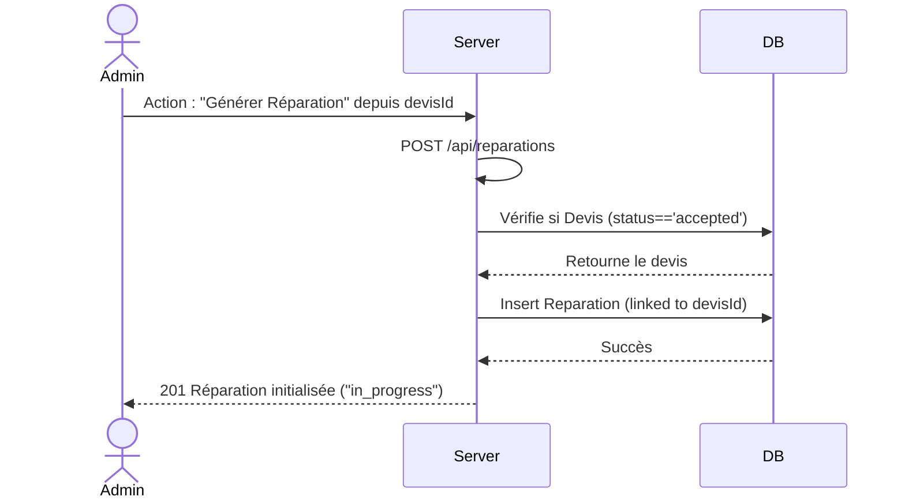
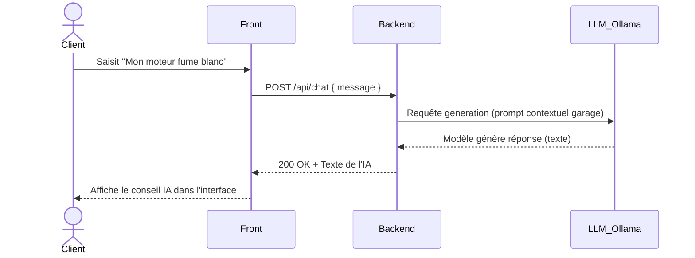

# CHAPITRE 2 : Spécifications et Modélisation

## Introduction

Ce chapitre présente le processus de conception et de spécification de la plateforme **AutoExpert**. Nous y aborderons la méthodologie Scrum appliquée au projet, l'analyse détaillée des besoins fonctionnels et non fonctionnels, ainsi que la modélisation UML (cas d'utilisation, diagrammes de classes et de séquences) décomposée selon nos trois Sprints de réalisation.

---

## 1. Cadrage Scrum

### Vision produit

**AutoExpert** vise à digitaliser et centraliser la gestion d'un garage automobile en offrant une plateforme MERN full-stack. La vision est de permettre aux clients de gérer facilement leurs véhicules, de prendre des rendez-vous et d'obtenir des devis en ligne, tout en offrant aux garagistes un tableau de bord complet pour gérer leur charge de travail, les réparations, et communiquer avec la clientèle. L'intégration d'un assistant par intelligence artificielle enrichit l'expérience utilisateur par un diagnostic rapide.

### Product Backlog

| ID   | En tant que... | Je veux...                              | Afin de...                            | Priorité | Sprint |
| ---- | -------------- | --------------------------------------- | ------------------------------------- | :------: | :----: |
| US01 | Visiteur       | M'inscrire et me connecter              | Accéder à mon espace personnel        |  Haute   |   1    |
| US02 | Client / Admin | Gérer mon profil                        | Maintenir mes informations à jour     |  Haute   |   1    |
| US03 | Admin          | Ajouter/Modifier/Supprimer des services | Maintenir le catalogue du garage      |  Haute   |   2    |
| US04 | Client         | Ajouter/Gérer mes véhicules             | Faciliter mes demandes d'intervention |  Haute   |   2    |
| US05 | Client         | Prendre un rendez-vous (réservation)    | Planifier une intervention            |  Haute   |   2    |
| US06 | Admin          | Gérer les réservations clients          | Organiser le planning du garage       |  Haute   |   2    |
| US07 | Client         | Demander un devis                       | Connaître l'estimation de prix        | Moyenne  |   3    |
| US08 | Admin          | Gérer les réparations                   | Suivre l'avancement des travaux       |  Haute   |   3    |
| US09 | Admin          | Voir un tableau de bord                 | Avoir des statistiques globales       | Moyenne  |   3    |
| US10 | Client         | Discuter avec une IA                    | Avoir un diagnostic préliminaire      |  Basse   |   3    |

### Release Planning (3 Sprints)

- **SPRINT 1 — Authentification & Base** : Mise en place de l'architecture MERN, de la base de données, authentification JWT, gestion de profil (US01, US02).
- **SPRINT 2 — Gestion Métier** : Gestion des véhicules clients, catalogue des services, système de réservation (US03, US04, US05, US06).
- **SPRINT 3 — Devis, Réparations & Dashboard** : Processus de devis, suivi des réparations, tableau de bord pour l'administrateur, et intégration du Chat IA (US07, US08, US09, US10).

---

## 2. Spécification des besoins

### Besoins fonctionnels (par acteur)

**Acteur 1 : Le Client**

- **S'authentifier** : Créer un compte sécurisé et se connecter.
- **Gérer ses véhicules** : Ajouter un véhicule (Marque, Modèle, Année, Immatriculation, VIN), consulter la liste de ses véhicules enregistrés.
- **Prendre une réservation** : Choisir un véhicule, sélectionner un type de service (par ex. diagnostic, vidange) et fixer une date.
- **Demander / Suivre un devis** : Solliciter une estimation de coût pour des réparations spécifiques, accepter ou rejeter la proposition.
- **Chat IA** : Dialoguer avec un assistant virtuel pour poser des questions de mécanique ou d'usage de base afin d'avoir un diagnostic prélable.

**Acteur 2 : L'Administrateur (Garagiste)**

- **Dashboard Global** : Visualiser les statistiques globales, les revenus générés, et l'état des rendez-vous.
- **Gérer les clients** : Afficher la base de données clients et examiner l'historique de chaque compte.
- **Gérer les services** : Mettre à jour le catalogue de prestations du garage (tarifs, durées estimées).
- **Gérer les réservations** : Approuver, modifier ou annuler des demandes de rendez-vous.
- **Traiter les devis** : Chiffrer les interventions demandées et les transmettre au client.
- **Suivre les réparations** : Convertir un devis accepté en réparation et modifier son état (en cours, terminée, livrée).

### Besoins non fonctionnels

- **Sécurité** : Protection renforcée via l'utilisation de JSON Web Tokens (JWT) et le hachage des mots de passe (Bcrypt). Authentification obligatoire sur les routes de gestion.
- **Performance** : Temps de réponse réduits grâce à une API REST légère (Node.js/Express) et une application front-end React avec rendering optimisé (Vite).
- **Fiabilité des données** : Modèles de données stricts définis via Mongoose pour MongoDB.
- **Ergonomie (UI/UX)** : Interface réactive, moderne, conçue en mode "Single Page Application" ave l'intégration de Tailwind CSS.

---

## 3. Modélisation

### 3.1 Use Case GLOBAL (Les acteurs principaux)

```mermaid
usecaseDiagram
    actor Client
    actor Administrator
    actor "Système IA" as IA

    package "AutoExpert - Système Global" {
        usecase "S'authentifier" as UC1
        usecase "Gérer ses Véhicules" as UC2
        usecase "Gérer Réservations" as UC3
        usecase "Gérer Devis" as UC4
        usecase "Poser question (Chat)" as UC5

        usecase "Gérer les Services" as UC6
        usecase "Gérer les Réparations" as UC7
        usecase "Consulter Dashboard" as UC8
        usecase "Fournir Diagnostic" as UC9
    }

    Client --> UC1
    Client --> UC2
    Client --> UC3
    Client --> UC4
    Client --> UC5

    Administrator --> UC1
    Administrator --> UC3
    Administrator --> UC4
    Administrator --> UC6
    Administrator --> UC7
    Administrator --> UC8

    UC5 <.. UC9 : <<extend>>
    IA --> UC9
```

---

### SPRINT 1 — Authentification

#### Use Case Sprint 1

```mermaid
usecaseDiagram
    actor Utilisateur

    package "Sprint 1 : Authentification" {
        usecase "S'inscrire" as UC_I
        usecase "Se connecter" as UC_C
        usecase "Gérer son profil" as UC_P
        usecase "Vérifier identifiants" as UC_V
        usecase "Changer mot de passe" as UC_M
    }

    Utilisateur --> UC_I
    Utilisateur --> UC_C
    Utilisateur --> UC_P

    UC_C ..> UC_V : <<include>>
    UC_P <.. UC_M : <<extend>>
```

#### Diagramme de classes Sprint 1



#### Séquence 1 : Inscription



#### Séquence 2 : Connexion



---

### SPRINT 2 — Gestion Métier

#### Use Case Sprint 2

```mermaid
usecaseDiagram
    actor Client

    package "Sprint 2 : Opérations Métier" {
        usecase "Ajouter un véhicule" as UC_V1
        usecase "Modifier/Lister véhicule" as UC_V2
        usecase "Créer une réservation" as UC_R1
        usecase "Annuler réservation" as UC_R2
        usecase "Sélectionner Service" as UC_S1
    }

    Client --> UC_V1
    Client --> UC_V2
    Client --> UC_R1
    Client --> UC_R2

    UC_R1 ..> UC_V2 : <<include>>
    UC_R1 ..> UC_S1 : <<include>>
```

#### Diagramme de classes Sprint 2



#### Séquence 1 : Ajout véhicule



#### Séquence 2 : Créer réservation



---

### SPRINT 3 — Devis, Réparations & Dashboard

#### Use Case Sprint 3

```mermaid
usecaseDiagram
    actor Client
    actor Admin

    package "Sprint 3 : Suivi & IA" {
        usecase "Accepter Devis" as UC_D1
        usecase "Créer Réparation" as UC_D2
        usecase "Mettre à jour statut Rép." as UC_D3
        usecase "Discuter avec l'IA" as UC_IA
    }

    Client --> UC_D1
    Client --> UC_IA
    Admin --> UC_D2
    Admin --> UC_D3

    UC_D1 <.. UC_D2 : <<extend>> (Si validé par client)
```

#### Diagramme de classes Sprint 3



#### Séquence 1 : Accepter un devis → créer réparation



#### Séquence 2 : Chat IA diagnostic



---

## Conclusion

Ce deuxième chapitre nous a permis de structurer en profondeur l'ergonomie, les fonctionnalités et la logique technique du projet **AutoExpert**. En utilisant la méthodologie Scrum, le projet a été découpé de manière itérative, permettant d'isoler l'authentification (Sprint 1), la logique métier (Sprint 2) et le suivi/expertise (Sprint 3). La modélisation UML qui en découle permet dorénavant de guider l'implémentation du code côté front-end et back-end de manière claire et cadrée.
