# Remerciements

Je tiens à exprimer ma profonde gratitude à l'Institut Supérieur des Études Technologiques de Nabeul (ISET Nabeul) pour la formation théorique et pratique qu'il m'a fournie tout au long de mon parcours universitaire.

J'adresse mes sincères remerciements à l'équipe de la **Maison du Web** pour m'avoir accueilli au sein de leur structure et pour les conditions favorables qu'ils m'ont offertes afin de mener à bien mon stage de perfectionnement.

Je remercie particulièrement mon encadreur professionnel, **M. Skander Belloum**, pour son accompagnement, ses conseils précieux et sa disponibilité constante tout au long de la période de stage.

Je tiens également à remercier l'ensemble du personnel administratif et technique qui a contribué, de près ou de loin, à la réussite de ce stage.

Enfin, je remercie tous ceux qui ont participé à l'enrichissement de mon expérience professionnelle et personnelle.

---

# Introduction générale

L'ingénierie automobile moderne ne se limite plus à la mécanique classique ; elle repose désormais sur une gestion intelligente et numérisée des données techniques. Face à la complexité croissante des véhicules, la digitalisation des processus de diagnostic et de maintenance est devenue un pilier central pour garantir la fiabilité des interventions et la traçabilité des opérations. Dans cette optique, le développement de plateformes métiers dédiées permet de transformer l'expertise technique en un système d'information structuré et performant.

Ce rapport s'inscrit dans le cadre d'un stage de perfectionnement effectué au sein de la société **Maison du Web**. L'objectif principal a été de concevoir et de réaliser **AutoExpert**, une plateforme web centralisée dédiée à la gestion des diagnostics et au suivi technique automobile. Nous avons adopté la démarche Agile Scrum, ce qui a permis d'instaurer un cycle de développement dynamique, itératif et collaboratif, parfaitement adapté aux exigences du secteur.

Après cette introduction, la suite du rapport est organisée comme suit :

Dans le **premier chapitre**, intitulé « Présentation de l'organisme d'accueil et étude préalable », nous commençons par présenter la société Maison du Web, son organisation interne et son infrastructure. Une étude de l'existant justifie ensuite la solution proposée avant d'exposer la méthodologie Agile adoptée.

Dans le **deuxième chapitre**, intitulé « Spécification des besoins et modélisation de la solution », les besoins fonctionnels et non fonctionnels de la plateforme sont identifiés, suivis de la conception détaillée du système via UML.

Enfin, dans le **troisième chapitre**, intitulé « Réalisation et tests », l'environnement logiciel et matériel utilisé est décrit, le déroulement des sprints de développement est expliqué, ainsi que les phases de tests et de validation de la plateforme AutoExpert.

---

## _(Sauts de page optionnels pour le document final...)_

# Chapitre 1 : Présentation de l'organisme d'accueil et étude préalable

## Introduction

Dans ce premier chapitre, nous définissons le cadre professionnel et méthodologique qui a entouré ce stage de perfectionnement. Nous commençons par présenter Maison du Web, en détaillant son organisation interne, ses infrastructures et les technologies qui font sa force dans le domaine du développement web et des solutions numériques.

Ensuite, nous introduisons le thème central du stage, à savoir la conception de la plateforme AutoExpert, ainsi que la démarche Agile Scrum adoptée pour piloter ce projet de manière itérative et collaborative.
Enfin, nous menons une étude de l'existant afin de relever les problèmes actuels dans le diagnostic automobile et de proposer une solution numérique adaptée pour moderniser ce processus. Cette analyse préparatoire permet de comprendre l'importance du projet et de poser les bases de la conception de la plateforme AutoExpert.

---

## 1. Présentation générale

### 1.1 Présentation de l'organisme

Le stage s'est déroulé au sein de la société Maison du Web.

**Identité et Historique :**
La société Maison du Web (MDW) est une Entreprise de Services du Numérique (ESN) fondée en 2012 par M. Riadh Rezig. Établie sous la forme d'une Société Unipersonnelle à Responsabilité Limitée (SUARL) avec un capital de 100 000 TND, elle est située à Rue Fares Jallouli, Dar Chaabane Plage, Nabeul.

**Fiche signalétique :**

| Élément             | Informations            |
| ------------------- | ----------------------- |
| E-mail              | contact@maisonduweb.com |
| Site web            | maisonduweb.com         |
| LinkedIn / Facebook | Maison du web           |
| Téléphone           | +216 72 351 351         |
| Twitter             | @maisonduweb            |

_Tableau 1.1 : Coordonnées de l'organisme Maison du Web_

**Domaines d'activités et Expertise :**
L'agence se spécialise dans la conception et la réalisation de solutions digitales sur mesure. Ses services s'articulent autour de plusieurs axes stratégiques :

- **Développement technique :** Création d'applications web et mobiles, sites e-commerce et logiciels métiers complexes.
- **Design et Innovation :** Conception graphique et design UI/UX pour optimiser l'expérience utilisateur.
- **Conseil et Data :** Analyse de données, solutions décisionnelles et accompagnement en transformation digitale.
- **Maintenance :** Assistance technique, support applicatif et intégration de systèmes d'information.

**Positionnement, Clients et Concurrents :**
Pour rester compétitive dans un environnement exigeant face à des acteurs tels que Medianet, Neapolis ou B2M, MDW mise sur une collaboration étroite avec ses partenaires. La société cible principalement une clientèle d'entreprises (B2B). Parmi les travaux majeurs réalisés :

- **Arvea Nature :** Plateformes ARVEA Business (suivi des performances) et ARVEA MLM (gestion internationale).
- **Pointiny :** Application mobile innovante pour la gestion des stocks.

**Environnement Logiciel et Stack Technique :**
Au quotidien, Maison du Web s'appuie principalement sur le framework **Laravel** pour le web et **React Native / Flutter** pour le mobile. La gestion des données est assurée par **PostgreSQL**. L'organisation et le suivi sont gérés via **Jira, Confluence et Git**, en conformité avec la méthodologie Agile Scrum.

### 1.2 Organigramme de l'organisme

L'organisation de Maison du Web est conçue pour favoriser l'agilité et la réactivité. Sous la supervision de la Direction Générale, les différents pôles travaillent en étroite synergie :

- **Direction et Pilotage :** La stratégie globale est définie par le PDG, M. Riadh Rezig, la gestion opérationnelle par le DG.
- **Pôles Techniques :** Regroupent les départements WEB, MOBILE, DATA et E-COMMERCE.
- **Support et Gestion :** Le PIMO assure la gestion administrative, le département OTO gère l'offre commerciale.
- **Qualité :** Un Process Owner et une équipe QA veillent au respect des normes.

---

## 2. Présentation du thème du stage

### 2.1 Champ de l'étude et objet du stage

Le champ de cette étude porte sur le développement d’une plateforme web intelligente dédiée à la gestion globale des services automobiles. Cette solution vise à intégrer, au sein d’un même système, les différentes activités liées à la maintenance automobile, notamment la mécanique, l’électricité automobile et la tôlerie.

L'objet de ce stage consiste à concevoir et développer une plateforme web nommée **AutoExpert**, dont l'objectif principal est de centraliser la gestion automobile tout en intégrant un diagnostic assisté par intelligence artificielle. Les travaux réalisés sont :

- Analyse des besoins fonctionnels et non fonctionnels (gestion + IA).
- Modélisation de la solution (UML/PlantUML).
- Développement sur la stack **MERN** (MongoDB, Express, React, Node.js).
- Application de la méthodologie Agile Scrum.

### 2.2 Planning prévisionnel du stage

Afin d'assurer une planification efficace des tâches, un planning prévisionnel a été élaboré en collaboration avec le responsable de l'entreprise.

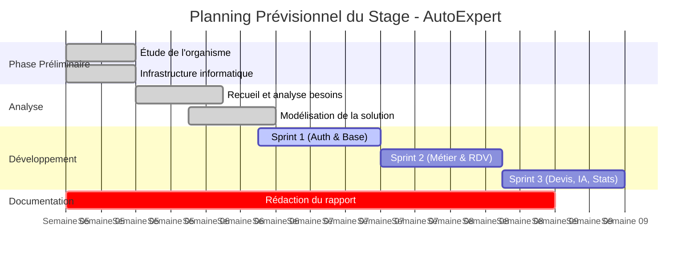

_Figure 1.1 : Diagramme de Gantt représentant la planification des activités du stage_

---

## 3. Étude préalable

### 3.1 Description de l'existant

Une analyse du marché des solutions numériques dédiées à la maintenance automobile a été menée. Deux plateformes représentatives ont été sélectionnées :

1. **Drivvo :** Application de carnet d'entretien numérique. Elle permet aux utilisateurs d'enregistrer manuellement leurs dépenses (carburant, réparations).
1. **Drivvo :** Application de carnet d'entretien numérique. Elle permet aux utilisateurs d'enregistrer manuellement leurs dépenses (carburant, réparations).
1. **Shopmonkey :** Système de gestion de garage (GMS). Il offre des fonctionnalités pour les devis, la facturation et une messagerie de communication entre le garage et le client. Cependant, cette messagerie reste un outil de support humain sans aucune intelligence artificielle.

**Le flux de travail traditionnel dans les garages actuels :**

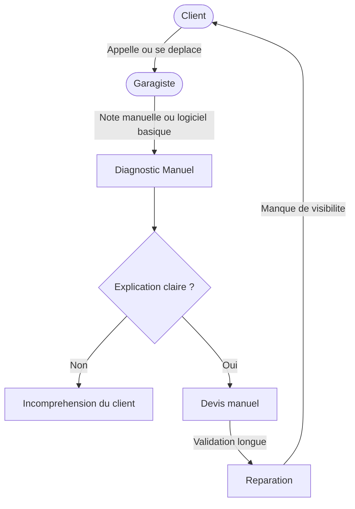

_Figure 1.2 : Goulots d'étranglement du processus classique de réparation automobile_

### 3.2 Critiques et analyse comparative

| Critères                      | Drivvo                                                | Shopmonkey                             |
| ----------------------------- | ----------------------------------------------------- | -------------------------------------- |
| **Type de plateforme**        | Carnet d'entretien numérique                          | Système de gestion de garage (GMS)     |
| **Saisie des données**        | Entièrement manuelle par le client                    | Saisie par l'atelier (factures/devis)  |
| **Bulle de discussion**       | Absente                                               | Présente (Support client/Messagerie)   |
| **Aide au diagnostic par IA** | Aucune                                                | Aucune                                 |
| **Rôle du système**           | Outil de suivi personnel (Garde un simple historique) | Prestataire de services administratifs |

_Tableau 1.2 : Analyse comparative des solutions existantes_

**Synthèse des limites :** L'analyse montre que les solutions actuelles se limitent soit au stockage passif de données, soit à la gestion administrative sans réelle intelligence métier. Qu'il s'agisse de Drivvo ou Shopmonkey, **aucune plateforme n'intègre l'intelligence artificielle** pour assister le diagnostic technique ou automatiser l'interaction client 24/7.

### 3.3 Solution proposée : AutoExpert

Pour remédier à ces problématiques, nous proposons la plateforme **AutoExpert**. Contrairement aux solutions existantes, AutoExpert apporte une réelle valeur ajoutée en transformant la gestion automobile en une expérience interactive et intelligente.

**Structure de la solution :**

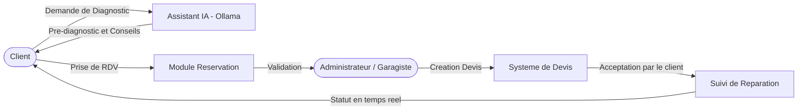

_Figure 1.3 : Architecture de la solution AutoExpert avec IA intégrée_

**Fonctionnalités clés de la solution :**

1.  **Assistant IA de Diagnostic :** Intégration d'un moteur d'IA (llama3.1) capable d'analyser les symptômes saisis par l'utilisateur pour proposer un pré-diagnostic instantané.
2.  **Centralisation Multi-pôles :** Une gestion unifiée couvrant la mécanique, l'électricité et la tôlerie.
3.  **Automatisation du Suivi :** Workflow fluide de la réservation jusqu'à la livraison du véhicule.

---

## 4. Méthodologie de développement adoptée : Agile Scrum

Pour assurer le bon déroulement du projet AutoExpert sur une durée limitée, nous avons adopté la méthodologie de développement Agile.

### 4.1 Approche Agile et framework Scrum

Le framework Scrum favorise l'organisation et l'amélioration continue, reposant sur trois piliers fondamentaux :

- **La transparence :** Visibilité totale sur l'avancement des tâches (outils de suivi).
- **L'inspection :** Vérification régulière de la conformité des développements.
- **L'adaptation :** Ajustement des priorités en temps réel.

### 4.2 Les valeurs fondamentales de l'Agilité

La méthode Scrum adoptée s'appuie sur le Manifeste Agile :

1. Les individus et leurs interactions _avant_ les processus et les outils.
2. Des logiciels opérationnels _avant_ une documentation exhaustive.
3. La collaboration avec le client _avant_ la négociation contractuelle.
4. L'adaptation au changement _avant_ le suivi d'un plan rigide.

### 4.3 Les rôles au sein de l'équipe Scrum

Bien que le projet ait été réalisé individuellement au niveau du développement, la structure des responsabilités a été respectée :

- **Product Owner (Encadrant Maison du Web) :** Responsable de la vision, il définit et priorise les fonctionnalités dans le Product Backlog.
- **Scrum Master (Stagiaire) :** Garantit l'application des méthodes, lève les obstacles et assure la fluidité.
- **Équipe de Développement (Stagiaire) :** Assure la conception, le développement technique (MERN) et la réalisation des tests.

### 4.4 Les cérémonies et artefacts Scrum

Scrum structure le travail autour d'événements :

- **Product Backlog :** Liste priorisée de toutes les fonctionnalités.
- **Sprint Planning :** Sélection des tâches pour le sprint de développement.
- **Daily Scrum :** Point quotidien (Qu'ai-je fait hier ? Que vais-je faire ? Quels obstacles ?).
- **Sprint Review :** Démonstration des fonctionnalités réalisées à la fin de l'itération.
- **Sprint Retrospective :** Analyse des améliorations pour le cycle suivant.

---

## Conclusion

Ce premier chapitre a permis de poser les fondements de la réalisation d'AutoExpert. La présentation de Maison du Web a mis en lumière un environnement technologique idéal. L'étude préalable (Drivvo, Shopmonkey) a révélé un manque crucial d'outils de diagnostic intelligent.
C'est pour combler cette lacune que nous avons proposé AutoExpert, combinant gestion classique et IA embarquée. L'adoption de la méthodologie Agile Scrum garantit une gestion structurée et flexible, indispensable pour transformer ces besoins en fonctionnalités concrètes. Nous aborderons la spécification et la modélisation UML détaillée dans le chapitre suivant.

# CHAPITRE 2 : Spécification des besoins et modélisation de la solution

## Introduction

Ce chapitre est consacré à la spécification des besoins de la plateforme AutoExpert et à la modélisation de la solution. Il définit précisément **ce que l'application doit faire** avant de s'intéresser à sa réalisation technique.

Le chapitre s'articule autour de quatre axes : le cadrage du projet selon Scrum (vision et acteurs), l'inventaire des besoins fonctionnels et non fonctionnels, la modélisation UML (cas d'utilisation, classes, séquences), et les choix architecturaux retenus.

---

## 1. Cadrage du projet selon Scrum

### 1.1 Vision du produit

**Objectif global d'AutoExpert**
AutoExpert est une application web full-stack conçue pour digitaliser et automatiser intégralement la gestion d'un garage automobile. L'objectif est de moderniser la prise de rendez-vous, la gestion des devis et le suivi des réparations, en offrant une plateforme centralisée, intuitive et accessible en permanence.

**Valeur apportée aux utilisateurs**
Le produit vise à transformer l'expérience client en leur offrant la transparence sur l'état de leurs réparations, la facilité de planification via un système de réservation en ligne, et une assistance instantanée via une IA intégrée. Pour l'administrateur (garagiste), la valeur réside dans l'optimisation de son temps, l'organisation rigoureuse de son planning et une vision claire des indicateurs de performance de l'atelier.

### 1.2 Identification des acteurs

Avant d'identifier les exigences du système, il est essentiel de définir les acteurs principaux :

| Acteur             | Définition                                                                                | Tâches principales                                                                                                                                                                                                                                                 |
| :----------------- | :---------------------------------------------------------------------------------------- | :----------------------------------------------------------------------------------------------------------------------------------------------------------------------------------------------------------------------------------------------------------------- |
| **Visiteur**       | Personne **non authentifiée** ayant accès aux pages publiques (sans être connecté).       | Consulter l'accueil, consulter les services, s'inscrire, se connecter, **réinitialiser son mot de passe** _(l'utilisateur possède déjà un compte mais a oublié son mot de passe — il initie la réinitialisation depuis la page de connexion, sans être connecté)_. |
| **Client**         | Utilisateur **authentifié** interagissant avec les services du garage pour ses véhicules. | Gérer profil, véhicules, réservations, devis, réparations, Chat IA.                                                                                                                                                                                                |
| **Administrateur** | Gestionnaire du garage disposant d'un **accès complet** au système.                       | Gérer clients, services, réservations, devis, réparations, tableau de bord analytique.                                                                                                                                                                             |

### 1.3 Les besoins fonctionnels par acteur

**A. Besoins fonctionnels du Client (et Visiteur)**

- **Gestion de l'authentification :**
  - L'application doit permettre à un visiteur de s'inscrire (nom, téléphone, email unique, mot de passe ≥ 6 caractères).
  - L'application doit permettre au visiteur de se connecter (email/mot de passe).
  - L'application doit permettre à un utilisateur ayant oublié son mot de passe de le réinitialiser via un lien envoyé par **email**. Une fois le lien cliqué, l'utilisateur peut définir un nouveau mot de passe.
- **Gestion du profil :** L'application doit permettre au client de consulter et mettre à jour ses informations personnelles et de modifier son mot de passe.
- **Gestion des véhicules :** L'application doit permettre au client d'ajouter un véhicule (Marque, Modèle, Année, Immatriculation, VIN), de les modifier ou supprimer.
- **Gestion des réservations :** L'application doit permettre au client de prendre un rendez-vous (véhicule, service, date), consulter l'historique ou annuler une réservation.
- **Gestion des devis et réparations :** L'application doit permettre au client de demander un devis, accepter ou refuser un devis formalisé, et suivre ses réparations.
- **Assistance virtuelle :** L'application doit permettre au client d'interagir avec une IA spécialisée pour obtenir des diagnostics primaires.

**B. Besoins fonctionnels de l'Administrateur**

- **Tableau de bord :** L'application doit permettre à l'administrateur de consulter un tableau de bord analytique (revenus, réservations, statistiques temps réel).
- **Gestion des clients :** Consulter la liste, bloquer, activer ou supprimer un client.
- **Gestion des services :** Créer, modifier ou archiver des services tarifés.
- **Gestion des réservations :** Voir tous les RDV, les accepter ou refuser.
- **Gestion des devis :** Créer un devis chiffré, suivre son état (Accepté/Refusé par le client).
- **Gestion des réparations :** Déclencher une réparation suite à un devis accepté, modifier son état (In Progress → Completed → Delivered).

### 1.4 Besoins non fonctionnels

| ID       | Attribut         | Description                                                                                                    |
| :------- | :--------------- | :------------------------------------------------------------------------------------------------------------- |
| **BNF1** | Sécurité         | Routes API protégées par JWT, hachage Bcrypt, **liens de réinitialisation à usage unique expirant après 24h**. |
| **BNF2** | Authentification | Accès aux fonctionnalités privées conditionné à l'authentification obligatoire.                                |
| **BNF3** | Ergonomie        | Interface intuitive avec rétroactions immédiates (toasts, validation temps réel), design moderne.              |
| **BNF4** | Portabilité      | Responsive sur navigateurs modernes (mobile, tablette, desktop).                                               |
| **BNF5** | Performance      | Temps de réponse du serveur < 2-3 secondes.                                                                    |

---

## 2. Diagramme de cas d'utilisation global

Le diagramme de cas d'utilisation global illustre l'ensemble des interactions entre les trois acteurs et le système AutoExpert, incluant la nouvelle fonctionnalité de réinitialisation de mot de passe par email.

**Figure 2.1 : Diagramme de cas d'utilisation global d'AutoExpert**

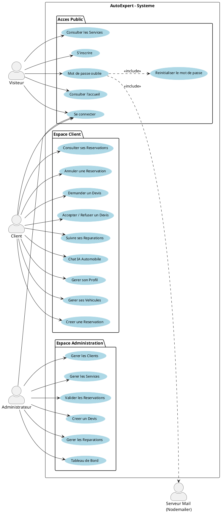

---

## 3. Tableau des Entités et Attributs

**Tableau 2.1 : Entités et Attributs du système AutoExpert**

| Entité          | Attributs principaux                                                                            | Type                     | Contrainte                                                    |
| :-------------- | :---------------------------------------------------------------------------------------------- | :----------------------- | :------------------------------------------------------------ |
| **User**        | `_id`, `name`, `email`, `password`, `phone`, `role`, `isActive`, `createdAt`                    | String, Boolean, Date    | email unique ; role ∈ {client, admin} ; password hashé Bcrypt |
| **Vehicle**     | `_id`, `userId`, `make`, `model`, `year`, `licensePlate`, `VIN`, `mileage`, `color`             | String, Number, ObjectId | licensePlate unique ; userId → User                           |
| **Service**     | `_id`, `name`, `description`, `basePrice`, `estimatedTime`, `category`, `isActive`              | String, Number, Boolean  | category ∈ {Entretien, Réparation, Diagnostic, Carrosserie}   |
| **Reservation** | `_id`, `userId`, `vehicleId`, `serviceId`, `date`, `status`, `notes`                            | ObjectId, Date, String   | status ∈ {pending, confirmed, completed, cancelled}           |
| **Devis**       | `_id`, `userId`, `vehicleId`, `services[]`, `totalPrice`, `status`, `validUntil`, `description` | ObjectId, Number, Date   | status ∈ {pending, accepted, rejected}                        |
| **Reparation**  | `_id`, `vehicleId`, `devisId`, `services[]`, `status`, `startDate`, `endDate`, `notes`          | ObjectId, Date, String   | status ∈ {in_progress, completed, delivered}                  |

---

## 4. Gestion de projet avec Scrum

### 4.1 L'équipe Scrum

**Tableau 2.2 : L'équipe Scrum**
| Rôle | Nom | Tâches |
| :--- | :--- | :--- |
| **Scrum Master** | Abir Ben Cheikh | Faciliter le processus Scrum, animer les cérémonies, éliminer les obstacles. |
| **Product Owner** | Skander Belloum | Définir la vision du produit, prioriser le Product Backlog. |
| **Équipe de développement** | Yassine Aounallah | Développer les fonctionnalités, concevoir l'architecture, exécuter les tests. |

### 4.2 Le Product Backlog enrichi

Les besoins ont été découpés en trois modules majeurs (Foundational Setup, Operational Essentials, Application Control), regroupant les fonctionnalités clés pour éviter la redondance et structurer le travail.

**Tableau 2.3 : Product Backlog d'AutoExpert**

| Module                     | Fonctionnalité                | ID  | Histoire Utilisateur                                                                                                                                                                                                                             | Priorité | Effort (Pts) |
| :------------------------- | :---------------------------- | :-: | :----------------------------------------------------------------------------------------------------------------------------------------------------------------------------------------------------------------------------------------------- | :------- | :----------: |
| **Foundational Setup**     | **Gestion d'accès et profil** |  1  | **En tant que** Visiteur, je veux m'inscrire ou me connecter.  **En tant qu'** Utilisateur, je veux réinitialiser mon mot de passe en cas d'oubli.  **En tant que** Client, je veux éditer les informations générales de mon compte. | Haute    |      10      |
|                            | **Gestion des services**      |  2  | **En tant qu'** administrateur, je veux créer, modifier, consulter, archiver et lister les prestations (services) proposées par le garage.                                                                                                       | Haute    |      2       |
| **Operational Essentials** | **Gestion des véhicules**     |  3  | **En tant que** client, je veux enregistrer, consulter, modifier et supprimer la liste de mes véhicules (marque, modèle, immatriculation).                                                                                                       | Haute    |      3       |
|                            | **Gestion des réservations**  |  4  | **En tant que** client, je veux prendre, consulter ou annuler un rendez-vous (Date, Véhicule, Service).  **En tant qu'** administrateur, je veux consulter, accepter ou refuser ces réservations.                                          | Haute    |      7       |
|                            | **Gestion des devis**         |  5  | **En tant qu'** administrateur, je veux créer et attribuer un devis chiffré comprenant les services requis et le coût total.  **En tant que** client, je veux consulter le détail de ce devis pour l'accepter ou le refuser.               | Haute    |      7       |
| **Application Control**    | **Suivi des réparations**     |  6  | **En tant qu'** administrateur, je veux gérer et faire évoluer les statuts d'une réparation (En cours, Terminée, Livrée) suite à l'acceptation d'un devis par le client.                                                                         | Haute    |      2       |
|                            | **Tableau de Bord**           |  7  | **En tant qu'** administrateur, je veux visualiser les statistiques (revenus, réservations, statut des réparations) sous forme de graphiques.                                                                                                    | Moyenne  |      3       |
|                            | **Chat IA Automobile**        |  8  | **En tant que** client, je veux dialoguer avec un assistant virtuel (IA locale) pour obtenir un pré-diagnostic mécanique personnalisé avant prise de rendez-vous.                                                                                | Faible   |      3       |

### 4.3 Planification des Sprints

Le projet a été découpé en trois sprints. Le tableau ci-dessous indique le module affecté à chaque sprint ainsi que la durée estimée.

**Tableau 2.4 : Sprint planning**

| Sprints      | Module Name                | Fonctionnalités                                                                 | Durée     |
| :----------- | :------------------------- | :------------------------------------------------------------------------------ | :-------- |
| **Sprint 1** | **Foundational Setup**     | - Gestion d'accès et profil - Gestion des services                           | 1 Semaine |
| **Sprint 2** | **Operational Essentials** | - Gestion des véhicules - Gestion des réservations - Gestion des devis    | 1 Semaine |
| **Sprint 3** | **Application Control**    | - Suivi des réparations - Tableau de bord analytique - Chat IA Automobile | 1 Semaine |

---

## 5. Environnement de Travail

### 5.1 Environnement matériel (Hardware Environment)

Le développement de la plateforme AutoExpert a été réalisé sur une machine de développement disposant des caractéristiques suivantes :

| Composant                  | Spécification                                     |
| :------------------------- | :------------------------------------------------ |
| **Processeur (CPU)**       | _(Insérer : ex. Intel Core i7-12th Gen, 2.1 GHz)_ |
| **Mémoire vive (RAM)**     | _(Insérer : ex. 16 Go DDR4)_                      |
| **Stockage**               | _(Insérer : ex. SSD 512 Go NVMe)_                 |
| **Système d'exploitation** | _(Insérer : ex. Windows 11 / Ubuntu 22.04)_       |
| **Résolution d'écran**     | _(Insérer : ex. 1920 x 1080 Full HD)_             |

_Tableau 2.5 : Caractéristiques de l'environnement matériel de développement_

---

### 5.2 Environnement logiciel (Software Environment)

#### A. Outils de développement (Software Tools)

| Outil                  |       Logo       | Description                                                                                                                                                                                                                                                                                        |
| :--------------------- | :--------------: | :------------------------------------------------------------------------------------------------------------------------------------------------------------------------------------------------------------------------------------------------------------------------------------------------- |
| **Visual Studio Code** | _(logo VS Code)_ | Éditeur de code source léger, extensible et multiplateforme développé par Microsoft. Il supporte le débogage intégré, la coloration syntaxique, la complétion automatique (IntelliSense) et une vaste bibliothèque d'extensions. Utilisé comme environnement principal de développement du projet. |
| **GitHub**             | _(logo GitHub)_  | Plateforme d'hébergement de code source basée sur le système de contrôle de versions Git. Elle permet la gestion des branches, le suivi des modifications (commits), la collaboration et la sauvegarde sécurisée du code source du projet AutoExpert.                                              |
| **Postman**            | _(logo Postman)_ | Outil de test et de débogage d'API REST. Il permet d'envoyer des requêtes HTTP (GET, POST, PUT, DELETE) avec paramètres, headers et authentification JWT, et d'inspecter les réponses JSON. Utilisé pour tester et valider toutes les routes du Backend.                                           |

_Tableau 2.6 : Outils de développement utilisés_

#### B. Frameworks et Bibliothèques (Frameworks & Libraries)

| Technologie           |        Logo         | Rôle               | Description                                                                                                                                                                                                            |
| :-------------------- | :-----------------: | :----------------- | :--------------------------------------------------------------------------------------------------------------------------------------------------------------------------------------------------------------------- |
| **Node.js**           |  _(logo Node.js)_   | Runtime Backend    | Environnement d'exécution JavaScript côté serveur, basé sur le moteur V8 de Chrome. Il permet d'exécuter du JavaScript en dehors du navigateur pour construire des serveurs performants et non-bloquants.              |
| **Express.js**        |  _(logo Express)_   | Framework Backend  | Micro-framework minimaliste pour Node.js permettant de créer rapidement des serveurs HTTP, de définir des routes REST et de gérer les middlewares (authentification, gestion d'erreurs, etc.).                         |
| **React.js**          |   _(logo React)_    | Framework Frontend | Bibliothèque JavaScript (Facebook/Meta) pour la construction d'interfaces utilisateur dynamiques sous forme de composants réutilisables. Couplé à Vite pour un démarrage rapide et un rechargement instantané (HMR).   |
| **Tailwind CSS**      |  _(logo Tailwind)_  | Stylisation UI     | Framework CSS utilitaire permettant de styler l'interface directement via des classes CSS prédéfinies. Il produit des designs responsives, modernes et cohérents sans écrire de CSS personnalisé.                      |
| **Mongoose**          |  _(logo Mongoose)_  | ODM MongoDB        | ODM (Object Data Modeling) pour MongoDB et Node.js. Il fournit un système de schémas typés, la validation des données, les relations entre documents et une interface simplifiée pour les requêtes vers MongoDB.       |
| **Axios**             |   _(logo Axios)_    | Client HTTP        | Bibliothèque JavaScript pour effectuer des requêtes HTTP asynchrones depuis le Frontend React vers le Backend Express. Elle gère automatiquement la sérialisation JSON et les headers d'authentification (tokens JWT). |
| **Nodemailer**        | _(logo Nodemailer)_ | Serveur Mail       | Module Node.js pour l'envoi d'emails via un serveur SMTP. Utilisé pour envoyer les liens de réinitialisation de mot de passe aux utilisateurs ayant oublié leur accès.                                                 |
| **Ollama (llama3.1)** |   _(logo Ollama)_   | Moteur IA          | Plateforme d'exécution de modèles de langage (LLM) en local. Le modèle llama3.1, configuré via un Modelfile spécialisé automobile, alimente le Chat IA de diagnostic du projet AutoExpert.                             |
| **Recharts**          |  _(logo Recharts)_  | Visualisation      | Bibliothèque de graphiques React pour la visualisation de données (camemberts, barres, courbes). Utilisée dans le tableau de bord administrateur pour afficher les statistiques du garage.                             |

_Tableau 2.7 : Frameworks et bibliothèques utilisés_

#### C. Langages et Standards

| Langage / Standard    | Description                                                                                                                                                                                                                                         |
| :-------------------- | :-------------------------------------------------------------------------------------------------------------------------------------------------------------------------------------------------------------------------------------------------- |
| **JavaScript (ES6+)** | Langage principal du projet, utilisé de bout en bout (Frontend React + Backend Node.js). Syntaxe moderne : arrow functions, async/await, destructuring, modules ES6.                                                                                |
| **HTML5**             | Langage de balisage structurant les pages web. Utilisé dans les composants JSX de React pour définir la structure des interfaces.                                                                                                                   |
| **CSS3**              | Langage de style étendu par Tailwind CSS pour la mise en page et le design responsive de l'application.                                                                                                                                             |
| **UML**               | Langage de modélisation unifié utilisé pour les diagrammes de cas d'utilisation, de classes et de séquence (notation PlantUML).                                                                                                                     |
| **JWT**               | Standard ouvert (RFC 7519) définissant un format compact et auto-suffisant pour la transmission sécurisée de données entre parties sous forme de token signé. Utilisé pour l'authentification et l'autorisation de toutes les routes API protégées. |
| **JSON**              | Format léger d'échange de données textuelles (JavaScript Object Notation), utilisé pour toutes les communications entre le Frontend et le Backend (requêtes et réponses HTTP).                                                                      |

_Tableau 2.8 : Langages et standards utilisés_

---

### 5.3 Architecture recommandée : MERN

Nous avons adopté l'architecture **MERN** (MongoDB · Express · React · Node.js), qui assure une **séparation claire** entre la couche de présentation (Frontend), la couche métier (Backend) et la couche de données (Base de données), tout en maintenant une **homogénéité** grâce à l'usage exclusif de JavaScript de bout en bout.

Cette architecture est également **modulaire et flexible**, ce qui facilite les évolutions futures et la maintenance du code. Chaque couche est indépendante et communique avec les autres via des interfaces bien définies (API REST + Axios).

- **Frontend** : React.js (SPA avec Vite + Tailwind CSS)
- **Backend** : Node.js + Express.js (API REST sécurisée par JWT)
- **Base de données** : MongoDB (documents JSON via Mongoose)

La figure ci-dessous résume le **flux de données** entre le Frontend, le Backend et les endpoints de l'API :

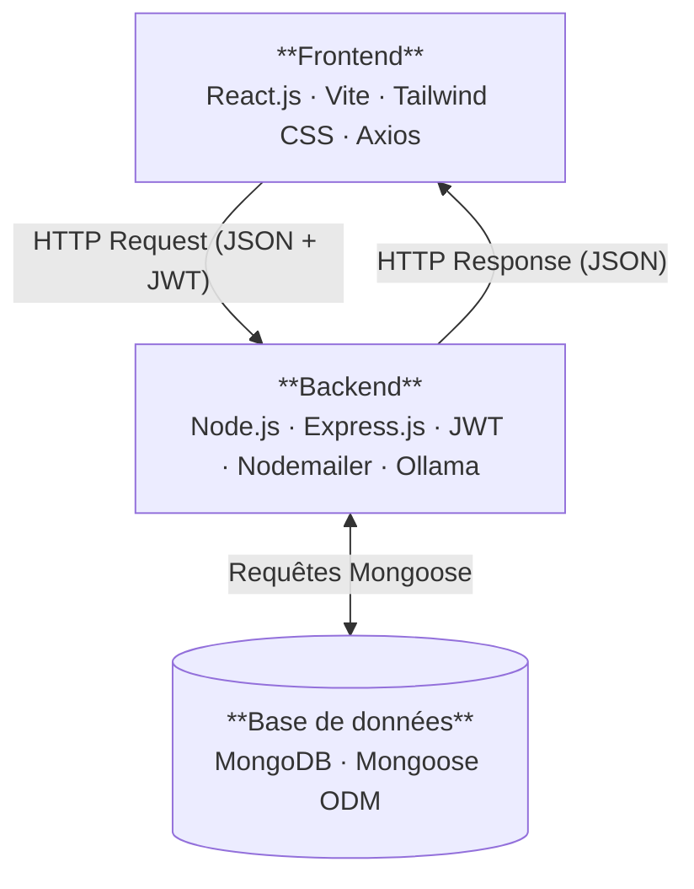

_Figure 2.2 : Architecture MERN — flux de données entre les 3 couches_

---

## Conclusion du Chapitre 2

Ce second chapitre a permis de formaliser les besoins et spécifications du projet AutoExpert. Le Product Backlog enrichi structure l'ensemble des 13 User Stories (incluant la réinitialisation de mot de passe par email - **US0**) avec leurs critères d'acceptation et estimations. La méthodologie Scrum, l'écosystème MERN et les outils choisis constituent une base solide pour aborder la phase de réalisation présentée dans le chapitre suivant.

# CHAPITRE 3 : Réalisation et tests

## Introduction

Ce chapitre décrit la mise en œuvre pratique d'AutoExpert, découpée en trois sprints successifs selon Scrum. Pour chaque sprint : backlog, Use Case, Classes avec méthodes, deux séquences, et interfaces réalisées.

---

## Sprint 1 : Foundational Setup (Auth & Services)

> 📋 **Fonctionnalités – Sprint 1**

| ID    | Fonctionnalité (User Story)      | Statut |
| :---- | :------------------------------- | :----- |
| **1** | Inscription et Connexion         | ✅     |
| **2** | Réinitialisation du mot de passe | ✅     |
| **3** | Gestion du profil utilisateur    | ✅     |
| **4** | Gestion des services (Admin)     | ✅     |

### 1.1 Backlog du Sprint 1

**Tableau 3.1 : Sprint Backlog 1**

| ID    | User story                                                                                                        | Task                                                                                                                                                                                                                                                                               | Effort                |
| :---- | :---------------------------------------------------------------------------------------------------------------- | :--------------------------------------------------------------------------------------------------------------------------------------------------------------------------------------------------------------------------------------------------------------------------------- | :-------------------- |
| **1** | En tant que Visiteur, je veux créer un compte et me connecter pour accéder aux fonctionnalités personnalisées.    | - Créer les fonctions d'authentification (Inscription, Connexion). - Implémenter le backend pour l'authentification (JWT, Bcrypt). - Concevoir l'UI front-end pour les formulaires de connexion et d'inscription. - Tester la fonctionnalité d'authentification.          | Difficile (5 pts)     |
| **2** | En tant qu'Utilisateur, je veux réinitialiser mon mot de passe via email pour retrouver mon accès en cas d'oubli. | - Créer la fonction de réinitialisation de mot de passe. - Implémenter le backend pour la génération de token et l'envoi d'email Nodemailer. - Créer l'UI front-end pour la saisie de l'email et le nouveau mot de passe. - Tester la fonctionnalité de réinitialisation. | Intermédiaire (3 pts) |
| **3** | En tant que Client, je veux gérer mon profil pour mettre à jour mes informations personnelles.                    | - Créer la fonction de mise à jour du profil. - Implémenter le backend pour la modification du profil. - Concevoir l'UI front-end pour les paramètres du compte. - Tester la fonctionnalité de mise à jour du profil.                                                     | Facile (2 pts)        |
| **4** | En tant qu'Administrateur, je veux gérer les services pour définir les prestations proposées par le garage.       | - Créer la fonction de gestion des services (CRUD). - Implémenter le backend pour la modification des services. - Créer l'UI front-end pour le catalogue des services. - Tester la fonctionnalité de gestion des services.                                                | Facile (2 pts)        |

### 1.2 Diagramme de Cas d'Utilisation – Sprint 1

**Figure 3.1 : Use Case Sprint 1**

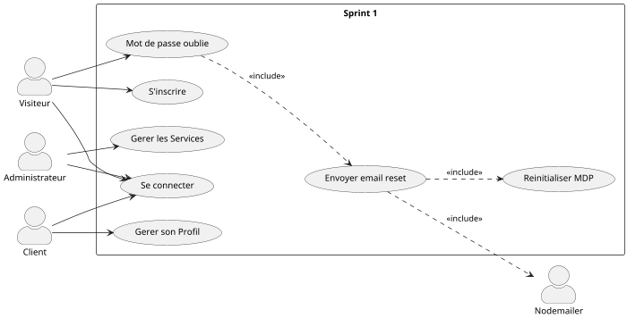

### 1.3 Diagramme de Classes – Sprint 1

**Figure 3.2 : Classes Sprint 1**

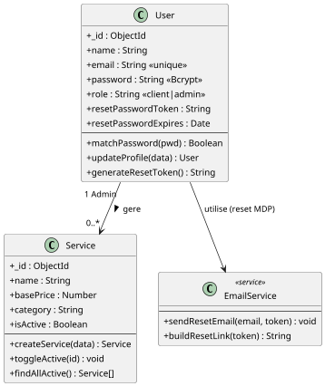

### 1.4 Séquence 1 – Inscription

**Figure 3.3 : Séquence – Inscription**

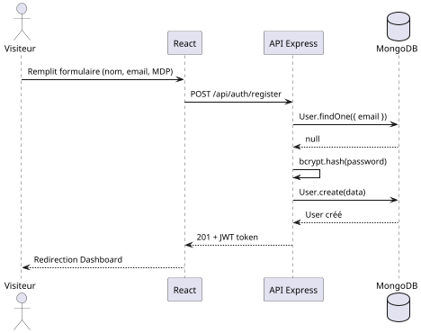

### 1.5 Séquence 2 – Réinitialisation du Mot de Passe

**Figure 3.4 : Séquence – Reset MDP par email**

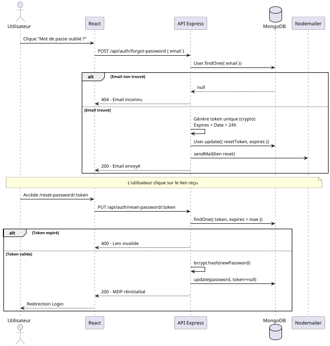

### 1.6 Interfaces Sprint 1

_(Insérer captures : LoginPage · ForgotPasswordPage · ResetPasswordPage · RegisterPage · ProfilePage)_

---

## Sprint 2 : Operational Essentials

> 📋 **Fonctionnalités – Sprint 2**

| ID    | Fonctionnalité (User Story)         | Statut |
| :---- | :---------------------------------- | :----- |
| **5** | Gestion des véhicules clients       | ✅     |
| **6** | Prise de rendez-vous (Client)       | ✅     |
| **7** | Validation des réservations (Admin) | ✅     |
| **8** | Création et envoi de devis          | ✅     |

### 2.1 Backlog du Sprint 2

**Tableau 3.2 : Sprint Backlog 2**

| ID    | User story                                                                                                  | Task                                                                                                                                                                                                                                                                       | Effort                |
| :---- | :---------------------------------------------------------------------------------------------------------- | :------------------------------------------------------------------------------------------------------------------------------------------------------------------------------------------------------------------------------------------------------------------------- | :-------------------- |
| **5** | En tant que Client, je veux gérer mes véhicules pour ajouter ou retirer des voitures de mon compte.         | - Créer la fonction de gestion des véhicules. - Implémenter le backend pour le CRUD des véhicules. - Créer le formulaire front-end pour l'ajout/modification de véhicules. - Tester la fonctionnalité de gestion des véhicules.                                   | Intermédiaire (3 pts) |
| **6** | En tant que Client, je veux créer une réservation pour planifier un service pour mon véhicule.              | - Créer la fonction de réservation. - Implémenter le backend pour la planification des rendez-vous. - Concevoir l'UI front-end pour la sélection de la date, du véhicule et du service. - Tester la fonctionnalité de création de réservation.                    | Difficile (4 pts)     |
| **7** | En tant qu'Administrateur, je veux gérer les réservations pour accepter ou refuser les rendez-vous clients. | - Créer la fonction de gestion des réservations. - Implémenter le backend pour valider/refuser les rendez-vous. - Mettre à jour le front-end pour afficher les demandes en attente à l'administrateur. - Tester la fonctionnalité de validation des réservations. | Intermédiaire (3 pts) |
| **8** | En tant qu'Administrateur, je veux créer des devis pour fournir des estimations de coûts aux clients.       | - Créer la fonction de génération de devis. - Implémenter le backend pour la création de devis avec les services rattachés. - Concevoir l'UI front-end pour l'élaboration détaillée d'un devis. - Tester la fonctionnalité de génération de devis.                | Difficile (4 pts)     |

### 2.2 Diagramme de Cas d'Utilisation – Sprint 2

**Figure 3.5 : Use Case Sprint 2**

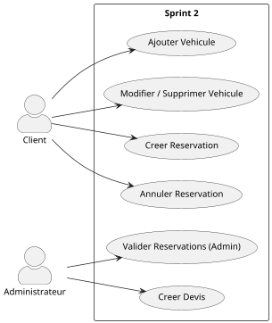

### 2.3 Diagramme de Classes – Sprint 2

**Figure 3.6 : Classes Sprint 2**

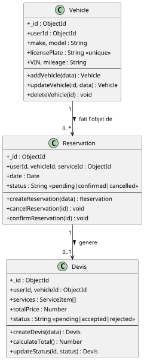

### 2.4 Séquence 1 – Ajout d'un Véhicule

**Figure 3.7 : Séquence – Ajout véhicule**

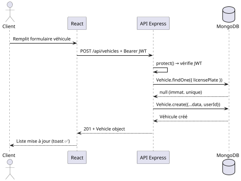

### 2.5 Séquence 2 – Prise de Rendez-vous

**Figure 3.8 : Séquence – Réservation**

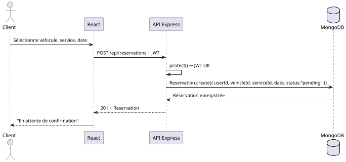

### 2.6 Interfaces Sprint 2

_(Insérer captures : MyVehiclesPage · ServicesPage · ReservationsPage · AdminReservationsPage)_

---

## Sprint 3 : Application Control (Suivi & IA)

> 📋 **Fonctionnalités – Sprint 3**

| ID     | Fonctionnalité (User Story)     | Statut |
| :----- | :------------------------------ | :----- |
| **9**  | Acceptation / Refus des devis   | ✅     |
| **10** | Suivi des réparations (Admin)   | ✅     |
| **11** | Tableau de bord et statistiques | ✅     |
| **12** | Chat IA de diagnostic           | ✅     |

### 3.1 Backlog du Sprint 3

**Tableau 3.3 : Sprint Backlog 3**

| ID     | User story                                                                                                                  | Task                                                                                                                                                                                                                                                                    | Effort                |
| :----- | :-------------------------------------------------------------------------------------------------------------------------- | :---------------------------------------------------------------------------------------------------------------------------------------------------------------------------------------------------------------------------------------------------------------------- | :-------------------- |
| **9**  | En tant que Client, je veux accepter ou refuser un devis pour qu'une réparation démarre automatiquement si accepté.         | - Créer la fonction de décision de devis. - Implémenter le backend pour la mise à jour du statut du devis et la création auto de réparation. - Concevoir l'UI front-end pour consulter et accepter les devis. - Tester la fonctionnalité de décision de devis. | Intermédiaire (3 pts) |
| **10** | En tant qu'Administrateur, je veux suivre les réparations pour mettre à jour le statut des voitures dans le garage.         | - Créer la fonction de suivi des réparations. - Implémenter le backend pour les transitions d'état (en cours, terminée, livrée). - Créer l'UI front-end pour mettre à jour l'évolution des réparations. - Tester la fonctionnalité de suivi des réparations.   | Facile (2 pts)        |
| **11** | En tant qu'Administrateur, je veux visualiser un tableau de bord pour superviser les statistiques et les revenus du garage. | - Créer la fonction de statistiques du tableau de bord. - Implémenter les agrégations backend pour les revenus et le nombre de réservations. - Concevoir l'UI front-end avec Recharts pour les données visuelles. - Tester l'affichage du tableau de bord.     | Intermédiaire (3 pts) |
| **12** | En tant que Client, je veux discuter avec une IA pour obtenir des pré-diagnostics mécaniques interactifs.                   | - Créer la fonction de Chat IA. - Implémenter l'intégration backend avec Ollama (llama3.1). - Créer l'UI front-end du Chat avec l'historique des messages. - Tester la fonctionnalité de diagnostic IA.                                                        | Intermédiaire (3 pts) |

### 3.2 Diagramme de Cas d'Utilisation – Sprint 3

**Figure 3.9 : Use Case Sprint 3**

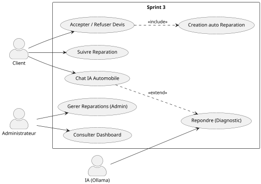

### 3.3 Diagramme de Classes – Sprint 3

**Figure 3.10 : Classes Sprint 3**

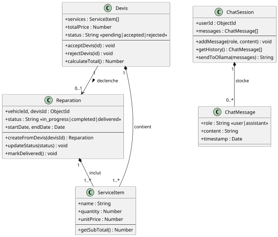

### 3.4 Séquence 1 – Acceptation d'un Devis

**Figure 3.11 : Séquence – Accepter Devis → Réparation auto**

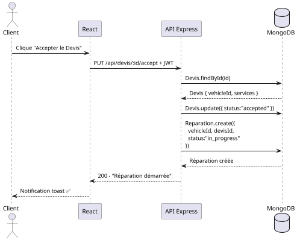

### 3.5 Séquence 2 – Chat avec l'IA

**Figure 3.12 : Séquence – Dialogue Chat IA**

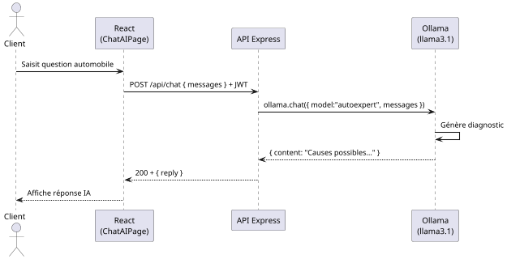

### 3.6 Interfaces Sprint 3

_(Insérer captures : DashboardAdmin · DevisPage · ReparationsPage · ChatAIPage)_

---

## 3.7 Diagramme de Classes Global

**Figure 3.13 : Classes Global – AutoExpert**

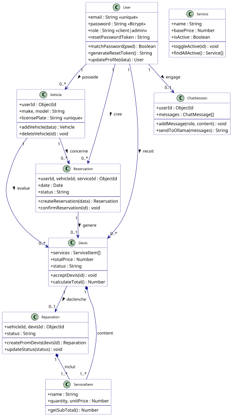

---

## 3.8 Rétrospectives et Bilan Scrum

À la fin de chaque sprint, une rétrospective a été organisée pour analyser le déroulement et identifier les axes d'amélioration.

```mermaid
flowchart LR
    subgraph S1["🔵 Sprint 1 — Rétrospective"]
        P1["✅ Points positifs<br>Authentification JWT robuste<br>Réinitialisation Email OK"]
        D1["⚠️ Difficultés<br>Configuration React/Vite<br>Gestion asynchrone Bcrypt"]
        A1["🔄 Actions<br>Standardisation Axios<br>Amélioration gestion erreurs"]
    end

    subgraph S2["🟢 Sprint 2 — Rétrospective"]
        P2["✅ Points positifs<br>Relations Mongoose complexes<br>CRUD Véhicules fluide"]
        D2["⚠️ Difficultés<br>Validation imbriquée Devis<br>Gestion dates Réservations"]
        A2["🔄 Actions<br>Refactorisation validation<br>Utilisation librairie date"]
    end

    subgraph S3["🟠 Sprint 3 — Rétrospective"]
        P3["✅ Points positifs<br>Intégration Ollama IA réussie<br>Graphiques Recharts dynamiques"]
        D3["⚠️ Difficultés<br>Temps de réponse IA<br>Agrégations MongoDB stats"]
        A3["🔄 Actions<br>Loading states (UI)<br>Optimisation Pipeline Mongo"]
    end

    P1 ~~~ D1 ~~~ A1
    P2 ~~~ D2 ~~~ A2
    P3 ~~~ D3 ~~~ A3

    A1 --> P2
    A2 --> P3
```

_Figure 3.14 : Rétrospectives des trois sprints_

---

## 4. Tests et Validation

### 4.1 Tests fonctionnels

Les tests fonctionnels ont été réalisés manuellement via Postman pour les API et en navigation réelle côté client pour chaque User Story.

**Validation des formulaires** (React Hook Form) — Tous les formulaires front-end ont été testés pour vérifier : les champs obligatoires (soumission impossible si vide), la validation du format email, l'unicité de la plaque d'immatriculation à l'enregistrement du véhicule, et la force du mot de passe.

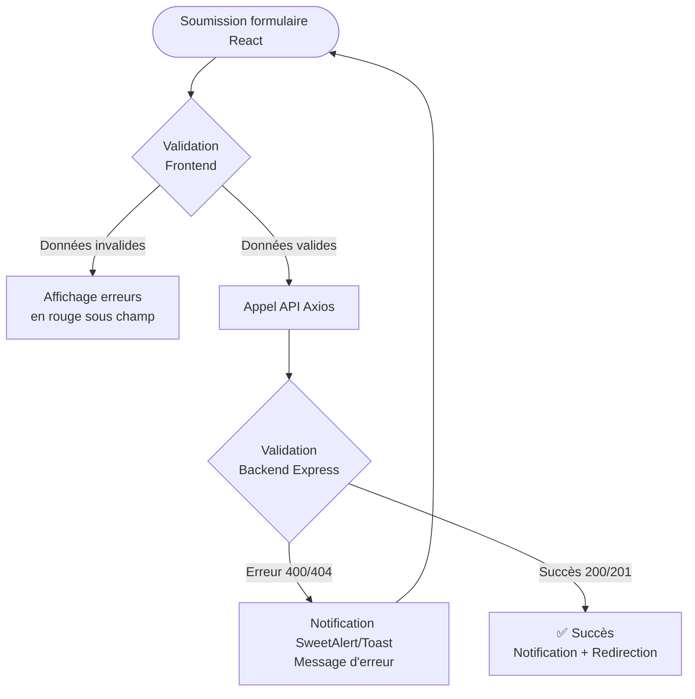

_Figure 3.15 : Flux de validation des données_

### 4.2 Tests de sécurité

**Protection JWT (Middlewares)** — Vérification qu'un utilisateur non authentifié tentant d'accéder à l'API reçoit une erreur `401 Unauthorized`, et qu'un client accédant à une route d'administration reçoit une erreur `403 Forbidden`.

**Hachage des mots de passe** — Confirmation que les mots de passe sont stockés et comparés via l'algorithme sécurisé `bcryptjs` et jamais en clair dans MongoDB.

**Gestion des Tokens de Réinitialisation** — Tests de rejet des tokens d'oubli de mot de passe expirés (plus de 24h) ou invalides.

### 4.3 Tests de performance

Les performances de l'API Node.js ont été mesurées et optimisées :

| Endpoint API / Action        | Temps estimé/moyen | Optimisation appliquée                |
| ---------------------------- | ------------------ | ------------------------------------- |
| `POST /api/auth/login`       | ~300ms             | Indexation email sur MongoDB          |
| `GET /api/admin/dashboard`   | ~450ms             | Eager Loading et Aggregation Pipeline |
| `POST /api/chat` (IA Ollama) | ~2.5s              | Loading Spinner et Streaming UI       |
| Chargement Vue React         | ~0.8s              | Compilation optimisée via Vite        |

_Tableau 3.4 : Temps de réponse des actions principales_

Toutes les interfaces classiques respectent l'exigence de fluidité immédiate demandée pour une architecture SPA (Single Page Application).

### 4.4 Tableau récapitulatif des tests

| Fonctionnalité             | Type        | Résultat | Observations                         |
| -------------------------- | ----------- | -------- | ------------------------------------ |
| Inscription & Connexion    | Fonctionnel | ✅       | Génération JWT + Hachage bcrypt      |
| Réinitialisation MDP       | Fonctionnel | ✅       | Envoi Nodemailer + token sécurisé    |
| CRUD Véhicules             | Fonctionnel | ✅       | Immatriculation vérifiée (unicité)   |
| Flux Réservation → Devis   | Fonctionnel | ✅       | Changement d'états cohérent          |
| Réponses Chat IA           | Fonctionnel | ✅       | Llama3.1 répond sur la mécanique     |
| Contrôle accès Admin       | Sécurité    | ✅       | Erreur 403 via Middleware Auth       |
| Contrôle accès Client      | Sécurité    | ✅       | Redirect `/login` si Bearer manquant |
| Validation formulaires     | Sécurité    | ✅       | React Hook Form prévient l'envoi     |
| Temps de réponse (hors IA) | Performance | ✅       | Très rapide (MERN asynchrone)        |

_Tableau 3.5 : Récapitulatif des tests de validation_

---

## Conclusion du Chapitre 3

La phase de réalisation s'est articulée fidèlement autour des spécifications établies. Les trois Sprints Scrum ont permis de livrer progressivement l'application complète : le Sprint 1 a posé les fondations sécurisées, le Sprint 2 a implémenté le cœur métier transactionnel, et le Sprint 3 a sublimé la plateforme avec le chat IA et le dashboard statistique.

L'environnement MERN s'est révélé être une architecture performante et homogène. Les tests fonctionnels, de sécurité et d'interfaces ont confirmé la fiabilité de la solution globale construite pour les besoins spécifiques d'un garage moderne. L'application AutoExpert est ainsi opérationnelle et prête à être déployée.

## Webographie

| Source                   | URL                    |
| ------------------------ | ---------------------- |
| Documentation Mongoose   | https://mongoosejs.com |
| Documentation React      | https://reactjs.org    |
| Documentation Ollama     | https://ollama.com     |
| Documentation Express    | https://expressjs.com  |
| Documentation Nodemailer | https://nodemailer.com |

## Liste des abréviations

| Abréviation | Signification                       |
| ----------- | ----------------------------------- |
| API         | Application Programming Interface   |
| IA          | Intelligence Artificielle           |
| JWT         | JSON Web Token                      |
| MERN        | MongoDB · Express · React · Node.js |
| MDP         | Mot De Passe                        |
| SMTP        | Simple Mail Transfer Protocol       |
| UML         | Unified Modeling Language           |

