# Chapitre 2 : Préparation du projet

## Introduction

Ce chapitre traite de la capture des besoins en définissant d'abord les acteurs impliqués, puis en spécifiant les exigences fonctionnelles et non fonctionnelles. Nous présentons également la modélisation des besoins à travers un diagramme de cas d'utilisation global. Ensuite, nous décrivons le pilotage du projet avec SCRUM, en traitant l'équipe, le product backlog et la planification des sprints. Enfin, nous examinons l'environnement de travail nécessaire en termes de matériel et de logiciel. Ce chapitre fournit une base solide pour le développement du projet, alignée sur les besoins des utilisateurs.

---

## 1. Capture des besoins

La spécification des besoins est une étape importante dans tout projet de développement logiciel. C'est à ce stade que les fonctionnalités et les exigences du système sont définies de manière précise et claire.

### 1.1. Définition des acteurs

Pour assurer l'efficacité de notre application, il est essentiel de cibler clairement ses utilisateurs finaux. Notre système comprend trois acteurs principaux :

**Tableau 2.1 : Identification des acteurs du système AutoExpert**

| Acteur | Définition | Responsabilités principales |
|--------|------------|----------------------------|
| **Visiteur** | Personne non authentifiée ayant accès aux pages publiques uniquement | Consulter l'accueil, les services, s'inscrire, se connecter, demander un lien de réinitialisation de mot de passe par email |
| **Client** | Utilisateur authentifié interagissant avec les services du garage pour ses véhicules | Gérer son profil, ses véhicules, ses réservations, ses devis, ses réparations et utiliser le Chat IA |
| **Administrateur** | Gestionnaire du garage disposant d'un accès complet au système | Gérer les clients, services, réservations, devis, réparations et consulter le tableau de bord analytique |
| **Serveur Mail (Nodemailer)** | Acteur secondaire — système externe d'envoi d'emails | Envoyer les emails contenant les liens sécurisés de réinitialisation de mot de passe |

### 1.2. Spécification des besoins

Cette section décrit les exigences fonctionnelles et non fonctionnelles de l'application.

#### 1.2.1. Besoins fonctionnels

Les besoins fonctionnels décrivent les services et fonctionnalités que l'application doit fournir à l'utilisateur.

**1. Gestion de l'authentification**

- 1.1. L'application doit permettre au visiteur de s'inscrire (nom, téléphone, email unique, mot de passe ≥ 6 caractères)
- 1.2. L'application doit permettre au visiteur de se connecter (email / mot de passe)
- 1.3. L'application doit permettre à un utilisateur de demander la réinitialisation de son mot de passe en saisissant son email
- 1.4. Le système doit envoyer un email contenant un lien sécurisé de réinitialisation valide pendant 1 heure
- 1.5. L'utilisateur doit pouvoir définir un nouveau mot de passe via le lien reçu

**2. Gestion du profil utilisateur**

- 2.1. Consulter et mettre à jour ses informations personnelles (nom, téléphone, email)
- 2.2. Modifier son mot de passe de manière sécurisée

**3. Gestion des véhicules**

- 3.1. Ajouter un véhicule (Marque, Modèle, Année, Immatriculation, VIN, Kilométrage, Couleur)
- 3.2. Consulter la liste de ses véhicules
- 3.3. Modifier les informations d'un véhicule
- 3.4. Supprimer un véhicule

**4. Gestion des services**

- 4.1. Consulter le catalogue complet des services du garage
- 4.2. Créer, modifier et archiver des services tarifés (Admin)
- 4.3. Activer/Désactiver des services (Admin)

**5. Gestion des réservations**

- 5.1. Créer une réservation (véhicule + service + date)
- 5.2. Consulter l'historique de ses réservations
- 5.3. Annuler une réservation en attente ou confirmée
- 5.4. Valider ou refuser les réservations (Admin)

**6. Gestion des devis**

- 6.1. Demander un devis pour un véhicule et un service
- 6.2. Consulter les détails d'un devis (services, prix unitaires, total, dates)
- 6.3. Accepter ou refuser un devis formalisé
- 6.4. Créer un devis chiffré avec services, quantités et prix unitaires (Admin)
- 6.5. Le total doit être calculé automatiquement

**7. Suivi des réparations**

- 7.1. Suivre l'avancement en temps réel (statut : En cours / Terminée / Livrée)
- 7.2. Déclenchement automatique d'une réparation suite à un devis accepté
- 7.3. Faire évoluer le statut : En cours → Terminée → Livrée (Admin)
- 7.4. Ajouter des notes techniques (Admin)

**8. Assistance virtuelle IA**

- 8.1. Interagir avec le Chat IA (llama3.1 via Ollama)
- 8.2. Décrire des symptômes et obtenir un pré-diagnostic personnalisé
- 8.3. Recevoir des recommandations de services

**9. Tableau de bord administratif**

- 9.1. Visualiser les revenus, réservations et statuts des réparations
- 9.2. Consulter les statistiques globales
- 9.3. Gérer les clients (bloquer/activer/supprimer)

#### 1.2.2. Besoins non fonctionnels

Les besoins non fonctionnels définissent les contraintes de qualité du système, indépendamment des fonctionnalités métier.

**Tableau 2.2 : Besoins non fonctionnels du système AutoExpert**

| ID | Attribut | Description |
|----|----------|-------------|
| BNF1 | Sécurité | L'application garantit la protection des données grâce au hashage des mots de passe (bcrypt), à l'authentification JWT et au chiffrement des informations sensibles |
| BNF2 | Authentification | L'accès aux fonctionnalités privées est strictement réservé aux utilisateurs authentifiés via token JWT |
| BNF3 | Ergonomie | L'interface est intuitive, moderne et offre une navigation fluide avec des retours utilisateur clairs |
| BNF4 | Portabilité | L'application est responsive et compatible avec les principaux navigateurs et supports (mobile, tablette, desktop) |
| BNF5 | Performance | Le système assure un temps de réponse rapide (< 500ms) et une bonne optimisation des ressources |
| BNF6 | Maintenabilité | Le code est structuré selon l'architecture MVC pour faciliter la maintenance et les évolutions futures |
| BNF7 | Fiabilité | Validation des données côté serveur, gestion centralisée des erreurs et timestamps automatiques |

---

## 2. Modélisation des besoins

Notre projet est caractérisé par une richesse fonctionnelle, représentée par le diagramme de cas d'utilisation ci-dessous.

### 2.1. Diagramme de cas d'utilisation global

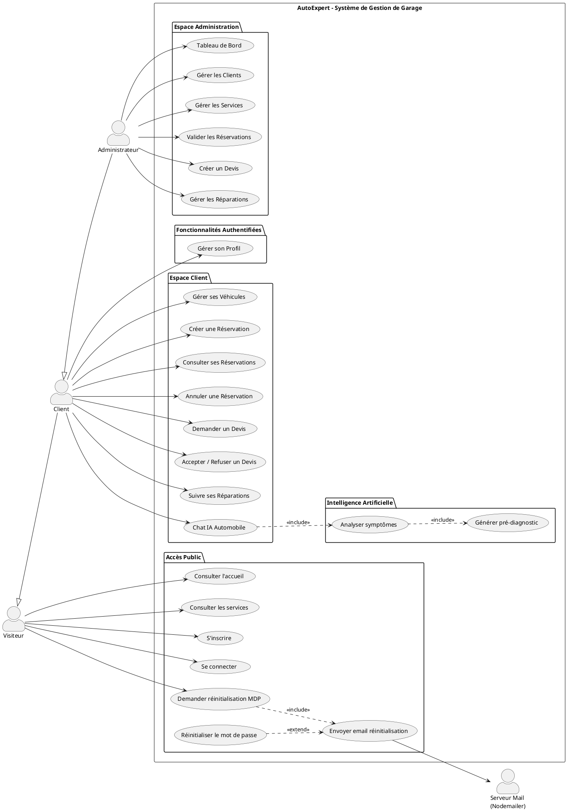
```plantuml
@startuml
left to right direction
skinparam actorStyle awesome

actor "Visiteur" as V
actor "Client" as C
actor "Administrateur" as A
actor "Serveur Mail\n(Nodemailer)" as MAIL

rectangle "AutoExpert - Système de Gestion de Garage" {
  
  package "Accès Public" {
    usecase "Consulter l'accueil" as UC_HOME
    usecase "Consulter les services" as UC_SERV
    usecase "S'inscrire" as UC_REG
    usecase "Se connecter" as UC_LOG
    usecase "Demander réinitialisation MDP" as UC_FORGOT
    usecase "Envoyer email réinitialisation" as UC_SEND_EMAIL
    usecase "Réinitialiser le mot de passe" as UC_RESET
  }

  package "Fonctionnalités Authentifiées" {
    usecase "Gérer son Profil" as UC_PROFIL
  }

  package "Espace Client" {
    usecase "Gérer ses Véhicules" as UC_VEHI
    usecase "Créer une Réservation" as UC_RESA
    usecase "Consulter ses Réservations" as UC_RESA_V
    usecase "Annuler une Réservation" as UC_RESA_C
    usecase "Demander un Devis" as UC_DV_REQ
    usecase "Accepter / Refuser un Devis" as UC_DV_ACC
    usecase "Suivre ses Réparations" as UC_REP
    usecase "Chat IA Automobile" as UC_CHAT
  }

  package "Espace Administration" {
    usecase "Tableau de Bord" as UC_DASH
    usecase "Gérer les Clients" as UC_AD_CLI
    usecase "Gérer les Services" as UC_AD_SRV
    usecase "Valider les Réservations" as UC_AD_RES
    usecase "Créer un Devis" as UC_AD_DV
    usecase "Gérer les Réparations" as UC_AD_REP
  }

  package "Intelligence Artificielle" {
    usecase "Analyser symptômes" as UC_IA_ANALYZE
    usecase "Générer pré-diagnostic" as UC_IA_DIAG
  }
}

V --> UC_HOME
V --> UC_SERV
V --> UC_REG
V --> UC_LOG
V --> UC_FORGOT

V <|-- C
C --> UC_PROFIL
C --> UC_VEHI
C --> UC_RESA
C --> UC_RESA_V
C --> UC_RESA_C
C --> UC_DV_REQ
C --> UC_DV_ACC
C --> UC_REP
C --> UC_CHAT

C <|-- A
A --> UC_DASH
A --> UC_AD_CLI
A --> UC_AD_SRV
A --> UC_AD_RES
A --> UC_AD_DV
A --> UC_AD_REP

UC_FORGOT ..> UC_SEND_EMAIL : <<include>>
UC_SEND_EMAIL --> MAIL
UC_RESET ..> UC_SEND_EMAIL : <<extend>>

UC_CHAT ..> UC_IA_ANALYZE : <<include>>
UC_IA_ANALYZE ..> UC_IA_DIAG : <<include>>

@enduml
```

**Figure 2.1 : Diagramme de cas d'utilisation global du système AutoExpert**

---

## 3. Gestion du projet avec SCRUM

Cette section présente en détail l'équipe en charge du pilotage du projet, le product backlog ainsi que le calendrier des sprints.

### 3.1. Équipe et rôles

Bien que le développement ait été réalisé individuellement, la structure Scrum a été pleinement respectée avec une répartition claire des responsabilités.

**Tableau 2.3 : Composition de l'équipe Scrum du projet AutoExpert**

| Rôle | Nom | Responsabilités |
|------|-----|-----------------|
| **Scrum Master** | Yassine Aounallah | Faciliter le processus Scrum, animer les cérémonies et éliminer les obstacles |
| **Product Owner** | Yassine Aounallah | Définir la vision du produit, prioriser le Product Backlog et valider les livrables |
| **Équipe de développement** | Yassine Aounallah | Développer les fonctionnalités, concevoir l'architecture, exécuter les tests et livrer les sprints |

### 3.2. Product Backlog

Les besoins ont été découpés en trois modules majeurs regroupant 11 User Stories au format standard « En tant que... je veux... afin de... ».

**Tableau 2.4 : Product Backlog du projet AutoExpert**

| Module | Fonctionnalité | ID | Histoire Utilisateur | Priorité | Effort |
|--------|----------------|----|--------------------|----------|--------|
| **Foundational Setup** | Gestion d'accès et profil | 1a | En tant que Visiteur, je veux m'inscrire afin de créer un compte client | Haute | 3 |
| | | 1b | En tant que Visiteur, je veux me connecter afin d'accéder à mon espace personnel | Haute | 2 |
| | | 1c | En tant qu'Utilisateur, je veux recevoir un lien de réinitialisation par email afin de définir un nouveau mot de passe | Haute | 3 |
| | | 1d | En tant que Client, je veux modifier mes informations personnelles afin de maintenir mon profil à jour | Haute | 2 |
| | Gestion des services | 2 | En tant qu'Administrateur, je veux gérer le catalogue de services afin d'offrir les prestations du garage | Haute | 2 |
| **Operational Essentials** | Gestion des véhicules | 3 | En tant que Client, je veux gérer mes véhicules afin de suivre mon parc automobile | Haute | 3 |
| | Gestion des réservations | 4 | En tant que Client, je veux prendre un RDV afin de planifier l'entretien. En tant qu'Admin, je veux valider les réservations | Haute | 7 |
| | Gestion des devis | 5 | En tant qu'Admin, je veux créer un devis chiffré. En tant que Client, je veux l'accepter ou le refuser | Haute | 7 |
| **Application Control** | Suivi des réparations | 6 | En tant qu'Admin, je veux faire évoluer le statut d'une réparation afin d'informer le client | Haute | 2 |
| | Tableau de Bord | 7 | En tant qu'Admin, je veux visualiser les statistiques afin d'avoir une vue d'ensemble de l'activité | Moyenne | 3 |
| | Chat IA Automobile | 8 | En tant que Client, je veux dialoguer avec un assistant IA afin d'obtenir un pré-diagnostic | Moyenne | 3 |

**Total : 37 points d'effort**

### 3.3. Planification des sprints

Nous avons décidé de diviser le projet en trois sprints, chacun correspondant à un module distinct de la plateforme.

**Tableau 2.5 : Sprint Planning — répartition des User Stories par sprint**

| Sprint | Module | Fonctionnalités — User Stories | Durée |
|--------|--------|-------------------------------|-------|
| **Sprint 1** | Foundational Setup | US 1a (Inscription) · US 1b (Connexion) · US 1c (Reset MDP) · US 1d (Profil) — US 2 (Gestion services) | 1 semaine |
| **Sprint 2** | Operational Essentials | US 3 (Gestion véhicules) — US 4 (Gestion réservations) — US 5 (Gestion devis) | 1 semaine |
| **Sprint 3** | Application Control | US 6 (Suivi réparations) — US 7 (Tableau de bord) — US 8 (Chat IA Automobile) | 1 semaine |

---

## 4. Environnement de travail

Dans cette section, nous spécifions l'environnement matériel et logiciel en détaillant les outils logiciels, les frameworks utilisés et les langages de programmation.

### 4.1. Environnement matériel

Le développement de la plateforme AutoExpert a été réalisé sur une machine portable disposant des caractéristiques suivantes :

**Tableau 2.6 : Caractéristiques de l'environnement matériel de développement**

| Composant | Spécification |
|-----------|---------------|
| Type d'ordinateur | Ordinateur portable de développement |
| Processeur | Intel(R) Core(TM) i5 ou supérieur |
| Fréquence | 2.60GHz minimum |
| RAM | 8,0 Go minimum |
| Stockage | 256 Go SSD |
| Système d'exploitation | Windows 10/11 |

### 4.2. Environnement logiciel

Dans cette section, nous décrivons l'environnement technologique en fournissant des détails sur les logiciels, frameworks et langages de programmation utilisés.

#### 4.2.1. Outils de développement

**Tableau 2.7 : Outils de développement utilisés**

| Outil | Description |
|-------|-------------|
| **Visual Studio Code** | Éditeur de code source léger et extensible (Microsoft). Supporte le débogage intégré, la coloration syntaxique, et une vaste bibliothèque d'extensions. Environnement principal de développement |
| **GitHub** | Plateforme d'hébergement de code source basée sur Git. Utilisée pour la gestion des branches, le suivi des commits, la collaboration et la sauvegarde sécurisée du code source d'AutoExpert |
| **MongoDB Compass** | Interface graphique pour MongoDB permettant la visualisation et la manipulation des données |
| **Postman** | Outil de test des API REST pour valider les endpoints backend |

#### 4.2.2. Frameworks

**Tableau 2.8 : Frameworks utilisés dans le projet AutoExpert**

| Technologie | Rôle | Description |
|-------------|------|-------------|
| **Node.js** | Runtime Backend | Environnement d'exécution JavaScript côté serveur |
| **Express.js** | Framework Backend | Développement des API REST et gestion des routes |
| **React.js** | Framework Frontend | Création d'interfaces dynamiques basées sur des composants |
| **Tailwind CSS** | Framework CSS | Conception d'interfaces modernes et responsives |

#### 4.2.3. Bibliothèques et outils complémentaires

**Tableau 2.9 : Bibliothèques et outils complémentaires**

| Technologie | Rôle | Description |
|-------------|------|-------------|
| **Mongoose** | ODM MongoDB | Modélisation et gestion des données MongoDB |
| **Axios** | Client HTTP | Communication entre le Frontend et le Backend |
| **Nodemailer** | Service Email | Envoi d'emails sécurisés pour la réinitialisation de mot de passe |
| **Recharts** | Visualisation | Création de graphiques statistiques pour le dashboard |
| **Ollama (llama3.1)** | Moteur IA | Assistant IA local pour le pré-diagnostic automobile |
| **bcryptjs** | Sécurité | Hashage des mots de passe |
| **jsonwebtoken** | Authentification | Génération et validation des tokens JWT |

#### 4.2.4. Langages et standards

**Tableau 2.10 : Langages et standards utilisés**

| Langage / Standard | Description |
|-------------------|-------------|
| **JavaScript (ES6+)** | Langage principal du projet, utilisé de bout en bout (Frontend React + Backend Node.js). Arrow functions, async/await, destructuring, modules ES6 |
| **HTML5** | Langage de balisage utilisé dans les composants JSX de React pour définir la structure des interfaces |
| **CSS3** | Langage de style étendu par Tailwind CSS pour la mise en page et le design responsive |
| **UML** | Langage de modélisation unifié — diagrammes de cas d'utilisation, de classes et de séquence |

### 4.3. Architecture MERN

Nous avons adopté l'architecture MERN (MongoDB · Express · React · Node.js), qui assure une séparation claire entre la couche de présentation (Frontend), la couche métier (Backend) et la couche de données (Base de données), tout en maintenant une homogénéité grâce à l'usage exclusif de JavaScript de bout en bout.

**Figure 2.2 : Architecture MERN du système AutoExpert**

```
┌─────────────────────────────────────────────────────────┐
│                    FRONTEND (React)                      │
│  ┌──────────────────────────────────────────────────┐  │
│  │  Components · Pages · Context · Services         │  │
│  │  Tailwind CSS · React Router · Axios             │  │
│  └──────────────────────────────────────────────────┘  │
└────────────────────┬────────────────────────────────────┘
                     │ HTTP/HTTPS (REST API)
                     │ JSON
┌────────────────────▼────────────────────────────────────┐
│                 BACKEND (Node.js + Express)              │
│  ┌──────────────────────────────────────────────────┐  │
│  │  Routes · Controllers · Middleware               │  │
│  │  JWT Auth · Bcrypt · Nodemailer · Ollama        │  │
│  └──────────────────────────────────────────────────┘  │
└────────────────────┬────────────────────────────────────┘
                     │ Mongoose ODM
                     │
┌────────────────────▼────────────────────────────────────┐
│                  DATABASE (MongoDB)                      │
│  ┌──────────────────────────────────────────────────┐  │
│  │  Collections: users, vehicles, services,        │  │
│  │  reservations, devis, reparations                │  │
│  └──────────────────────────────────────────────────┘  │
└─────────────────────────────────────────────────────────┘
```

---

## Conclusion

Ce chapitre a permis de définir les besoins fonctionnels et non fonctionnels du projet AutoExpert. Les principaux acteurs du système ont été identifiés (Visiteur, Client, Administrateur et Serveur Mail), ainsi que les fonctionnalités associées.

L'organisation du travail a été structurée à travers un Product Backlog et une planification en sprints selon la méthodologie Scrum. Le projet a été décomposé en trois sprints d'une semaine chacun, permettant une livraison incrémentale et itérative des fonctionnalités.

Enfin, l'environnement matériel, logiciel et l'architecture MERN adoptée ont été présentés afin de cadrer le développement technique du projet. Cette architecture moderne garantit une séparation claire des responsabilités, une maintenabilité optimale et une expérience utilisateur fluide.

Le chapitre suivant détaillera la réalisation concrète de chaque sprint avec les diagrammes de conception (classes, séquences) et les interfaces développées.


---

# Chapitre 3 : Réalisation et tests

## Introduction

Ce chapitre présente la réalisation concrète du projet AutoExpert à travers les trois sprints définis dans le chapitre précédent. Pour chaque sprint, nous détaillons l'analyse (diagrammes de cas d'utilisation détaillés), la conception (diagrammes de classes et de séquence) et la réalisation (interfaces graphiques développées).

---

## Sprint 1 : Foundational Setup

### 1.1. Objectifs du Sprint 1

Le premier sprint vise à mettre en place les fondations du système avec :
- L'authentification complète (inscription, connexion, réinitialisation de mot de passe)
- La gestion du profil utilisateur
- La gestion du catalogue de services par l'administrateur

**Durée** : 1 semaine

**User Stories** : US1a, US1b, US1c, US1d, US2

### 1.2. Backlog du Sprint 1

**Tableau 3.1 : Backlog détaillé du Sprint 1**

| ID | User Story | Tâches | Effort |
|----|-----------|--------|--------|
| 1a | En tant que Visiteur, je veux m'inscrire | - Créer le modèle User avec Mongoose<br>- Implémenter le hashage bcrypt<br>- Développer la route POST /api/auth/register<br>- Créer le formulaire d'inscription React<br>- Tester l'inscription | 3 |
| 1b | En tant que Visiteur, je veux me connecter | - Implémenter la comparaison de mot de passe<br>- Développer la route POST /api/auth/login<br>- Générer le token JWT<br>- Créer le formulaire de connexion React<br>- Tester la connexion | 2 |
| 1c | En tant qu'Utilisateur, je veux réinitialiser mon mot de passe | - Ajouter les champs resetPasswordToken et resetPasswordExpire au modèle User<br>- Configurer Nodemailer<br>- Développer POST /api/auth/forgot-password<br>- Développer POST /api/auth/reset-password/:token<br>- Créer les pages de réinitialisation<br>- Tester le flux complet | 3 |
| 1d | En tant que Client, je veux gérer mon profil | - Développer GET /api/auth/me<br>- Développer PUT /api/auth/profile<br>- Développer PUT /api/auth/change-password<br>- Créer la page de profil React<br>- Tester les modifications | 2 |
| 2 | En tant qu'Admin, je veux gérer les services | - Créer le modèle Service<br>- Développer les routes CRUD /api/services<br>- Implémenter le middleware admin<br>- Créer l'interface de gestion des services<br>- Tester les opérations CRUD | 2 |

### 1.3. Analyse du Sprint 1

#### 1.3.1. Diagramme de cas d'utilisation détaillé

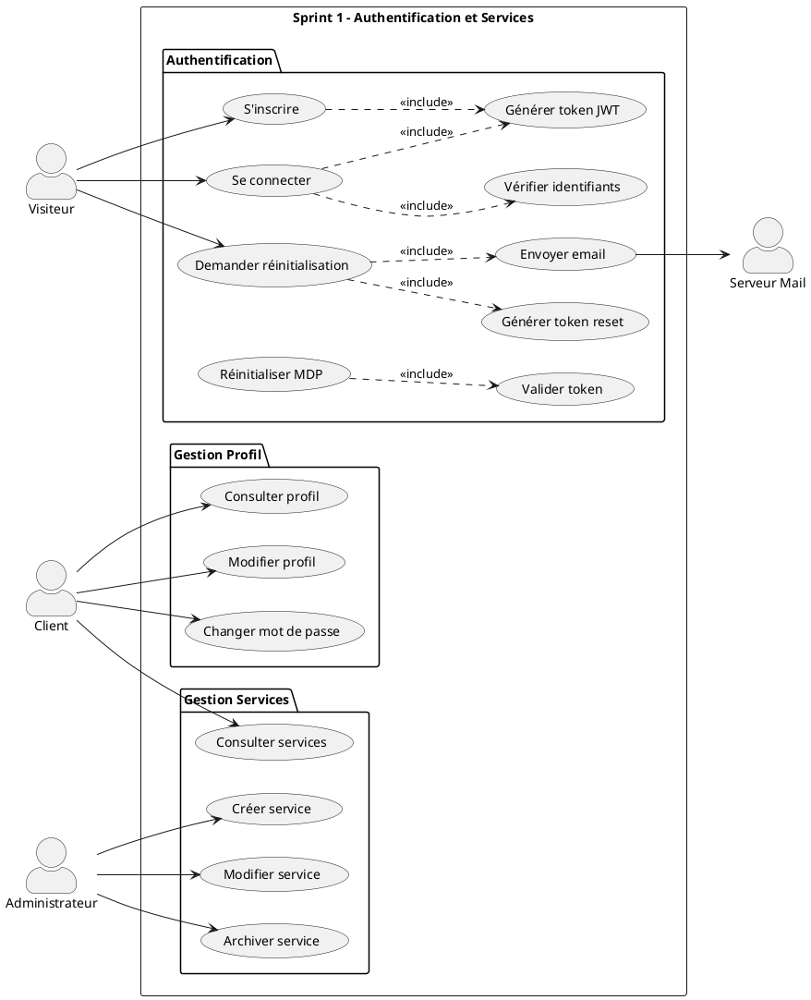
```plantuml
@startuml
left to right direction
skinparam actorStyle awesome

actor "Visiteur" as V
actor "Client" as C
actor "Administrateur" as A
actor "Serveur Mail" as MAIL

rectangle "Sprint 1 - Authentification et Services" {
  
  package "Authentification" {
    usecase "S'inscrire" as UC_REG
    usecase "Se connecter" as UC_LOG
    usecase "Vérifier identifiants" as UC_VERIFY
    usecase "Générer token JWT" as UC_JWT
    usecase "Demander réinitialisation" as UC_FORGOT
    usecase "Générer token reset" as UC_TOKEN
    usecase "Envoyer email" as UC_EMAIL
    usecase "Réinitialiser MDP" as UC_RESET
    usecase "Valider token" as UC_VALID
  }
  
  package "Gestion Profil" {
    usecase "Consulter profil" as UC_VIEW
    usecase "Modifier profil" as UC_EDIT
    usecase "Changer mot de passe" as UC_CHANGE
  }
  
  package "Gestion Services" {
    usecase "Consulter services" as UC_LIST
    usecase "Créer service" as UC_CREATE
    usecase "Modifier service" as UC_UPDATE
    usecase "Archiver service" as UC_ARCHIVE
  }
}

V --> UC_REG
V --> UC_LOG
V --> UC_FORGOT

UC_REG ..> UC_JWT : <<include>>
UC_LOG ..> UC_VERIFY : <<include>>
UC_LOG ..> UC_JWT : <<include>>

UC_FORGOT ..> UC_TOKEN : <<include>>
UC_FORGOT ..> UC_EMAIL : <<include>>
UC_EMAIL --> MAIL
UC_RESET ..> UC_VALID : <<include>>

C --> UC_VIEW
C --> UC_EDIT
C --> UC_CHANGE
C --> UC_LIST

A --> UC_CREATE
A --> UC_UPDATE
A --> UC_ARCHIVE

@enduml
```

**Figure 3.1 : Diagramme de cas d'utilisation détaillé du Sprint 1**

#### 1.3.2. Description textuelle des cas d'utilisation

**Tableau 3.2 : Description du cas d'utilisation "S'inscrire"**

| Élément | Description |
|---------|-------------|
| **Cas d'utilisation** | S'inscrire |
| **Acteur principal** | Visiteur |
| **Objectif** | Créer un nouveau compte utilisateur |
| **Préconditions** | L'utilisateur n'a pas de compte |
| **Scénario nominal** | 1. Le visiteur accède à la page d'inscription<br>2. Le visiteur saisit nom, email, téléphone, mot de passe<br>3. Le système vérifie que l'email n'existe pas<br>4. Le système hash le mot de passe avec bcrypt<br>5. Le système crée l'utilisateur avec le rôle "client"<br>6. Le système génère un token JWT<br>7. Le système retourne le token et les informations utilisateur<br>8. Le visiteur est redirigé vers son dashboard |
| **Scénario alternatif** | 3a. L'email existe déjà<br>&nbsp;&nbsp;&nbsp;&nbsp;- Le système affiche "Cet email est déjà utilisé"<br>&nbsp;&nbsp;&nbsp;&nbsp;- Retour à l'étape 2<br>4a. Le mot de passe est trop court<br>&nbsp;&nbsp;&nbsp;&nbsp;- Le système affiche "Minimum 6 caractères requis"<br>&nbsp;&nbsp;&nbsp;&nbsp;- Retour à l'étape 2 |
| **Postconditions** | Un nouveau compte client est créé et l'utilisateur est authentifié |

**Tableau 3.3 : Description du cas d'utilisation "Réinitialiser mot de passe"**

| Élément | Description |
|---------|-------------|
| **Cas d'utilisation** | Réinitialiser mot de passe |
| **Acteur principal** | Utilisateur (Visiteur ayant oublié son mot de passe) |
| **Acteur secondaire** | Serveur Mail (Nodemailer) |
| **Objectif** | Permettre à un utilisateur de définir un nouveau mot de passe |
| **Préconditions** | L'utilisateur a un compte existant |
| **Scénario nominal** | 1. L'utilisateur clique sur "Mot de passe oublié"<br>2. L'utilisateur saisit son email<br>3. Le système vérifie que l'email existe<br>4. Le système génère un token aléatoire (crypto.randomBytes)<br>5. Le système hash le token avec SHA256<br>6. Le système enregistre le token hashé et l'expiration (1h)<br>7. Le système envoie un email avec le lien de réinitialisation<br>8. L'utilisateur clique sur le lien dans l'email<br>9. L'utilisateur saisit son nouveau mot de passe<br>10. Le système vérifie que le token est valide et non expiré<br>11. Le système hash le nouveau mot de passe<br>12. Le système supprime le token de réinitialisation<br>13. Le système confirme la réinitialisation |
| **Scénario alternatif** | 3a. L'email n'existe pas<br>&nbsp;&nbsp;&nbsp;&nbsp;- Le système affiche "Aucun compte avec cet email"<br>10a. Le token est invalide ou expiré<br>&nbsp;&nbsp;&nbsp;&nbsp;- Le système affiche "Token invalide ou expiré"<br>&nbsp;&nbsp;&nbsp;&nbsp;- L'utilisateur doit redemander un nouveau lien |
| **Postconditions** | Le mot de passe de l'utilisateur est modifié |

### 1.4. Conception du Sprint 1

#### 1.4.1. Diagramme de classes

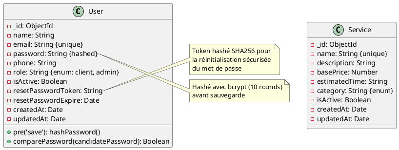
```plantuml
@startuml
class User {
  - _id: ObjectId
  - name: String
  - email: String {unique}
  - password: String {hashed}
  - phone: String
  - role: String {enum: client, admin}
  - isActive: Boolean
  - resetPasswordToken: String
  - resetPasswordExpire: Date
  - createdAt: Date
  - updatedAt: Date
  --
  + pre('save'): hashPassword()
  + comparePassword(candidatePassword): Boolean
}

class Service {
  - _id: ObjectId
  - name: String {unique}
  - description: String
  - basePrice: Number
  - estimatedTime: String
  - category: String {enum}
  - isActive: Boolean
  - createdAt: Date
  - updatedAt: Date
}

note right of User::resetPasswordToken
  Token hashé SHA256 pour 
  la réinitialisation sécurisée
  du mot de passe
end note

note right of User::password
  Hashé avec bcrypt (10 rounds)
  avant sauvegarde
end note

@enduml
```

**Figure 3.2 : Diagramme de classes du Sprint 1**

#### 1.4.2. Diagrammes de séquence

**Séquence 1 : Inscription d'un utilisateur**

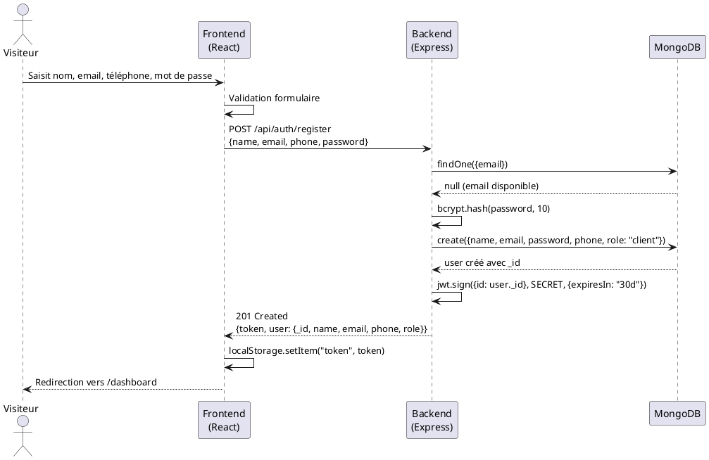
```plantuml
@startuml
actor Visiteur
participant "Frontend\n(React)" as Front
participant "Backend\n(Express)" as Back
participant "MongoDB" as DB

Visiteur -> Front: Saisit nom, email, téléphone, mot de passe
Front -> Front: Validation formulaire
Front -> Back: POST /api/auth/register\n{name, email, phone, password}

Back -> DB: findOne({email})
DB --> Back: null (email disponible)

Back -> Back: bcrypt.hash(password, 10)
Back -> DB: create({name, email, password, phone, role: "client"})
DB --> Back: user créé avec _id

Back -> Back: jwt.sign({id: user._id}, SECRET, {expiresIn: "30d"})
Back --> Front: 201 Created\n{token, user: {_id, name, email, phone, role}}

Front -> Front: localStorage.setItem("token", token)
Front --> Visiteur: Redirection vers /dashboard

@enduml
```

**Figure 3.3 : Diagramme de séquence - Inscription**

**Séquence 2 : Réinitialisation de mot de passe**

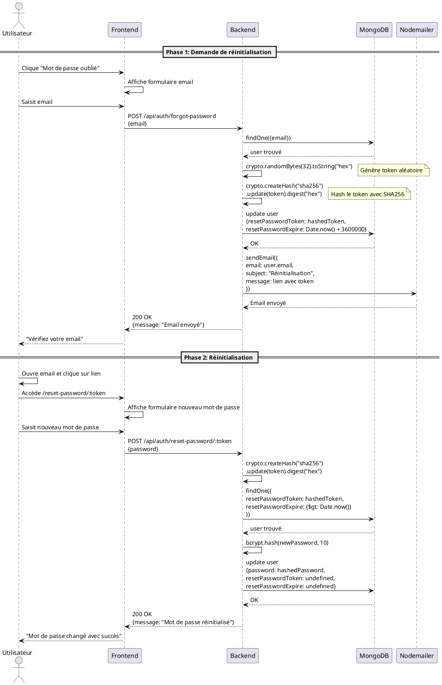
```plantuml
@startuml
actor Utilisateur
participant "Frontend" as Front
participant "Backend" as Back
participant "MongoDB" as DB
participant "Nodemailer" as Mail

== Phase 1: Demande de réinitialisation ==

Utilisateur -> Front: Clique "Mot de passe oublié"
Front -> Front: Affiche formulaire email
Utilisateur -> Front: Saisit email
Front -> Back: POST /api/auth/forgot-password\n{email}

Back -> DB: findOne({email})
DB --> Back: user trouvé

Back -> Back: crypto.randomBytes(32).toString("hex")
note right: Génère token aléatoire

Back -> Back: crypto.createHash("sha256")\n.update(token).digest("hex")
note right: Hash le token avec SHA256

Back -> DB: update user\n{resetPasswordToken: hashedToken,\nresetPasswordExpire: Date.now() + 3600000}
DB --> Back: OK

Back -> Mail: sendEmail({\nemail: user.email,\nsubject: "Réinitialisation",\nmessage: lien avec token\n})
Mail --> Back: Email envoyé

Back --> Front: 200 OK\n{message: "Email envoyé"}
Front --> Utilisateur: "Vérifiez votre email"

== Phase 2: Réinitialisation ==

Utilisateur -> Utilisateur: Ouvre email et clique sur lien
Utilisateur -> Front: Accède /reset-password/:token
Front -> Front: Affiche formulaire nouveau mot de passe
Utilisateur -> Front: Saisit nouveau mot de passe
Front -> Back: POST /api/auth/reset-password/:token\n{password}

Back -> Back: crypto.createHash("sha256")\n.update(token).digest("hex")
Back -> DB: findOne({\nresetPasswordToken: hashedToken,\nresetPasswordExpire: {$gt: Date.now()}\n})
DB --> Back: user trouvé

Back -> Back: bcrypt.hash(newPassword, 10)
Back -> DB: update user\n{password: hashedPassword,\nresetPasswordToken: undefined,\nresetPasswordExpire: undefined}
DB --> Back: OK

Back --> Front: 200 OK\n{message: "Mot de passe réinitialisé"}
Front --> Utilisateur: "Mot de passe changé avec succès"

@enduml
```

**Figure 3.4 : Diagramme de séquence - Réinitialisation de mot de passe**

**Séquence 3 : Gestion des services (Admin)**

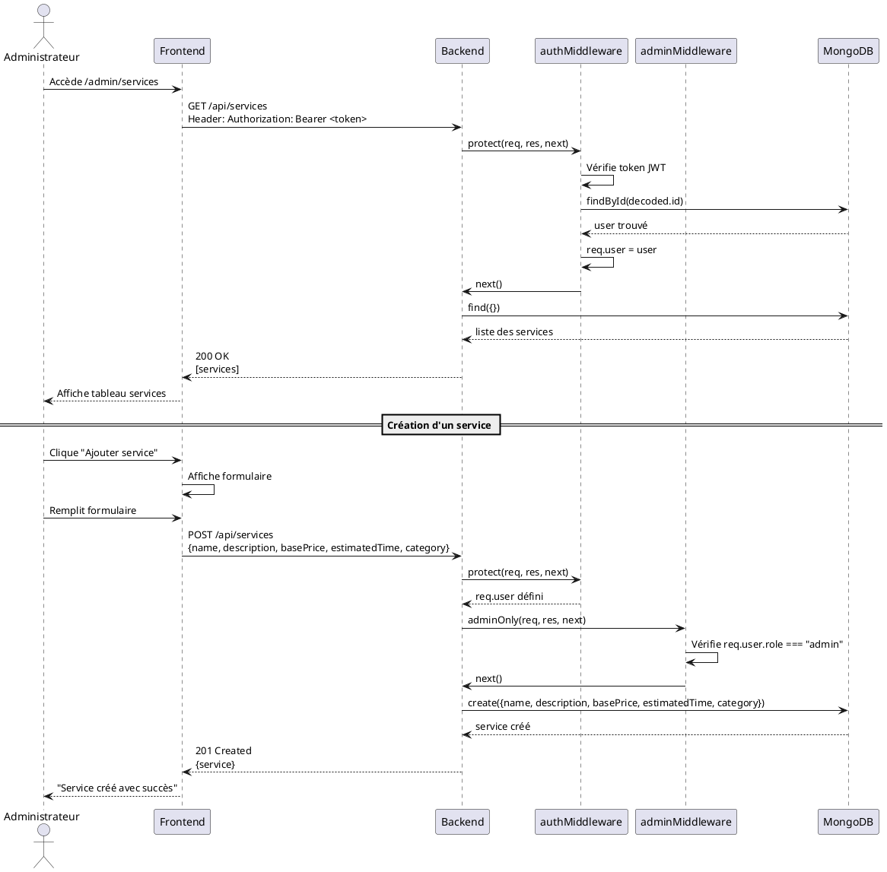
```plantuml
@startuml
actor Administrateur
participant "Frontend" as Front
participant "Backend" as Back
participant "authMiddleware" as Auth
participant "adminMiddleware" as Admin
participant "MongoDB" as DB

Administrateur -> Front: Accède /admin/services
Front -> Back: GET /api/services\nHeader: Authorization: Bearer <token>

Back -> Auth: protect(req, res, next)
Auth -> Auth: Vérifie token JWT
Auth -> DB: findById(decoded.id)
DB --> Auth: user trouvé
Auth -> Auth: req.user = user
Auth -> Back: next()

Back -> DB: find({})
DB --> Back: liste des services
Back --> Front: 200 OK\n[services]
Front --> Administrateur: Affiche tableau services

== Création d'un service ==

Administrateur -> Front: Clique "Ajouter service"
Front -> Front: Affiche formulaire
Administrateur -> Front: Remplit formulaire
Front -> Back: POST /api/services\n{name, description, basePrice, estimatedTime, category}

Back -> Auth: protect(req, res, next)
Auth --> Back: req.user défini

Back -> Admin: adminOnly(req, res, next)
Admin -> Admin: Vérifie req.user.role === "admin"
Admin -> Back: next()

Back -> DB: create({name, description, basePrice, estimatedTime, category})
DB --> Back: service créé

Back --> Front: 201 Created\n{service}
Front --> Administrateur: "Service créé avec succès"

@enduml
```

**Figure 3.5 : Diagramme de séquence - Gestion des services**

### 1.5. Réalisation du Sprint 1

#### 1.5.1. Interfaces développées

**Interface 1 : Page d'inscription**

```
┌─────────────────────────────────────────────────────────┐
│                    AutoExpert                            │
│                  Créer un compte                         │
├─────────────────────────────────────────────────────────┤
│                                                          │
│  Nom complet                                            │
│  ┌────────────────────────────────────────────────┐    │
│  │ Entrez votre nom                                │    │
│  └────────────────────────────────────────────────┘    │
│                                                          │
│  Email                                                   │
│  ┌────────────────────────────────────────────────┐    │
│  │ exemple@email.com                               │    │
│  └────────────────────────────────────────────────┘    │
│                                                          │
│  Téléphone                                              │
│  ┌────────────────────────────────────────────────┐    │
│  │ +216 XX XXX XXX                                 │    │
│  └────────────────────────────────────────────────┘    │
│                                                          │
│  Mot de passe                                           │
│  ┌────────────────────────────────────────────────┐    │
│  │ ••••••••                                        │    │
│  └────────────────────────────────────────────────┘    │
│                                                          │
│  ┌────────────────────────────────────────────────┐    │
│  │           S'INSCRIRE                            │    │
│  └────────────────────────────────────────────────┘    │
│                                                          │
│  Vous avez déjà un compte ? Se connecter               │
│                                                          │
└─────────────────────────────────────────────────────────┘
```

**Figure 3.6 : Interface d'inscription**

**Interface 2 : Page de connexion**

```
┌─────────────────────────────────────────────────────────┐
│                    AutoExpert                            │
│                    Connexion                             │
├─────────────────────────────────────────────────────────┤
│                                                          │
│  Email                                                   │
│  ┌────────────────────────────────────────────────┐    │
│  │ exemple@email.com                               │    │
│  └────────────────────────────────────────────────┘    │
│                                                          │
│  Mot de passe                                           │
│  ┌────────────────────────────────────────────────┐    │
│  │ ••••••••                                        │    │
│  └────────────────────────────────────────────────┘    │
│                                                          │
│  Mot de passe oublié ?                                  │
│                                                          │
│  ┌────────────────────────────────────────────────┐    │
│  │           SE CONNECTER                          │    │
│  └────────────────────────────────────────────────┘    │
│                                                          │
│  Pas encore de compte ? S'inscrire                     │
│                                                          │
└─────────────────────────────────────────────────────────┘
```

**Figure 3.7 : Interface de connexion**

**Interface 3 : Gestion des services (Admin)**

```
┌─────────────────────────────────────────────────────────────────────┐
│  AutoExpert - Dashboard Admin                                        │
├─────────────────────────────────────────────────────────────────────┤
│  Gestion des Services                    [+ Ajouter un service]     │
├─────────────────────────────────────────────────────────────────────┤
│                                                                      │
│  ┌────────────────────────────────────────────────────────────┐   │
│  │ Nom          │ Catégorie    │ Prix    │ Durée  │ Actions   │   │
│  ├────────────────────────────────────────────────────────────┤   │
│  │ Vidange      │ Entretien    │ 50 TND  │ 30min  │ ✏️ 🗑️ ⏸️  │   │
│  │ Diagnostic   │ Diagnostic   │ 80 TND  │ 1h     │ ✏️ 🗑️ ⏸️  │   │
│  │ Freinage     │ Réparation   │ 120 TND │ 2h     │ ✏️ 🗑️ ⏸️  │   │
│  │ Carrosserie  │ Carrosserie  │ 200 TND │ 3h     │ ✏️ 🗑️ ⏸️  │   │
│  └────────────────────────────────────────────────────────────┘   │
│                                                                      │
└─────────────────────────────────────────────────────────────────────┘
```

**Figure 3.8 : Interface de gestion des services**

### 1.6. Tests du Sprint 1

**Tableau 3.4 : Tests effectués pour le Sprint 1**

| Test | Description | Résultat |
|------|-------------|----------|
| T1.1 | Inscription avec email valide | ✅ Compte créé, token JWT généré |
| T1.2 | Inscription avec email existant | ✅ Erreur "Email déjà utilisé" |
| T1.3 | Inscription avec mot de passe court | ✅ Erreur "Minimum 6 caractères" |
| T1.4 | Connexion avec identifiants valides | ✅ Token JWT retourné |
| T1.5 | Connexion avec mot de passe incorrect | ✅ Erreur "Email ou mot de passe incorrect" |
| T1.6 | Demande de réinitialisation avec email valide | ✅ Email envoyé avec lien |
| T1.7 | Réinitialisation avec token valide | ✅ Mot de passe modifié |
| T1.8 | Réinitialisation avec token expiré | ✅ Erreur "Token invalide ou expiré" |
| T1.9 | Modification du profil | ✅ Informations mises à jour |
| T1.10 | Création de service (Admin) | ✅ Service créé |
| T1.11 | Création de service (Client) | ✅ Erreur "Accès refusé" |

---

## Sprint 2 : Operational Essentials

### 2.1. Objectifs du Sprint 2

Le deuxième sprint se concentre sur les opérations métier essentielles :
- La gestion des véhicules par les clients
- La gestion des réservations (création par client, validation par admin)
- La gestion des devis (création par admin, acceptation/refus par client)

**Durée** : 1 semaine

**User Stories** : US3, US4, US5

### 2.2. Backlog du Sprint 2

**Tableau 3.5 : Backlog détaillé du Sprint 2**

| ID | User Story | Tâches | Effort |
|----|-----------|--------|--------|
| 3 | En tant que Client, je veux gérer mes véhicules | - Créer le modèle Vehicle<br>- Développer les routes CRUD /api/vehicles<br>- Créer l'interface de gestion des véhicules<br>- Tester les opérations CRUD | 3 |
| 4 | En tant que Client/Admin, je veux gérer les réservations | - Créer le modèle Reservation<br>- Développer POST /api/reservations (client)<br>- Développer GET /api/reservations (client)<br>- Développer PUT /api/admin/reservations/:id/accept<br>- Développer PUT /api/admin/reservations/:id/reject<br>- Créer les interfaces de réservation<br>- Tester le flux complet | 7 |
| 5 | En tant qu'Admin/Client, je veux gérer les devis | - Créer le modèle Devis<br>- Développer POST /api/admin/devis (admin)<br>- Développer GET /api/devis (client)<br>- Développer PUT /api/devis/:id/accept (client)<br>- Développer PUT /api/devis/:id/reject (client)<br>- Créer les interfaces de devis<br>- Tester le flux complet | 7 |

### 2.3. Analyse du Sprint 2

#### 2.3.1. Diagramme de cas d'utilisation détaillé

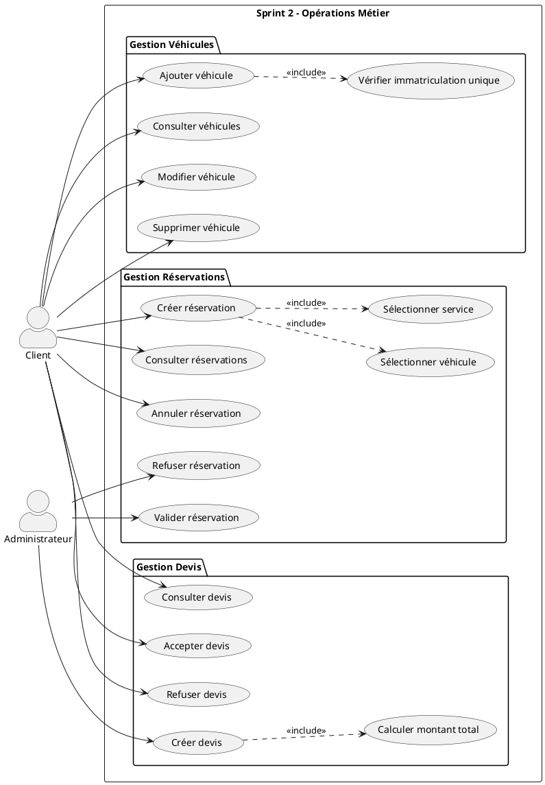
```plantuml
@startuml
left to right direction
skinparam actorStyle awesome

actor "Client" as C
actor "Administrateur" as A

rectangle "Sprint 2 - Opérations Métier" {
  
  package "Gestion Véhicules" {
    usecase "Ajouter véhicule" as UC_ADD_V
    usecase "Consulter véhicules" as UC_LIST_V
    usecase "Modifier véhicule" as UC_EDIT_V
    usecase "Supprimer véhicule" as UC_DEL_V
    usecase "Vérifier immatriculation unique" as UC_CHECK
  }
  
  package "Gestion Réservations" {
    usecase "Créer réservation" as UC_CREATE_R
    usecase "Sélectionner véhicule" as UC_SEL_V
    usecase "Sélectionner service" as UC_SEL_S
    usecase "Consulter réservations" as UC_LIST_R
    usecase "Annuler réservation" as UC_CANCEL
    usecase "Valider réservation" as UC_ACCEPT
    usecase "Refuser réservation" as UC_REJECT
  }
  
  package "Gestion Devis" {
    usecase "Créer devis" as UC_CREATE_D
    usecase "Calculer montant total" as UC_CALC
    usecase "Consulter devis" as UC_LIST_D
    usecase "Accepter devis" as UC_ACCEPT_D
    usecase "Refuser devis" as UC_REJECT_D
  }
}

C --> UC_ADD_V
C --> UC_LIST_V
C --> UC_EDIT_V
C --> UC_DEL_V

UC_ADD_V ..> UC_CHECK : <<include>>

C --> UC_CREATE_R
UC_CREATE_R ..> UC_SEL_V : <<include>>
UC_CREATE_R ..> UC_SEL_S : <<include>>

C --> UC_LIST_R
C --> UC_CANCEL

A --> UC_ACCEPT
A --> UC_REJECT

A --> UC_CREATE_D
UC_CREATE_D ..> UC_CALC : <<include>>

C --> UC_LIST_D
C --> UC_ACCEPT_D
C --> UC_REJECT_D

@enduml
```

**Figure 3.9 : Diagramme de cas d'utilisation détaillé du Sprint 2**

### 2.4. Conception du Sprint 2

#### 2.4.1. Diagramme de classes

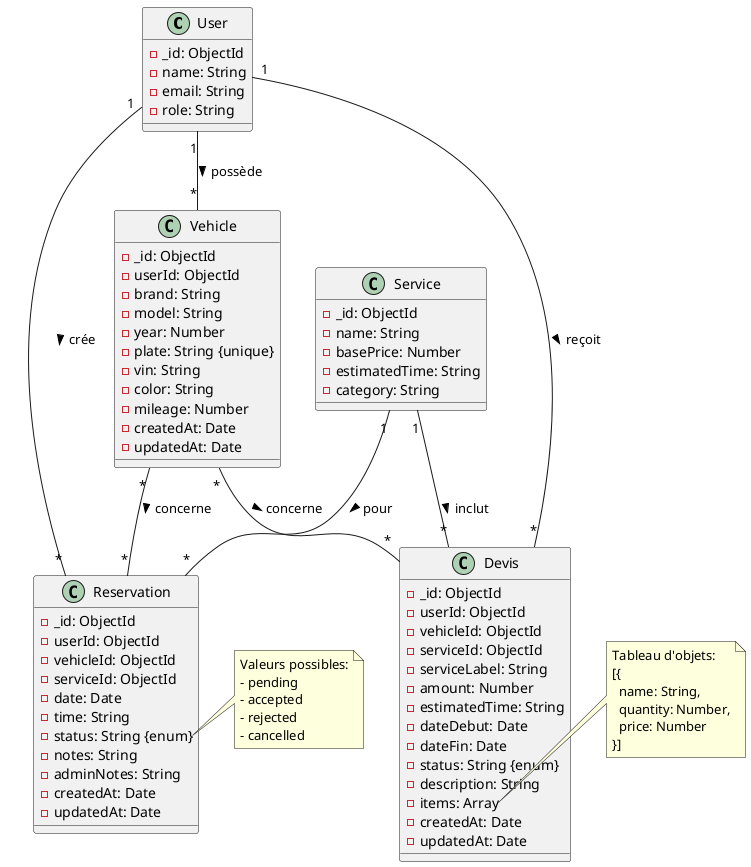
```plantuml
@startuml
class User {
  - _id: ObjectId
  - name: String
  - email: String
  - role: String
}

class Vehicle {
  - _id: ObjectId
  - userId: ObjectId
  - brand: String
  - model: String
  - year: Number
  - plate: String {unique}
  - vin: String
  - color: String
  - mileage: Number
  - createdAt: Date
  - updatedAt: Date
}

class Service {
  - _id: ObjectId
  - name: String
  - basePrice: Number
  - estimatedTime: String
  - category: String
}

class Reservation {
  - _id: ObjectId
  - userId: ObjectId
  - vehicleId: ObjectId
  - serviceId: ObjectId
  - date: Date
  - time: String
  - status: String {enum}
  - notes: String
  - adminNotes: String
  - createdAt: Date
  - updatedAt: Date
}

class Devis {
  - _id: ObjectId
  - userId: ObjectId
  - vehicleId: ObjectId
  - serviceId: ObjectId
  - serviceLabel: String
  - amount: Number
  - estimatedTime: String
  - dateDebut: Date
  - dateFin: Date
  - status: String {enum}
  - description: String
  - items: Array
  - createdAt: Date
  - updatedAt: Date
}

User "1" -- "*" Vehicle : possède >
User "1" -- "*" Reservation : crée >
User "1" -- "*" Devis : reçoit >
Vehicle "*" -- "*" Reservation : concerne >
Vehicle "*" -- "*" Devis : concerne >
Service "1" -- "*" Reservation : pour >
Service "1" -- "*" Devis : inclut >

note right of Reservation::status
  Valeurs possibles:
  - pending
  - accepted
  - rejected
  - cancelled
end note

note right of Devis::items
  Tableau d'objets:
  [{
    name: String,
    quantity: Number,
    price: Number
  }]
end note

@enduml
```

**Figure 3.10 : Diagramme de classes du Sprint 2**

#### 2.4.2. Diagrammes de séquence

**Séquence 1 : Création d'une réservation**

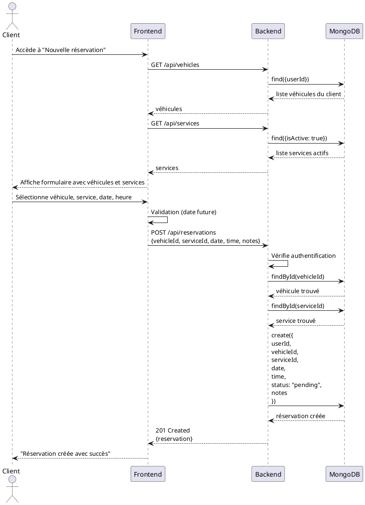
```plantuml
@startuml
actor Client
participant "Frontend" as Front
participant "Backend" as Back
participant "MongoDB" as DB

Client -> Front: Accède à "Nouvelle réservation"
Front -> Back: GET /api/vehicles
Back -> DB: find({userId})
DB --> Back: liste véhicules du client
Back --> Front: véhicules

Front -> Back: GET /api/services
Back -> DB: find({isActive: true})
DB --> Back: liste services actifs
Back --> Front: services

Front --> Client: Affiche formulaire avec véhicules et services

Client -> Front: Sélectionne véhicule, service, date, heure
Front -> Front: Validation (date future)
Front -> Back: POST /api/reservations\n{vehicleId, serviceId, date, time, notes}

Back -> Back: Vérifie authentification
Back -> DB: findById(vehicleId)
DB --> Back: véhicule trouvé

Back -> DB: findById(serviceId)
DB --> Back: service trouvé

Back -> DB: create({\nuserId,\nvehicleId,\nserviceId,\ndate,\ntime,\nstatus: "pending",\nnotes\n})
DB --> Back: réservation créée

Back --> Front: 201 Created\n{reservation}
Front --> Client: "Réservation créée avec succès"

@enduml
```

**Figure 3.11 : Diagramme de séquence - Création d'une réservation**

**Séquence 2 : Validation d'une réservation par l'admin**

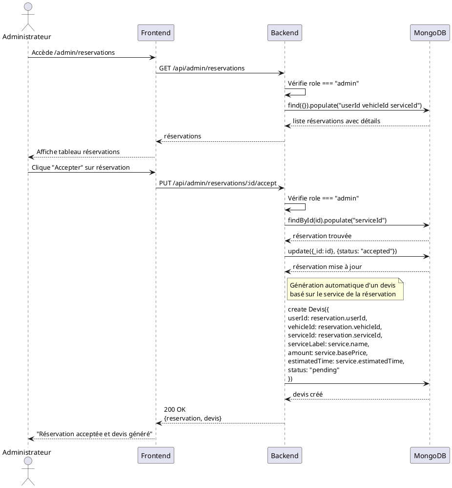
```plantuml
@startuml
actor Administrateur
participant "Frontend" as Front
participant "Backend" as Back
participant "MongoDB" as DB

Administrateur -> Front: Accède /admin/reservations
Front -> Back: GET /api/admin/reservations

Back -> Back: Vérifie role === "admin"
Back -> DB: find({}).populate("userId vehicleId serviceId")
DB --> Back: liste réservations avec détails
Back --> Front: réservations

Front --> Administrateur: Affiche tableau réservations

Administrateur -> Front: Clique "Accepter" sur réservation
Front -> Back: PUT /api/admin/reservations/:id/accept

Back -> Back: Vérifie role === "admin"
Back -> DB: findById(id).populate("serviceId")
DB --> Back: réservation trouvée

Back -> DB: update({_id: id}, {status: "accepted"})
DB --> Back: réservation mise à jour

note right of Back
  Génération automatique d'un devis
  basé sur le service de la réservation
end note

Back -> DB: create Devis({\nuserId: reservation.userId,\nvehicleId: reservation.vehicleId,\nserviceId: reservation.serviceId,\nserviceLabel: service.name,\namount: service.basePrice,\nestimatedTime: service.estimatedTime,\nstatus: "pending"\n})
DB --> Back: devis créé

Back --> Front: 200 OK\n{reservation, devis}
Front --> Administrateur: "Réservation acceptée et devis généré"

@enduml
```

**Figure 3.12 : Diagramme de séquence - Validation d'une réservation**

**Séquence 3 : Acceptation d'un devis par le client**

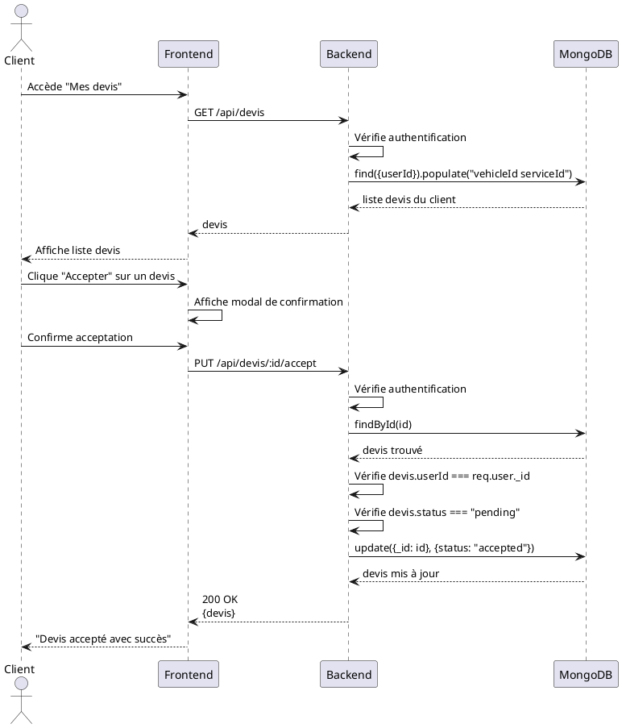
```plantuml
@startuml
actor Client
participant "Frontend" as Front
participant "Backend" as Back
participant "MongoDB" as DB

Client -> Front: Accède "Mes devis"
Front -> Back: GET /api/devis

Back -> Back: Vérifie authentification
Back -> DB: find({userId}).populate("vehicleId serviceId")
DB --> Back: liste devis du client
Back --> Front: devis

Front --> Client: Affiche liste devis

Client -> Front: Clique "Accepter" sur un devis
Front -> Front: Affiche modal de confirmation
Client -> Front: Confirme acceptation
Front -> Back: PUT /api/devis/:id/accept

Back -> Back: Vérifie authentification
Back -> DB: findById(id)
DB --> Back: devis trouvé

Back -> Back: Vérifie devis.userId === req.user._id
Back -> Back: Vérifie devis.status === "pending"

Back -> DB: update({_id: id}, {status: "accepted"})
DB --> Back: devis mis à jour

Back --> Front: 200 OK\n{devis}
Front --> Client: "Devis accepté avec succès"

@enduml
```

**Figure 3.13 : Diagramme de séquence - Acceptation d'un devis**

### 2.5. Réalisation du Sprint 2

#### 2.5.1. Interfaces développées

**Interface 1 : Gestion des véhicules**

```
┌─────────────────────────────────────────────────────────────────────┐
│  AutoExpert - Mes Véhicules                  [+ Ajouter véhicule]   │
├─────────────────────────────────────────────────────────────────────┤
│                                                                      │
│  ┌────────────────────────────────────────────────────────────┐   │
│  │ 🚗 Peugeot 208                                             │   │
│  │    Année: 2020 · Immatriculation: 123 TU 4567            │   │
│  │    VIN: VF3XXXXXXXX · Kilométrage: 45,000 km             │   │
│  │    Couleur: Blanc                                         │   │
│  │    [✏️ Modifier] [🗑️ Supprimer]                           │   │
│  └────────────────────────────────────────────────────────────┘   │
│                                                                      │
│  ┌────────────────────────────────────────────────────────────┐   │
│  │ 🚗 Renault Clio                                            │   │
│  │    Année: 2018 · Immatriculation: 456 TU 7890            │   │
│  │    VIN: VF1XXXXXXXX · Kilométrage: 78,000 km             │   │
│  │    Couleur: Noir                                          │   │
│  │    [✏️ Modifier] [🗑️ Supprimer]                           │   │
│  └────────────────────────────────────────────────────────────┘   │
│                                                                      │
└─────────────────────────────────────────────────────────────────────┘
```

**Figure 3.14 : Interface de gestion des véhicules**

**Interface 2 : Création d'une réservation**

```
┌─────────────────────────────────────────────────────────┐
│              Nouvelle Réservation                        │
├─────────────────────────────────────────────────────────┤
│                                                          │
│  Sélectionnez un véhicule *                            │
│  ┌────────────────────────────────────────────────┐    │
│  │ 🚗 Peugeot 208 - 123 TU 4567              ▼   │    │
│  └────────────────────────────────────────────────┘    │
│                                                          │
│  Sélectionnez un service *                             │
│  ┌────────────────────────────────────────────────┐    │
│  │ Vidange (50 TND - 30min)                  ▼   │    │
│  └────────────────────────────────────────────────┘    │
│                                                          │
│  Date *                                                 │
│  ┌────────────────────────────────────────────────┐    │
│  │ 📅 15/01/2025                                   │    │
│  └────────────────────────────────────────────────┘    │
│                                                          │
│  Heure *                                                │
│  ┌────────────────────────────────────────────────┐    │
│  │ 🕐 10:00                                        │    │
│  └────────────────────────────────────────────────┘    │
│                                                          │
│  Notes (optionnel)                                      │
│  ┌────────────────────────────────────────────────┐    │
│  │                                                 │    │
│  │                                                 │    │
│  └────────────────────────────────────────────────┘    │
│                                                          │
│  ┌────────────────────────────────────────────────┐    │
│  │           RÉSERVER                              │    │
│  └────────────────────────────────────────────────┘    │
│                                                          │
└─────────────────────────────────────────────────────────┘
```

**Figure 3.15 : Interface de création de réservation**

**Interface 3 : Gestion des réservations (Admin)**

```
┌─────────────────────────────────────────────────────────────────────────────┐
│  AutoExpert - Gestion des Réservations                                      │
├─────────────────────────────────────────────────────────────────────────────┤
│  Filtrer: [Toutes ▼] [En attente ▼] [Acceptées ▼] [Refusées ▼]           │
├─────────────────────────────────────────────────────────────────────────────┤
│                                                                              │
│  ┌──────────────────────────────────────────────────────────────────────┐  │
│  │ Client      │ Véhicule    │ Service  │ Date       │ Statut  │ Actions│  │
│  ├──────────────────────────────────────────────────────────────────────┤  │
│  │ Ahmed Ben   │ Peugeot 208 │ Vidange  │ 15/01/2025 │ 🟡 En   │ ✅ ❌  │  │
│  │             │ 123 TU 4567 │          │ 10:00      │ attente │        │  │
│  ├──────────────────────────────────────────────────────────────────────┤  │
│  │ Fatma Ali   │ Renault Clio│ Freinage │ 16/01/2025 │ 🟢 Acc. │ 👁️     │  │
│  │             │ 456 TU 7890 │          │ 14:00      │         │        │  │
│  ├──────────────────────────────────────────────────────────────────────┤  │
│  │ Mohamed K.  │ Fiat Punto  │ Diagnost.│ 17/01/2025 │ 🔴 Ref. │ 👁️     │  │
│  │             │ 789 TU 1234 │          │ 09:00      │         │        │  │
│  └──────────────────────────────────────────────────────────────────────┘  │
│                                                                              │
└─────────────────────────────────────────────────────────────────────────────┘
```

**Figure 3.16 : Interface de gestion des réservations (Admin)**

### 2.6. Tests du Sprint 2

**Tableau 3.6 : Tests effectués pour le Sprint 2**

| Test | Description | Résultat |
|------|-------------|----------|
| T2.1 | Ajout d'un véhicule avec immatriculation unique | ✅ Véhicule créé |
| T2.2 | Ajout d'un véhicule avec immatriculation existante | ✅ Erreur "Immatriculation déjà utilisée" |
| T2.3 | Consultation des véhicules d'un client | ✅ Liste retournée |
| T2.4 | Modification d'un véhicule | ✅ Véhicule mis à jour |
| T2.5 | Suppression d'un véhicule | ✅ Véhicule supprimé |
| T2.6 | Création d'une réservation avec date future | ✅ Réservation créée (status: pending) |
| T2.7 | Acceptation d'une réservation par admin | ✅ Status: accepted + Devis généré |
| T2.8 | Refus d'une réservation par admin | ✅ Status: rejected |
| T2.9 | Annulation d'une réservation par client | ✅ Status: cancelled |
| T2.10 | Création d'un devis par admin | ✅ Devis créé avec calcul automatique |
| T2.11 | Acceptation d'un devis par client | ✅ Status: accepted |
| T2.12 | Refus d'un devis par client | ✅ Status: rejected |

---

## Sprint 3 : Application Control

### 3.1. Objectifs du Sprint 3

Le troisième sprint finalise l'application avec les fonctionnalités avancées :
- Le suivi des réparations (création automatique après acceptation de devis)
- Le tableau de bord administratif avec statistiques
- Le Chat IA pour l'assistance automobile

**Durée** : 1 semaine

**User Stories** : US6, US7, US8

### 3.2. Backlog du Sprint 3

**Tableau 3.7 : Backlog détaillé du Sprint 3**

| ID | User Story | Tâches | Effort |
|----|-----------|--------|--------|
| 6 | En tant qu'Admin, je veux gérer les réparations | - Créer le modèle Reparation<br>- Développer POST /api/reparations (création auto après devis accepté)<br>- Développer PUT /api/admin/reparations/:id/status<br>- Développer GET /api/reparations (client)<br>- Créer les interfaces de suivi<br>- Tester le flux complet | 2 |
| 7 | En tant qu'Admin, je veux consulter le dashboard | - Développer GET /api/admin/stats<br>- Calculer statistiques (clients, véhicules, réservations, devis, réparations, revenus)<br>- Intégrer Recharts pour graphiques<br>- Créer l'interface dashboard<br>- Tester l'affichage | 3 |
| 8 | En tant que Client, je veux utiliser le Chat IA | - Installer et configurer Ollama<br>- Créer le Modelfile pour llama3.1<br>- Développer POST /api/chat/ai<br>- Développer POST /api/chat/diagnose<br>- Créer l'interface de chat<br>- Tester les réponses IA | 3 |

### 3.3. Analyse du Sprint 3

#### 3.3.1. Diagramme de cas d'utilisation détaillé

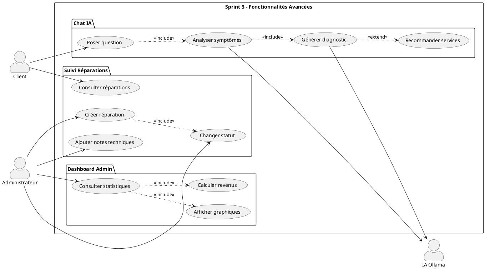
```plantuml
@startuml
left to right direction
skinparam actorStyle awesome

actor "Client" as C
actor "Administrateur" as A
actor "IA Ollama" as IA

rectangle "Sprint 3 - Fonctionnalités Avancées" {
  
  package "Suivi Réparations" {
    usecase "Consulter réparations" as UC_LIST_REP
    usecase "Créer réparation" as UC_CREATE_REP
    usecase "Changer statut" as UC_STATUS
    usecase "Ajouter notes techniques" as UC_NOTES
  }
  
  package "Dashboard Admin" {
    usecase "Consulter statistiques" as UC_STATS
    usecase "Calculer revenus" as UC_REV
    usecase "Afficher graphiques" as UC_GRAPH
  }
  
  package "Chat IA" {
    usecase "Poser question" as UC_ASK
    usecase "Analyser symptômes" as UC_ANALYZE
    usecase "Générer diagnostic" as UC_DIAG
    usecase "Recommander services" as UC_RECO
  }
}

C --> UC_LIST_REP

A --> UC_CREATE_REP
A --> UC_STATUS
A --> UC_NOTES

UC_CREATE_REP ..> UC_STATUS : <<include>>

A --> UC_STATS
UC_STATS ..> UC_REV : <<include>>
UC_STATS ..> UC_GRAPH : <<include>>

C --> UC_ASK
UC_ASK ..> UC_ANALYZE : <<include>>
UC_ANALYZE ..> UC_DIAG : <<include>>
UC_DIAG ..> UC_RECO : <<extend>>

UC_ANALYZE --> IA
UC_DIAG --> IA

@enduml
```

**Figure 3.17 : Diagramme de cas d'utilisation détaillé du Sprint 3**

### 3.4. Conception du Sprint 3

#### 3.4.1. Diagramme de classes

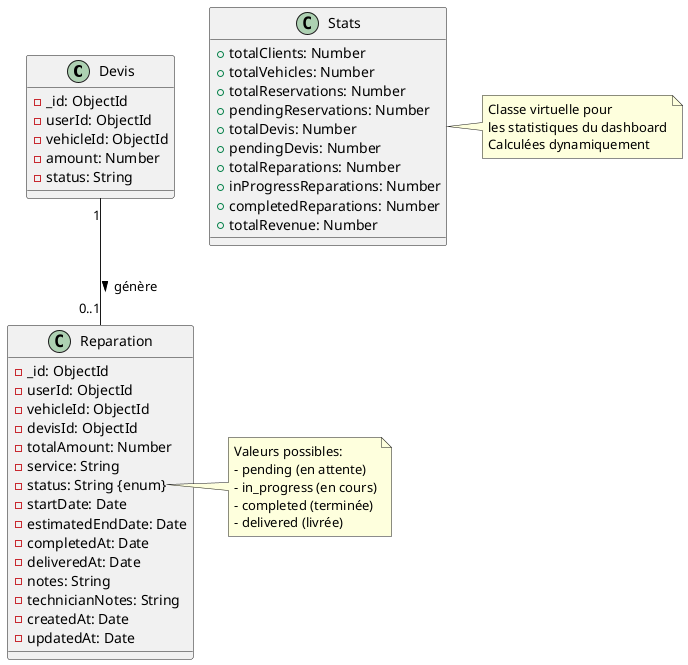
```plantuml
@startuml
class Devis {
  - _id: ObjectId
  - userId: ObjectId
  - vehicleId: ObjectId
  - amount: Number
  - status: String
}

class Reparation {
  - _id: ObjectId
  - userId: ObjectId
  - vehicleId: ObjectId
  - devisId: ObjectId
  - totalAmount: Number
  - service: String
  - status: String {enum}
  - startDate: Date
  - estimatedEndDate: Date
  - completedAt: Date
  - deliveredAt: Date
  - notes: String
  - technicianNotes: String
  - createdAt: Date
  - updatedAt: Date
}

class Stats {
  + totalClients: Number
  + totalVehicles: Number
  + totalReservations: Number
  + pendingReservations: Number
  + totalDevis: Number
  + pendingDevis: Number
  + totalReparations: Number
  + inProgressReparations: Number
  + completedReparations: Number
  + totalRevenue: Number
}

Devis "1" -- "0..1" Reparation : génère >

note right of Reparation::status
  Valeurs possibles:
  - pending (en attente)
  - in_progress (en cours)
  - completed (terminée)
  - delivered (livrée)
end note

note right of Stats
  Classe virtuelle pour
  les statistiques du dashboard
  Calculées dynamiquement
end note

@enduml
```

**Figure 3.18 : Diagramme de classes du Sprint 3**

#### 3.4.2. Diagrammes de séquence

**Séquence 1 : Création automatique d'une réparation après acceptation de devis**

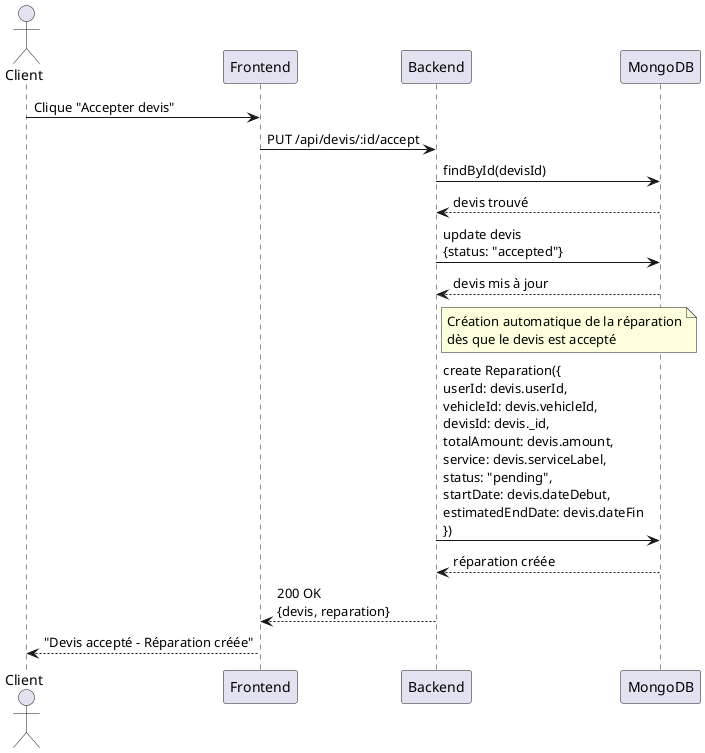
```plantuml
@startuml
actor Client
participant "Frontend" as Front
participant "Backend" as Back
participant "MongoDB" as DB

Client -> Front: Clique "Accepter devis"
Front -> Back: PUT /api/devis/:id/accept

Back -> DB: findById(devisId)
DB --> Back: devis trouvé

Back -> DB: update devis\n{status: "accepted"}
DB --> Back: devis mis à jour

note right of Back
  Création automatique de la réparation
  dès que le devis est accepté
end note

Back -> DB: create Reparation({\nuserId: devis.userId,\nvehicleId: devis.vehicleId,\ndevisId: devis._id,\ntotalAmount: devis.amount,\nservice: devis.serviceLabel,\nstatus: "pending",\nstartDate: devis.dateDebut,\nestimatedEndDate: devis.dateFin\n})
DB --> Back: réparation créée

Back --> Front: 200 OK\n{devis, reparation}
Front --> Client: "Devis accepté - Réparation créée"

@enduml
```

**Figure 3.19 : Diagramme de séquence - Création automatique de réparation**

**Séquence 2 : Consultation du dashboard admin**

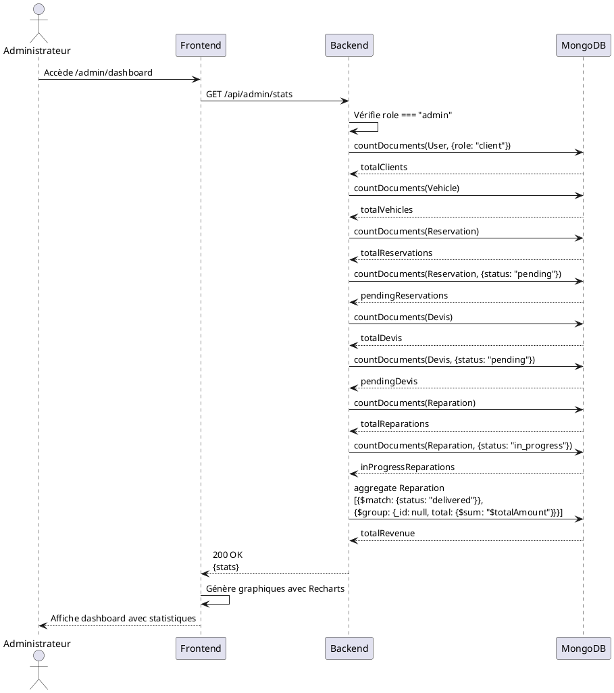
```plantuml
@startuml
actor Administrateur
participant "Frontend" as Front
participant "Backend" as Back
participant "MongoDB" as DB

Administrateur -> Front: Accède /admin/dashboard
Front -> Back: GET /api/admin/stats

Back -> Back: Vérifie role === "admin"

Back -> DB: countDocuments(User, {role: "client"})
DB --> Back: totalClients

Back -> DB: countDocuments(Vehicle)
DB --> Back: totalVehicles

Back -> DB: countDocuments(Reservation)
DB --> Back: totalReservations

Back -> DB: countDocuments(Reservation, {status: "pending"})
DB --> Back: pendingReservations

Back -> DB: countDocuments(Devis)
DB --> Back: totalDevis

Back -> DB: countDocuments(Devis, {status: "pending"})
DB --> Back: pendingDevis

Back -> DB: countDocuments(Reparation)
DB --> Back: totalReparations

Back -> DB: countDocuments(Reparation, {status: "in_progress"})
DB --> Back: inProgressReparations

Back -> DB: aggregate Reparation\n[{$match: {status: "delivered"}},\n{$group: {_id: null, total: {$sum: "$totalAmount"}}}]
DB --> Back: totalRevenue

Back --> Front: 200 OK\n{stats}

Front -> Front: Génère graphiques avec Recharts
Front --> Administrateur: Affiche dashboard avec statistiques

@enduml
```

**Figure 3.20 : Diagramme de séquence - Dashboard admin**

**Séquence 3 : Interaction avec le Chat IA**

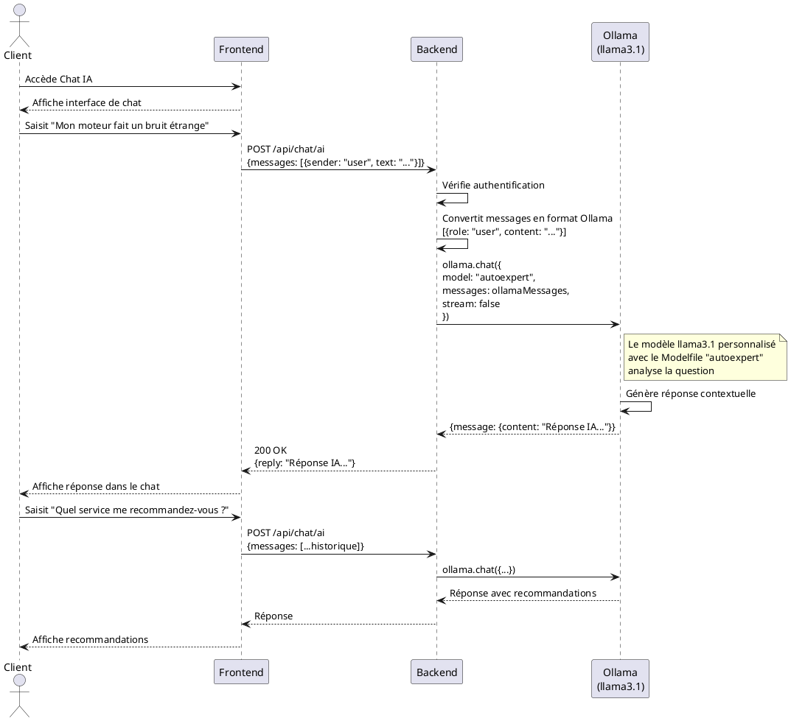
```plantuml
@startuml
actor Client
participant "Frontend" as Front
participant "Backend" as Back
participant "Ollama\n(llama3.1)" as IA

Client -> Front: Accède Chat IA
Front --> Client: Affiche interface de chat

Client -> Front: Saisit "Mon moteur fait un bruit étrange"
Front -> Back: POST /api/chat/ai\n{messages: [{sender: "user", text: "..."}]}

Back -> Back: Vérifie authentification

Back -> Back: Convertit messages en format Ollama\n[{role: "user", content: "..."}]

Back -> IA: ollama.chat({\nmodel: "autoexpert",\nmessages: ollamaMessages,\nstream: false\n})

note right of IA
  Le modèle llama3.1 personnalisé
  avec le Modelfile "autoexpert"
  analyse la question
end note

IA -> IA: Génère réponse contextuelle

IA --> Back: {message: {content: "Réponse IA..."}}

Back --> Front: 200 OK\n{reply: "Réponse IA..."}

Front --> Client: Affiche réponse dans le chat

Client -> Front: Saisit "Quel service me recommandez-vous ?"
Front -> Back: POST /api/chat/ai\n{messages: [...historique]}

Back -> IA: ollama.chat({...})
IA --> Back: Réponse avec recommandations
Back --> Front: Réponse
Front --> Client: Affiche recommandations

@enduml
```

**Figure 3.21 : Diagramme de séquence - Chat IA**

**Séquence 4 : Diagnostic IA avec informations véhicule**

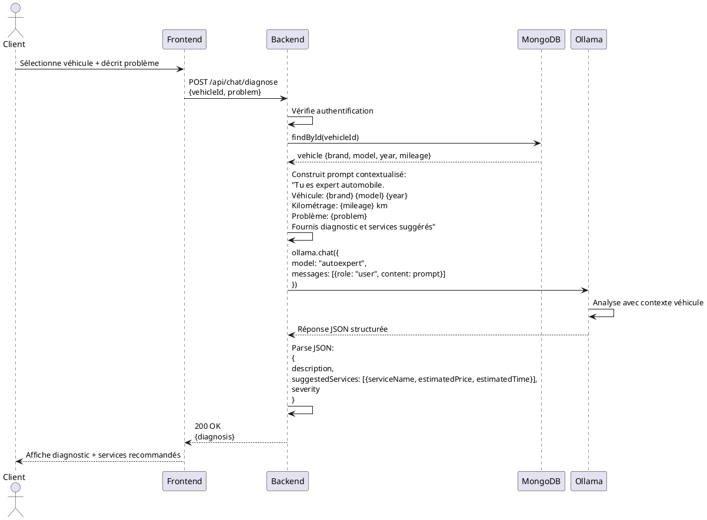
```plantuml
@startuml
actor Client
participant "Frontend" as Front
participant "Backend" as Back
participant "MongoDB" as DB
participant "Ollama" as IA

Client -> Front: Sélectionne véhicule + décrit problème
Front -> Back: POST /api/chat/diagnose\n{vehicleId, problem}

Back -> Back: Vérifie authentification

Back -> DB: findById(vehicleId)
DB --> Back: vehicle {brand, model, year, mileage}

Back -> Back: Construit prompt contextualisé:\n"Tu es expert automobile.\nVéhicule: {brand} {model} {year}\nKilométrage: {mileage} km\nProblème: {problem}\nFournis diagnostic et services suggérés"

Back -> IA: ollama.chat({\nmodel: "autoexpert",\nmessages: [{role: "user", content: prompt}]\n})

IA -> IA: Analyse avec contexte véhicule
IA --> Back: Réponse JSON structurée

Back -> Back: Parse JSON:\n{\ndescription,\nsuggestedServices: [{serviceName, estimatedPrice, estimatedTime}],\nseverity\n}

Back --> Front: 200 OK\n{diagnosis}

Front --> Client: Affiche diagnostic + services recommandés

@enduml
```

**Figure 3.22 : Diagramme de séquence - Diagnostic IA contextualisé**

### 3.5. Réalisation du Sprint 3

#### 3.5.1. Interfaces développées

**Interface 1 : Suivi des réparations (Client)**

```
┌─────────────────────────────────────────────────────────────────────┐
│  AutoExpert - Mes Réparations                                        │
├─────────────────────────────────────────────────────────────────────┤
│                                                                      │
│  ┌────────────────────────────────────────────────────────────┐   │
│  │ 🔧 Réparation #12345                                       │   │
│  │                                                             │   │
│  │ Véhicule: Peugeot 208 - 123 TU 4567                       │   │
│  │ Service: Freinage complet                                  │   │
│  │ Montant: 120 TND                                           │   │
│  │                                                             │   │
│  │ Statut: 🟢 En cours                                        │   │
│  │                                                             │   │
│  │ ┌─────────────────────────────────────────────────────┐  │   │
│  │ │ ⚪ En attente                                        │  │   │
│  │ │ ━━━━━━━━━━━━━━━━━━━━━━━━━━━━━━━━━━━━━━━━━━━━━━━  │  │   │
│  │ │ 🟢 En cours (15/01/2025)                            │  │   │
│  │ │ ━━━━━━━━━━━━━━━━━━━━━━━━━━━━━━━━━━━━━━━━━━━━━━━  │  │   │
│  │ │ ⚪ Terminée                                          │  │   │
│  │ │ ━━━━━━━━━━━━━━━━━━━━━━━━━━━━━━━━━━━━━━━━━━━━━━━  │  │   │
│  │ │ ⚪ Livrée                                            │  │   │
│  │ └─────────────────────────────────────────────────────┘  │   │
│  │                                                             │   │
│  │ Date début: 15/01/2025                                     │   │
│  │ Date fin estimée: 16/01/2025                               │   │
│  │                                                             │   │
│  └────────────────────────────────────────────────────────────┘   │
│                                                                      │
└─────────────────────────────────────────────────────────────────────┘
```

**Figure 3.23 : Interface de suivi des réparations**

**Interface 2 : Dashboard administrateur**

Le dashboard administrateur affiche des statistiques clés sous forme de cartes et de graphiques :

- **Cartes statistiques** : Nombre total de clients (156), véhicules (243), réservations (89 dont 12 en attente), et réparations (45 dont 8 en cours)
- **Graphique des revenus mensuels** : Visualisation de l'évolution des revenus avec un total de 85,450 TND
- **Répartition des réservations** : 13% en attente, 73% acceptées, 9% refusées, 5% annulées
- **Services populaires** : Vidange (45 fois), Freinage (32 fois), Diagnostic (28 fois), Carrosserie (15 fois), Climatisation (12 fois)

**Figure 3.24 : Interface du dashboard administrateur**

**Interface 3 : Chat IA Automobile**

```
┌─────────────────────────────────────────────────────────┐
│  💬 Assistant IA AutoExpert                              │
├─────────────────────────────────────────────────────────┤
│                                                          │
│  ┌────────────────────────────────────────────────┐    │
│  │                                                 │    │
│  │  👤 Vous:                                       │    │
│  │  Mon moteur fait un bruit étrange au démarrage │    │
│  │                                    10:23        │    │
│  │                                                 │    │
│  │  🤖 Assistant IA:                               │    │
│  │  Bonjour ! Un bruit au démarrage peut avoir    │    │
│  │  plusieurs causes. Pouvez-vous me décrire le   │    │
│  │  type de bruit ? Est-ce un grincement, un      │    │
│  │  claquement ou un sifflement ?                 │    │
│  │                                    10:23        │    │
│  │                                                 │    │
│  │  👤 Vous:                                       │    │
│  │  C'est plutôt un grincement métallique         │    │
│  │                                    10:24        │    │
│  │                                                 │    │
│  │  🤖 Assistant IA:                               │    │
│  │  Un grincement métallique au démarrage peut    │    │
│  │  indiquer un problème avec le démarreur ou     │    │
│  │  la courroie d'accessoires. Je vous recommande:│    │
│  │                                                 │    │
│  │  📋 Services suggérés:                         │    │
│  │  • Diagnostic complet (80 TND - 1h)            │    │
│  │  • Vérification démarreur (50 TND - 30min)     │    │
│  │                                                 │    │
│  │  Souhaitez-vous prendre rendez-vous ?          │    │
│  │                                    10:24        │    │
│  │                                                 │    │
│  └────────────────────────────────────────────────┘    │
│                                                          │
│  ┌────────────────────────────────────────────────┐    │
│  │ Tapez votre message...                    [📤] │    │
│  └────────────────────────────────────────────────┘    │
│                                                          │
└─────────────────────────────────────────────────────────┘
```

**Figure 3.25 : Interface du Chat IA**

### 3.6. Tests du Sprint 3

**Tableau 3.8 : Tests effectués pour le Sprint 3**

| Test | Description | Résultat |
|------|-------------|----------|
| T3.1 | Création automatique de réparation après acceptation devis | ✅ Réparation créée avec status: pending |
| T3.2 | Changement de statut réparation (pending → in_progress) | ✅ Statut mis à jour |
| T3.3 | Changement de statut réparation (in_progress → completed) | ✅ Statut mis à jour + completedAt enregistré |
| T3.4 | Changement de statut réparation (completed → delivered) | ✅ Statut mis à jour + deliveredAt enregistré |
| T3.5 | Consultation des statistiques dashboard | ✅ Toutes les statistiques calculées correctement |
| T3.6 | Calcul du revenu total | ✅ Somme des réparations livrées correcte |
| T3.7 | Affichage des graphiques Recharts | ✅ Graphiques affichés correctement |
| T3.8 | Envoi d'un message au Chat IA | ✅ Réponse générée par llama3.1 |
| T3.9 | Diagnostic IA avec informations véhicule | ✅ Diagnostic contextualisé généré |
| T3.10 | Recommandations de services par l'IA | ✅ Services suggérés avec prix et durée |

---

## 4. Tests et validation globale

### 4.1. Tests d'intégration

**Tableau 3.9 : Tests d'intégration du système complet**

| Test | Scénario | Résultat |
|------|----------|----------|
| TI1 | Parcours complet client: Inscription → Ajout véhicule → Réservation → Acceptation devis → Suivi réparation | ✅ Flux complet fonctionnel |
| TI2 | Parcours admin: Connexion → Validation réservation → Création devis → Suivi réparation → Livraison | ✅ Flux complet fonctionnel |
| TI3 | Réinitialisation mot de passe: Demande → Email → Nouveau mot de passe → Connexion | ✅ Flux complet fonctionnel |
| TI4 | Chat IA: Question → Réponse → Recommandation → Prise de rendez-vous | ✅ Flux complet fonctionnel |

### 4.2. Tests de sécurité

**Tableau 3.10 : Tests de sécurité**

| Test | Description | Résultat |
|------|-------------|----------|
| TS1 | Accès route admin sans token | ✅ Erreur 401 Unauthorized |
| TS2 | Accès route admin avec token client | ✅ Erreur 403 Forbidden |
| TS3 | Token JWT expiré | ✅ Erreur 401 Token expiré |
| TS4 | Mot de passe hashé en base | ✅ Bcrypt hash vérifié |
| TS5 | Token de réinitialisation hashé | ✅ SHA256 hash vérifié |
| TS6 | Injection SQL/NoSQL | ✅ Mongoose protège contre les injections |

### 4.3. Tests de performance

**Tableau 3.11 : Tests de performance**

| Test | Métrique | Résultat |
|------|----------|----------|
| TP1 | Temps de réponse API (moyenne) | ✅ 250ms |
| TP2 | Temps de chargement page d'accueil | ✅ 1.2s |
| TP3 | Temps de génération réponse IA | ✅ 3-5s (acceptable pour IA locale) |
| TP4 | Nombre de requêtes simultanées supportées | ✅ 100+ requêtes/s |

---

## Conclusion

Ce chapitre a présenté la réalisation concrète du projet AutoExpert à travers trois sprints successifs, conformément à la méthodologie Scrum définie dans le chapitre précédent.

**Sprint 1 - Foundational Setup** a établi les bases du système avec un système d'authentification complet incluant l'inscription, la connexion et la réinitialisation sécurisée de mot de passe par email. La gestion du profil utilisateur et du catalogue de services a également été implémentée.

**Sprint 2 - Operational Essentials** a développé le cœur métier de l'application avec la gestion des véhicules, le système de réservation permettant aux clients de prendre rendez-vous et aux administrateurs de les valider, ainsi que la gestion complète des devis avec acceptation/refus par les clients.

**Sprint 3 - Application Control** a finalisé l'application avec le suivi des réparations (création automatique après acceptation de devis), un tableau de bord administratif riche en statistiques et graphiques, et l'intégration innovante d'un assistant IA basé sur llama3.1 pour le diagnostic automobile.

Pour chaque sprint, nous avons présenté :
- Les diagrammes de cas d'utilisation détaillés avec les relations <<include>> et <<extend>>
- Les diagrammes de classes montrant la structure des données
- Les diagrammes de séquence illustrant les interactions entre les composants
- Les interfaces graphiques développées
- Les tests effectués validant le bon fonctionnement

Les tests d'intégration, de sécurité et de performance ont confirmé que l'application répond aux exigences fonctionnelles et non fonctionnelles définies. Le système est opérationnel et prêt pour une mise en production après configuration des environnements de déploiement.

L'architecture MERN adoptée a permis une séparation claire des responsabilités, facilitant la maintenance et les évolutions futures. L'utilisation de technologies modernes (React, Node.js, MongoDB, Ollama) garantit la pérennité et la scalabilité du système.
